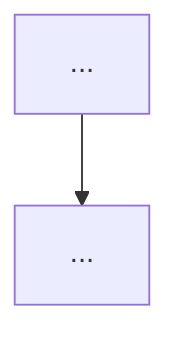

# Learning Notes - Agent 协作规则

## 笔记整理 Agent

### 职责
- 维护笔记间的双向链接完整性
- 检查并清理空文件和 stub 文件
- 确保 README.md (MOC) 与实际笔记目录保持同步
- 检查图片引用是否有效

### 操作规则
1. **新增笔记时**：在笔记开头添加相关链接，并更新 README.md 对应分类，同步更新 CLAUDE.md 目录结构
2. **删除笔记时**：搜索所有引用该笔记的 wikilink 并移除或更新
3. **重命名笔记时**：全局搜索并替换所有旧名称的 wikilink
4. **合并笔记时**：保留更完整的文件名，合并非重复内容，删除被合并的文件

### 质量检查清单
- [ ] 所有 `[[wikilink]]` 指向的文件都存在（用 `fd -t f -e md | xargs grep -l '\[\['` 扫描）
- [ ] 无空文件（0 行或仅含标签/图片引用）
- [ ] 图片文件都在对应目录的 `图片/` 子目录中
- [ ] README.md 包含所有笔记的链接
- [ ] 文件名全为英文小写 + 连字符格式
- [ ] 每篇笔记有 `## 面试要点` 章节

### 断链检测命令
```bash
# 检测所有断链 wikilink
grep -roh '\[\[[a-z0-9_-]*\]\]' --include='*.md' --exclude='AGENTS.md' . | \
  sort -u | sed 's/\[\[//;s/\]\]//' | \
  while read link; do
    found=$(fd -t f "^${link}\.md$" 2>/dev/null | head -1)
    [ -z "$found" ] && echo "BROKEN: [[$link]]"
  done
```

---

## 内容审查 Agent

### 职责
- 审查笔记内容的准确性和完整性
- 识别内容重复的笔记并建议合并
- 标记过时或不准确的技术内容（尤其是版本相关内容）

### 操作规则
1. 不直接修改笔记的技术内容，仅提出建议
2. 发现重复内容时，列出具体文件和重复段落
3. 发现过时内容时，标注具体位置和建议更新方向
4. Go 版本特性注意区分 1.18/1.21/1.22/1.23 差异
5. K8s 内容注意区分版本（如 dockershim 在 1.24 移除）

---

## 链接维护 Agent

### 职责
- 定期扫描所有笔记中的 wikilink，确保指向有效
- 发现孤立笔记（无入链和出链）并建议添加链接
- 维护知识图谱的连通性

### 操作规则
1. 使用断链检测命令（见上方）扫描所有 wikilink
2. 对比实际文件列表，找出断链
3. 对孤立笔记推荐至少 2 个相关笔记进行链接

---

## 新增笔记模板

```markdown
#标签1 #标签2

相关笔记：[[file-a]] | [[file-b]] | [[file-c]]

## 概述

简短描述该主题。

## 核心概念

### 子主题 1

内容...



### 子主题 2

内容...

```go
// 代码示例
```

## 面试要点

### Q: 问题 1？

A: 回答...

### Q: 问题 2？

A: 回答...
```

---

## 目录规范（新增笔记时对照）

| 主题 | 目录 | 示例文件名 |
|------|------|-----------|
| Docker 底层 | `cloud-native/docker/` | `cgroup.md` |
| K8s 控制平面 | `cloud-native/kubernetes/control-plane/` | `scheduler-deep-dive.md` |
| K8s 网络插件 | `cloud-native/kubernetes/networking/` | `cilium.md` |
| K8s 存储插件 | `cloud-native/kubernetes/storage/` | `ceph-csi.md` |
| K8s 基础设施 | `cloud-native/kubernetes/infrastructure/` | `etcd.md` |
| K8s 扩展开发 | `cloud-native/kubernetes/extension/` | `operator-pattern.md` |
| MySQL | `database/mysql/` | `mysql-transaction.md` |
| Redis | `database/redis/` | `redis-cluster.md` |
| PostgreSQL | `database/postgresql/` | `postgresql-advanced.md` |
| ES | `database/elasticsearch/` | `es-field-types.md` |
| Kafka | `middleware/kafka/` | `kafka-basics.md` |
| Go 语言 | `go/` | `channel.md` |
| 算法搜索 | `algorithm/search/` | `dijkstra.md` |
| 算法排序 | `algorithm/sorting/` | `heap-sort.md` |
| 算法技巧 | `algorithm/techniques/` | `sliding-window.md` |
| 字符串算法 | `algorithm/string/` | `kmp.md` |
| 动态规划 | `algorithm/dp/` | `house-robber.md` |
| 数据结构 | `algorithm/data-structures/` | `lru.md` |
| AI/LLM | `ai/` | `llm-inference-pipeline.md` |
