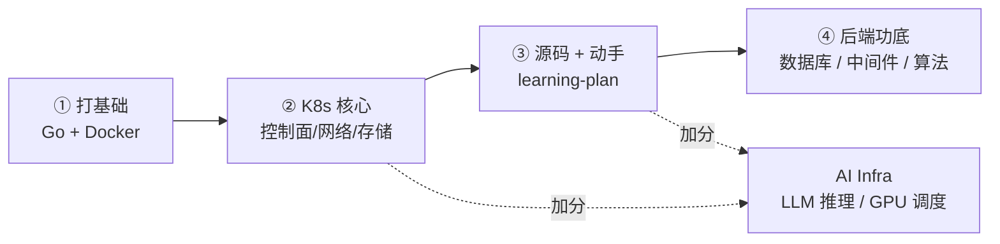

# Learning Notes · 云原生求职知识库

> 面向 **Kubernetes / 云原生 / 后端** 岗位求职的系统化技术笔记。基于 Obsidian 构建，同时兼容 GitHub 浏览。

**130 篇技术笔记** · **10 个可运行 demo** · **13 篇源码导读**，覆盖 8 大板块。
每篇知识笔记都配有 **mermaid 图解** + **面试要点 Q&A**，可直接当作复习卡片。

---

## 🚀 学习路线（求职导向）

不知道从哪开始？按下面这条主线走，每一步都点进对应领域的「学习索引」，里面有由浅入深的细化顺序。

| 阶段 | 学什么 | 入口 |
|------|--------|------|
| ① 打基础 | 岗位语言 Go + 容器基础 Docker | [Go 索引](go/README.md) · [云原生索引（Docker 部分）](cloud-native/README.md) |
| ② K8s 核心 | 基础设施 → 控制面 → 网络 → 存储 → 扩展 | [云原生索引](cloud-native/README.md) |
| ③ 源码 + 动手 | 读源码 + 跑 demo，把机制吃透 | [learning-plan 专区](#-learning-plan--kubernetes-开发深挖专区) |
| ④ 后端功底 | MySQL/Redis 必考、Kafka、手撕算法 | [数据库](database/README.md) · [中间件](middleware/README.md) · [算法](algorithm/README.md) |
| ⭐ 加分方向 | AI Infra：LLM 推理、Agent 开发、GPU 调度/HAMi | [AI](ai/README.md) · [GPU 调度](cloud-native/kubernetes/control-plane/gpu-scheduling.md) |

---

## 🗺️ 知识地图

每个领域都有一份 **学习索引**（推荐顺序 + 难度 + 一句话简介），点标题进入。

### ☁️ [云原生 Cloud Native](cloud-native/README.md) · 41 篇
容器与 Kubernetes 全栈，岗位核心主战场。
`Docker 底层` `Cgroup/Namespace/UnionFS` `etcd` `Informer` `Scheduler` `RBAC` `CNI` `Cilium` `CSI` `Operator` `GPU 调度`

### 🐹 [Go 语言](go/README.md) · 9 篇
runtime 底层是面试区分度所在。
`GMP 调度` `三色标记 GC` `Channel` `Map/Slice 内存模型` `Context` `泛型/版本特性`

### 🗄️ [数据库 Database](database/README.md) · 13 篇
MySQL 索引/事务/锁几乎必考，Redis 考工程实战。
`B+Tree 索引` `MVCC` `Next-Key Lock` `RDB/AOF` `缓存穿透/击穿/雪崩` `Sentinel/Cluster` `Elasticsearch` `PostgreSQL`

### 🔗 [中间件 Middleware](middleware/README.md) · 10 篇
消息队列高频，分布式事务考一致性权衡。
`Kafka 架构` `零消息丢失` `ISR/acks` `NATS JetStream` `Canal Binlog 同步` `2PC/TCC/Saga`

### 🧮 [算法 Algorithm](algorithm/README.md) · 27 篇
笔试硬门槛，覆盖手撕高频方向。
`BFS/DFS/回溯` `二分` `拓扑/Dijkstra/并查集` `快排/归并/堆排` `前缀和/差分/滑窗/单调栈` `DP` `LRU/LFU` `KMP/Trie`

### 🤖 [AI](ai/README.md) · 7 篇 ＆ 🧰 [Misc](#-misc) · 1 篇
LLM 推理学习路径、Prefill/Decode、Prefix Cache、KV Cache、Agent 开发、Agent 源码导读、生产级 Agent；终端效率速查。

---

## 🧭 learning-plan · Kubernetes 开发深挖专区

> 新手先读 **[k8s-development-roadmap](learning-plan/k8s-development-roadmap.md)** —— 一张决策图告诉你该走哪条路径，别直接乱点下面的链接。

**路线图与打卡**
- [k8s-development-roadmap](learning-plan/k8s-development-roadmap.md) —— 12 主题地图 + 阶段计划 + 决策图（learning-plan 入口）
- [hami-learning-path](learning-plan/source/hami-learning-path.md) —— HAMi（GPU 虚拟化中间件）由浅入深学习路径
- [learn-k8s-via-hami](learning-plan/demos/hami-mac/learn-k8s-via-hami.md) —— 以 HAMi 为线索串透 K8s 12 个核心机制（Mac 友好）
- [progress](learning-plan/progress.md) —— 6 周高阶打卡表（Scheduler → Device Plugin → CRI → CSI → etcd → CNI）

**源码导读**（真实源码片段 + 手写简化复现，多数带文件路径 + 行号定位）
[client-go](learning-plan/source/client-go-source.md) ·
[controller-runtime](learning-plan/source/controller-runtime-source.md) ·
[scheduler-framework](learning-plan/source/scheduler-framework-source.md) ·
[scheduler-podgroup](learning-plan/source/scheduler-podgroup-source.md) ·
[volcano](learning-plan/source/volcano-source.md) ·
[kubelet-cri](learning-plan/source/kubelet-cri-source.md) ·
[cri](learning-plan/source/cri-source.md) ·
[etcd](learning-plan/source/etcd-source.md) ·
[csi](learning-plan/source/csi-source.md) ·
[cni](learning-plan/source/cni-source.md) ·
[gpu-scheduling](learning-plan/source/gpu-scheduling-source.md) ·
[hami](learning-plan/source/hami-source.md) ·
[agent-development](learning-plan/source/agent-development-source.md)

**专题深挖**（研发排障、白板训练、端到端机制）
[Kubernetes 组件拆解（每篇带源码入口）](learning-plan/topics/components/README.md) ·
[kube-apiserver](learning-plan/topics/components/kube-apiserver-component.md) ·
[etcd](learning-plan/topics/components/etcd-component.md) ·
[kube-scheduler](learning-plan/topics/components/kube-scheduler-component.md) ·
[kube-controller-manager](learning-plan/topics/components/kube-controller-manager-component.md) ·
[kubelet](learning-plan/topics/components/kubelet-component.md) ·
[kube-proxy component](learning-plan/topics/components/kube-proxy-component.md) ·
[kube-proxy](learning-plan/topics/networking/kube-proxy.md) ·
[Cilium deep dive](learning-plan/topics/networking/cilium-deep-dive.md) ·
[CNI troubleshooting](learning-plan/topics/networking/cni-troubleshooting.md) ·
[Volume lifecycle](learning-plan/topics/storage/volume-lifecycle.md) ·
[CSI sidecars](learning-plan/topics/storage/csi-sidecars.md) ·
[CSI troubleshooting](learning-plan/topics/storage/csi-troubleshooting.md) ·
[Production Agent](learning-plan/topics/agent/production-agent-development.md)

**面试题库**
[K8s/GPU/AI Infra 面试模块题库](learning-plan/interviews/k8s-gpu-ai-infra-interview-modules.md) —— 按模块沉淀 Operator、调度、GPU、容错、K8s 基础链路和岗位追问

**可运行 demo**（每个目录含可编译代码 + README 跑测步骤）
[sample-controller](learning-plan/demos/sample-controller/demo-sample-controller.md) ·
[kubebuilder-operator](learning-plan/demos/kubebuilder-operator/demo-kubebuilder-operator.md) ·
[scheduler-plugin](learning-plan/demos/scheduler-plugin/demo-scheduler-plugin.md) ·
[device-plugin](learning-plan/demos/device-plugin/demo-device-plugin.md) ·
[fake-cri](learning-plan/demos/fake-cri/demo-fake-cri.md) ·
[csi-hostpath](learning-plan/demos/csi-hostpath/demo-csi-hostpath.md) ·
[cni-bridge](learning-plan/demos/cni-bridge/demo-cni-bridge.md) ·
[fake-gpu](learning-plan/demos/fake-gpu/demo-fake-gpu.md) ·
[hami-mac](learning-plan/demos/hami-mac/demo-hami-mac.md) ·
[raftexample-walkthrough](learning-plan/demos/raftexample-walkthrough/demo-raftexample-walkthrough.md)（配套 [raftexample 源码笔记](learning-plan/demos/raftexample-walkthrough/raftexample-notes.md)）

---

## 🤖 AI

- [AI 学习索引](ai/README.md) —— LLM 推理、Prefix Cache、Agent 开发学习路径
- [LLM 推理学习路径](learning-plan/llm-inference-learning-path.md) —— Router / KV Cache / PD 分离，8 阶段路线
- [LLM 推理 8 周打卡表](learning-plan/llm-inference-progress.md) —— vLLM → PagedAttention → KV Store → PD → Router
- [Agent 开发学习路径](learning-plan/agent-development-learning-path.md) —— RAG、ReAct loop、Planning、LangGraph、OpenTelemetry 与工具链选型
- [Agent 开发源码导读](learning-plan/source/agent-development-source.md) —— LangGraph、OpenAI Agents SDK、LlamaIndex、OpenTelemetry GenAI 源码阅读路径
- [生产级 Agent 开发](learning-plan/topics/agent/production-agent-development.md) —— 上线架构、工具权限、幂等、人审、Eval、OTel、灰度回滚
- [LLM 推理全流程](ai/llm-inference-pipeline.md) —— Prefill / Decode 两阶段、KV Cache、Prefix Cache
- [Prefill 缓存未命中分析](ai/prefill-cache-miss.md) —— 序列化不确定性如何拖垮 Prefix Cache 命中率

## 🧰 Misc

- [Zsh / iTerm2 快捷键](misc/zsh.md) —— 终端效率速查

---

## 📐 关于本库

- **结构**：每个领域目录下都有 `README.md` 学习索引；`learning-plan/` 是 K8s 开发深挖路线（源码导读 + 专题深挖 + 可运行 demo）。
- **笔记规范**：中英混合（术语用英文，解释用中文）；每篇含 `#标签`、`相关笔记：[[...]]` 双向链接、mermaid 图解、`## 面试要点` Q&A。
- **阅读方式**：Obsidian 中可用图谱/反向链接漫游；GitHub 上可顺着本页与各领域索引逐层下钻。
