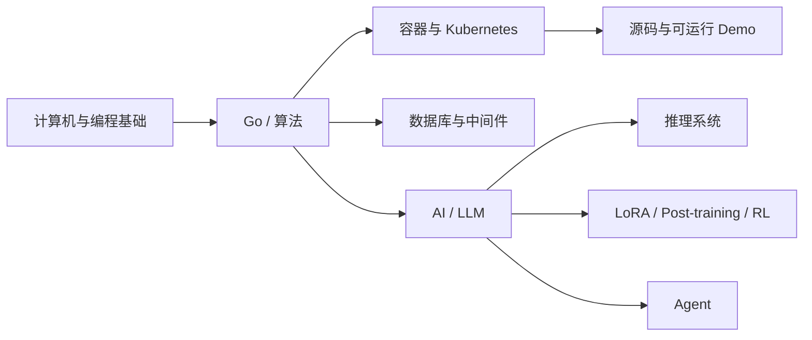

# Learning Notes

这是一个按知识领域组织的个人技术学习笔记库，兼容 Obsidian 与 GitHub 阅读。正文以理解机制、动手验证和形成可复用知识为目标；面试题只是复习视图，不再决定整个仓库的组织方式。

## 从这里开始

第一次进入某个领域，先打开对应的 `README.md`。领域 MOC 负责阅读顺序和完整清单；根 README 只维护一级入口。

## 知识领域

| 领域 | 入口 | 主要内容 |
| --- | --- | --- |
| AI / LLM | [AI 学习索引](ai/README.md) | LLM 基础、vLLM、SGLang、LoRA、Post-training、RL、Agent |
| Cloud Native | [云原生学习索引](cloud-native/README.md) | 容器、Kubernetes、源码、排障、可运行 Demo |
| Go | [Go 学习索引](go/README.md) | 语言机制、并发、Runtime 与源码导读 |
| Database | [数据库学习索引](database/README.md) | MySQL、Redis、PostgreSQL、Elasticsearch |
| Middleware | [中间件学习索引](middleware/README.md) | Kafka、NATS、Canal、分布式事务 |
| Algorithm | [算法学习索引](algorithm/README.md) | 搜索、排序、动态规划、数据结构、字符串与常用技巧 |
| Misc | [工具笔记](misc/README.md) | 终端与零散工具知识 |

## 三条建议路线

### 云原生与 Kubernetes

容器基础 → Kubernetes 基础 → 控制面/节点 → 网络/存储 → 组件拆解 → 源码导读 → Demo 与排障。详细入口见 [Kubernetes 学习索引](cloud-native/kubernetes/README.md)。

### Go 深入

Slice/Map/Interface → Context/Channel → GMP/GC → 当前版本源码 → 版本实现对比。源码层入口见 [Go Runtime 源码索引](go/internals/README.md)。

### AI 与 LLM

Token/Transformer → 推理完整链路 → vLLM/SGLang → LoRA/QLoRA → SFT/DPO → PPO/GRPO → Agent。详细入口见 [AI 学习索引](ai/README.md)。

## 仓库约定

- 顶层目录按知识领域划分，不再使用跨领域的“学习计划”大桶。
- 每个知识文件只有一个 canonical 归属；路线、源码、Demo 和题库通过领域内子目录表达。
- 普通知识笔记使用全局唯一的英文 kebab-case 文件名，保证 `[[wikilink]]` 能唯一解析。
- MOC、知识笔记、源码导读、学习路线、Demo 手册和题库使用不同模板，不强迫所有文档都包含相同章节。
- 所有正式学习题都提供默认折叠的参考答案，便于先主动回忆再展开核对；任务清单不伪装成题目。
- 结构检查运行：`python3 scripts/validate_notes.py`。

完整目录职责与写作规范见 [仓库架构](docs/architecture.md) 和 [AGENTS.md](AGENTS.md)。
