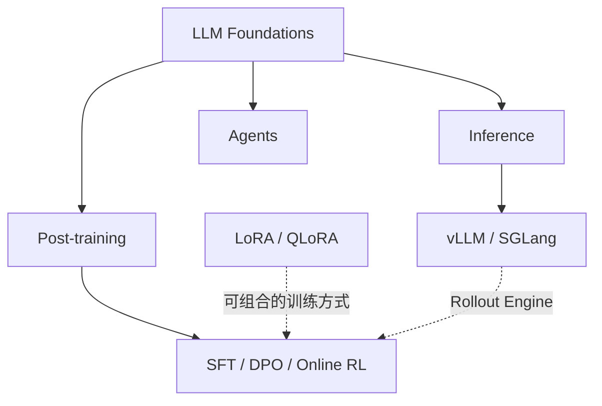

# AI 学习索引

> ⬆ 返回 [知识库首页](../README.md)

AI 内容按“基础 → 推理 / 后训练 / Agent”组织。vLLM/SGLang 是推理系统；LoRA/QLoRA 是可组合的参数高效训练方法；SFT、DPO 和 Online RL 是不同的 Post-training 目标与数据闭环。

## 目录入口

| 方向    | 入口                                           | 内容                                              |
| ----- | -------------------------------------------- | ----------------------------------------------- |
| 基础    | [LLM Foundations](foundations/README.md)     | 零基础路线、Token、Transformer、模型生命周期                  |
| 推理    | [LLM Inference](inference/README.md)         | Prefill/Decode、KV Cache、vLLM、SGLang、分布式推理       |
| 后训练   | [LLM Post-training](post-training/README.md) | LoRA/QLoRA、SFT、DPO、Reward Model、PPO、GRPO        |
| Agent | [Agent](agents/README.md)                    | RAG、Tool Calling、Planning、Graph Workflow、生产化与源码 |
| 实验    | [AI Experiments](experiments/README.md)      | 可离线运行的机制实验，以及未实测的推理服务基准脚本                       |

## 推荐顺序

1. 先完成 [LLM 零基础学习路线](foundations/llm-learning-path.md)。
2. 想做服务和 AI Infra，进入 [推理方向](inference/README.md)。
3. 想训练和对齐模型，进入 [后训练方向](post-training/README.md)。
4. 想构建应用与工作流，进入 [Agent 方向](agents/README.md)。

三个方向可以交叉，但不要跳过基础数据流。完成标准是能解释、运行最小实验并观察关键指标，而不是只读完文档。
