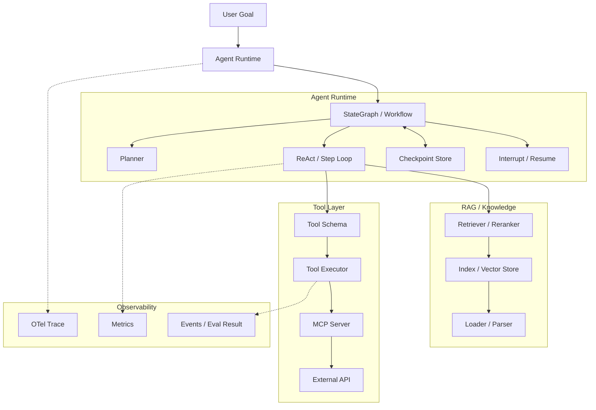
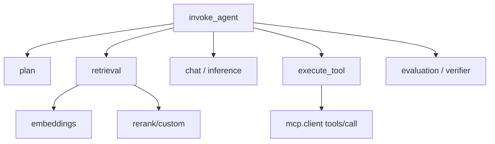
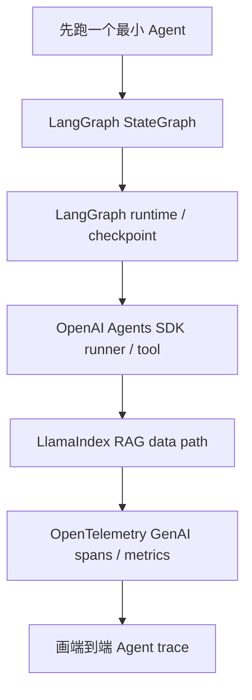

#ai #agent #rag #源码导读

相关笔记：[[agent-development-learning-path]] | [[production-agent-development]] | [[llm-inference-learning-path]] | [[llm-inference-pipeline]] | [[prefill-cache-miss]] | [[k8s-development-roadmap]]

# Agent 开发框架源码导读

## 概述

本篇是 **Agent 开发框架源码导读**，目标不是把每个框架都读完，而是抓住生产 Agent 的共同骨架：**状态图 / loop runtime / tool schema / handoff / checkpoint / observability**。读源码时按“一个主线 + 三个对照”推进：

1. **主线：LangGraph**。看清楚 `StateGraph -> compile -> runtime -> checkpoint -> interrupt/resume` 这条链路，理解为什么生产 Agent 更像状态机而不是普通 chain。
2. **对照一：OpenAI Agents SDK**。看 `Agent / Runner / Tool / Handoff / Guardrail / Trace` 如何被组织成轻量 runtime。
3. **对照二：LlamaIndex**。看 RAG-first 框架里 `Document -> Node -> Index -> Retriever -> QueryEngine / AgentWorkflow` 的数据链路。
4. **对照三：OpenTelemetry GenAI semantic conventions**。看 Agent、LLM、tool、MCP 在 trace / metrics / events 里应该怎么命名和关联。

> 源码路径以 2026-06 官方 GitHub 仓库 `main` 为参照。AI Agent 生态变化很快，读之前先确认目录是否移动；但抽象层次基本稳定：graph runtime、tool execution、state persistence、observability。

## 源码目录结构

| 项目 | 仓库 | 重点路径 | 看什么 |
| --- | --- | --- | --- |
| LangGraph | `github.com/langchain-ai/langgraph` | `libs/langgraph/langgraph/graph/` | `StateGraph`、节点、边、条件分支 |
| LangGraph | `github.com/langchain-ai/langgraph` | `libs/langgraph/langgraph/pregel/` | graph 编译后的执行引擎、step、stream |
| LangGraph | `github.com/langchain-ai/langgraph` | `libs/checkpoint/langgraph/checkpoint/` | checkpoint、thread、恢复执行 |
| LangGraph | `github.com/langchain-ai/langgraph` | `libs/langgraph/langgraph/types.py`、`runtime.py` | command、interrupt、runtime 上下文 |
| OpenAI Agents SDK | `github.com/openai/openai-agents-python` | `src/agents/agent.py` | Agent 定义、instructions、tools、handoffs |
| OpenAI Agents SDK | `github.com/openai/openai-agents-python` | `src/agents/run.py` | run loop、model response、tool 调用推进 |
| OpenAI Agents SDK | `github.com/openai/openai-agents-python` | `src/agents/tool*.py` | function tool、tool schema、tool context |
| OpenAI Agents SDK | `github.com/openai/openai-agents-python` | `src/agents/guardrail*.py`、`tracing/` | guardrail 与 trace |
| LlamaIndex | `github.com/run-llama/llama_index` | `llama-index-core/llama_index/core/agent/` | Agent 与 AgentWorkflow |
| LlamaIndex | `github.com/run-llama/llama_index` | `llama-index-core/llama_index/core/indices/` | index 构建与查询入口 |
| LlamaIndex | `github.com/run-llama/llama_index` | `llama-index-core/llama_index/core/retrievers/` | retriever 抽象与 query 流程 |
| LlamaIndex | `github.com/run-llama/llama_index` | `llama-index-core/llama_index/core/callbacks/` | 观测与回调 |
| OpenTelemetry GenAI | `github.com/open-telemetry/semantic-conventions-genai` | `docs/gen-ai/gen-ai-spans.md` | LLM inference / embedding / retrieval / tool span |
| OpenTelemetry GenAI | `github.com/open-telemetry/semantic-conventions-genai` | `docs/gen-ai/gen-ai-agent-spans.md` | `invoke_agent`、`plan`、`invoke_workflow` |
| OpenTelemetry GenAI | `github.com/open-telemetry/semantic-conventions-genai` | `docs/gen-ai/gen-ai-metrics.md` | token、duration、TTFT、tool duration |
| OpenTelemetry GenAI | `github.com/open-telemetry/semantic-conventions-genai` | `docs/gen-ai/mcp.md` | MCP trace context propagation |

## 整体架构



源码阅读要盯住五个问题：

1. **状态在哪里**：messages、plan、tool results、approval、final answer 放在哪个 state 结构里。
2. **下一步怎么决定**：graph edge、conditional edge、model tool call、handoff 谁负责推进。
3. **工具怎么约束**：schema 怎么生成，参数怎么校验，执行失败怎么反馈给 loop。
4. **失败怎么恢复**：checkpoint 粒度是什么，interrupt 后怎么 resume。
5. **怎么观测**：trace / callback / span / metrics 在哪一层插入，是否采集敏感内容。

## 一、LangGraph：状态图与执行引擎

### 1.1 先读 `graph/`：StateGraph 是用户 API

LangGraph 的入口不是“让模型自己决定所有事”，而是开发者显式定义节点、边和状态。重点看：

| 路径 | 关注点 |
| --- | --- |
| `libs/langgraph/langgraph/graph/state.py` | `StateGraph` 如何定义 state schema、node、edge、conditional edge |
| `libs/langgraph/langgraph/graph/graph.py` | 普通 graph 抽象与 compile 流程 |
| `libs/langgraph/langgraph/graph/message.py` | message state 的聚合方式 |

面试要能说清楚：**LangGraph 的价值不是“比 LLM 更聪明”，而是把 Agent 的控制流显式化**。条件分支、循环、人审中断、恢复执行都从 prompt 里拿出来，变成可测试的代码结构。

### 1.2 再读 `pregel/`：编译后的 runtime

`StateGraph.compile()` 之后进入类似 Pregel 的 step runtime。重点看：

| 路径 | 关注点 |
| --- | --- |
| `libs/langgraph/langgraph/pregel/` | step 如何推进、节点如何执行、stream 如何输出 |
| `libs/langgraph/langgraph/channels/` | state/channel 如何在节点之间传递 |
| `libs/langgraph/langgraph/runtime.py` | runtime context 如何传给节点 |

要理解的不是每行实现，而是 runtime 不变量：

- 每轮 step 只推进当前可执行节点。
- 节点输出不是随便改全局变量，而是写入 state/channel。
- 条件边决定下一批节点。
- stream 让外部可以看到中间状态，而不是只等最终答案。

### 1.3 最后读 checkpoint / interrupt

生产 Agent 不能只会“一次性跑完”。长任务、人工确认、外部工具失败都要求能暂停和恢复。

| 路径 | 关注点 |
| --- | --- |
| `libs/checkpoint/langgraph/checkpoint/` | checkpoint 存什么，thread 怎么标识 |
| `libs/langgraph/langgraph/types.py` | `Command`、interrupt/resume 相关类型 |
| `libs/langgraph/langgraph/errors.py` | recursion limit、interrupt、graph 错误 |

**白板答案**：一个高风险工具调用前，graph 节点返回 interrupt；外部 UI 拿到 pending state，让人确认；确认后以同一个 thread/checkpoint resume，继续执行后续节点。

## 二、OpenAI Agents SDK：轻量 Agent Runtime

### 2.1 Agent 定义

先读 `src/agents/agent.py`：Agent 通常包含 instructions、model、tools、handoffs、guardrails、output type 等。这里要看清楚 Agent 是配置对象，不是执行循环本身。

| 关注点 | 面试问题 |
| --- | --- |
| instructions | system / developer instruction 怎么进入模型请求 |
| tools | function tool 怎么挂到 Agent 上 |
| handoffs | 一个 Agent 怎么把任务交给另一个 Agent |
| output type | 结构化输出失败怎么处理 |
| guardrails | 输入/输出约束在哪一层执行 |

### 2.2 Runner / Run Loop

再读 `src/agents/run.py`（如目录变动，以当前仓库搜索 `Runner` / `run` 为准）。重点看：

- 如何调用模型。
- 如何解析 model response 里的 tool call。
- tool result 如何作为 observation 回填给下一轮模型调用。
- max turns / error / handoff 如何终止或转移。

这条链路对应面试里的 ReAct loop：**model response 决定 action，tool result 变 observation，runner 决定是否继续下一轮**。

### 2.3 Tool / Guardrail / Tracing

| 路径 | 关注点 |
| --- | --- |
| `src/agents/tool*.py` | function tool、schema、参数校验、上下文 |
| `src/agents/guardrail*.py` | 输入/输出 guardrail 的插入点 |
| `src/agents/tracing/` | trace span 如何描述 agent、model、tool |
| `src/agents/mcp/` 或 MCP 相关文件 | MCP server tool 如何接入 |

**关键结论**：Agents SDK 的源码适合看“轻量 runtime 怎么把模型、工具、handoff、trace 串起来”；LangGraph 更适合看“复杂状态机怎么显式建模”。

## 三、LlamaIndex：RAG-first 的 Agent

LlamaIndex 的价值在 RAG 数据链路。读它不要从 Agent 开始，而是先读文档、节点、索引、检索。

### 3.1 RAG 数据链路

| 路径 | 关注点 |
| --- | --- |
| `llama-index-core/llama_index/core/schema.py` | Document / TextNode / NodeWithScore 等核心数据结构 |
| `llama-index-core/llama_index/core/node_parser/` | 文档如何切成节点 |
| `llama-index-core/llama_index/core/indices/` | index 如何构建 |
| `llama-index-core/llama_index/core/retrievers/` | retriever 如何拿 query 找节点 |
| `llama-index-core/llama_index/core/query_engine/` | 查询结果如何合成答案 |

要能解释：**RAG 的核心不是“有向量库”，而是从文档解析、chunk、metadata、检索、rerank、context packing 到 citation 的完整数据路径**。

### 3.2 Agent / Workflow

读完 RAG 再看 `llama-index-core/llama_index/core/agent/`。重点关注：

- Agent 如何把 retriever / query engine 包装成 tool。
- AgentWorkflow 如何组织步骤。
- callback 如何记录中间事件。
- tool result 如何进入下一轮上下文。

## 四、OpenTelemetry GenAI：源码之外的可观测契约

OpenTelemetry 这里不是传统意义的“业务源码”，但它定义了 Agent 系统上线后最重要的观测契约。

| 文件 | 重点 |
| --- | --- |
| `docs/gen-ai/gen-ai-spans.md` | inference、embeddings、retrieval、memory、execute_tool spans |
| `docs/gen-ai/gen-ai-agent-spans.md` | create_agent、invoke_agent、invoke_workflow、plan spans |
| `docs/gen-ai/gen-ai-metrics.md` | token usage、operation duration、TTFT、TPOT、workflow/tool duration |
| `docs/gen-ai/gen-ai-events.md` | 输入输出详情、evaluation result events |
| `docs/gen-ai/mcp.md` | MCP 基于 JSON-RPC 的 trace context propagation |

### 4.1 一次 Agent 请求的 span tree



### 4.2 采集边界

必须默认采集：

- provider、model、operation name、agent name/version。
- token usage、latency、error.type、tool duration。
- retrieval top-k、candidate count、data source ID（低基数版本）。

默认不要采集：

- prompt 原文。
- output 原文。
- tool arguments 原文。
- 用户问题、用户 ID、完整文档 URI 这类高敏或高基数字段。

需要排障时，通过 opt-in event 或受控对象存储采集，并做脱敏、截断、TTL、审计。

## 五、源码阅读顺序



推荐顺序：

1. 跑一个最小 LangGraph demo：一个 planner 节点、一个 retriever 节点、一个 tool 节点、一个 verifier 节点。
2. 读 `StateGraph`：搞清楚 node / edge / conditional edge / state。
3. 读 checkpoint：搞清楚 thread、interrupt、resume。
4. 读 OpenAI Agents SDK runner：对照它如何处理 tool call / handoff。
5. 读 LlamaIndex retriever：补齐 RAG 数据链路。
6. 读 OpenTelemetry GenAI：给上面每个步骤设计 span 和 metrics。

## 六、手写简化复现

不用一上来复刻框架，手写 200 行足够：

```python
class State(dict):
    pass

def planner(state: State) -> State:
    state["plan"] = ["retrieve", "maybe_call_tool", "verify"]
    return state

def retrieve(state: State) -> State:
    state["contexts"] = search_docs(state["question"])
    return state

def decide(state: State) -> str:
    if needs_tool(state):
        return "tool"
    return "verify"

def tool(state: State) -> State:
    state["tool_result"] = call_tool(state["tool_input"], idempotency_key=state["trace_id"])
    return state

def verify(state: State) -> State:
    state["final"] = answer_with_citations(state)
    return state
```

复现目标：

- state 明确传递，不用全局变量。
- conditional edge 决定下一步。
- tool 调用有 timeout、schema、idempotency key。
- 每个节点创建一个 span。
- 人工确认用 interrupt/resume 模拟。

## 面试要点

### Q: LangGraph 源码最该先读哪里？

> [!question]- 参考答案（点击展开）
>
> 先读 `graph/` 里的 `StateGraph`，理解用户如何声明 state、node、edge、conditional edge；再读 `pregel/` 看 compile 后的 step runtime；最后读 checkpoint / interrupt，理解长任务如何暂停和恢复。不要一开始陷进所有内部实现，先抓住“显式状态图”这个主线。

### Q: OpenAI Agents SDK 和 LangGraph 的源码关注点有什么不同？

> [!question]- 参考答案（点击展开）
>
> OpenAI Agents SDK 更适合看轻量 Agent runtime：Agent 配置、Runner 循环、tool call、handoff、guardrail、tracing 怎么串起来。LangGraph 更适合看复杂工作流：状态图、条件边、checkpoint、人审中断、恢复执行。前者偏“模型工具运行时”，后者偏“可控状态机”。

### Q: 为什么 LlamaIndex 要先读 RAG 数据链路，再读 Agent？

> [!question]- 参考答案（点击展开）
>
> 因为 LlamaIndex 的核心优势是 data / RAG。Agent 只是把 retriever、query engine、tool 包装进决策循环。如果不先理解 Document、Node、Index、Retriever、QueryEngine，直接看 Agent 会看不到它真正解决的问题。

### Q: Agent 源码里怎么判断一个框架是否适合生产？

> [!question]- 参考答案（点击展开）
>
> 看五件事：状态是否显式、工具 schema 是否严格、是否支持 checkpoint / resume、是否能插入人审、是否有 trace / callback / metrics。只会跑 prompt 和 tool call，但没有状态恢复和观测边界的框架，上生产会很难排障。

### Q: OpenTelemetry GenAI 规范在 Agent 源码导读里有什么价值？

> [!question]- 参考答案（点击展开）
>
> 它给了跨框架的观测语言。无论你用 LangGraph、OpenAI Agents SDK 还是 LlamaIndex，都可以把一次任务拆成 `invoke_agent -> plan -> retrieval -> chat -> execute_tool -> verifier`，再统一采集 token、latency、error、tool duration。这样框架不同，排障视角仍然一致。

### Q: 读 Agent 框架源码时最容易踩的坑是什么？

> [!question]- 参考答案（点击展开）
>
> 最大的坑是把框架 API 当成核心。真正要读的是控制流和状态流：下一步谁决定、工具结果怎么回填、失败怎么重试、状态怎么持久化、trace 怎么串起来。API 名字会变，但这些不变量才是面试和工程里最有价值的部分。

## 参考资料

- LangGraph source: <https://github.com/langchain-ai/langgraph>
- OpenAI Agents SDK source: <https://github.com/openai/openai-agents-python>
- LlamaIndex source: <https://github.com/run-llama/llama_index>
- Microsoft Agent Framework source: <https://github.com/microsoft/agent-framework>
- OpenTelemetry GenAI semantic conventions: <https://github.com/open-telemetry/semantic-conventions-genai>
