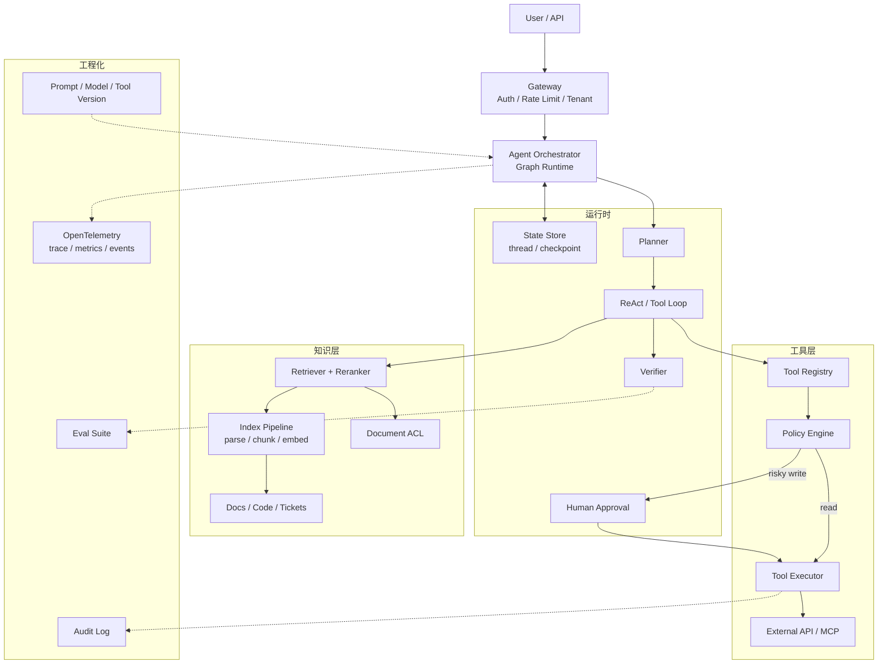
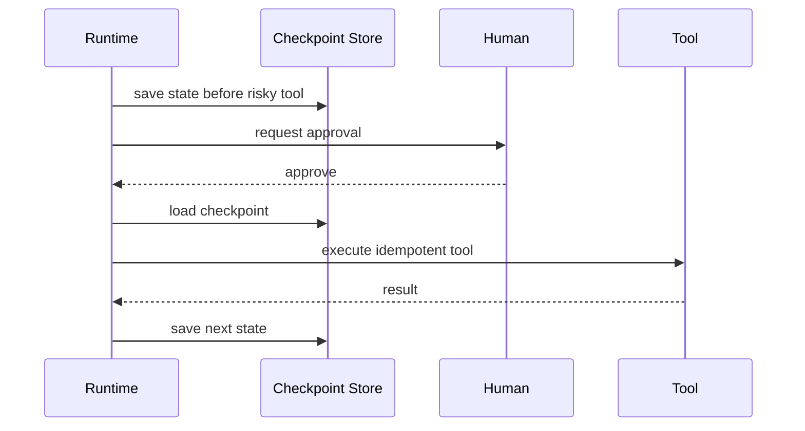
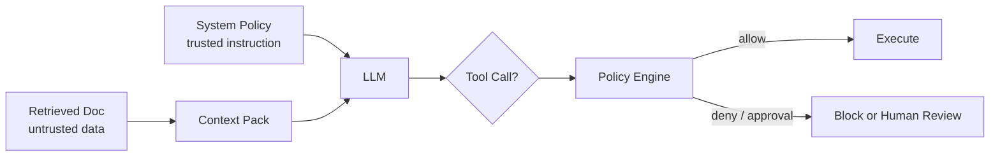
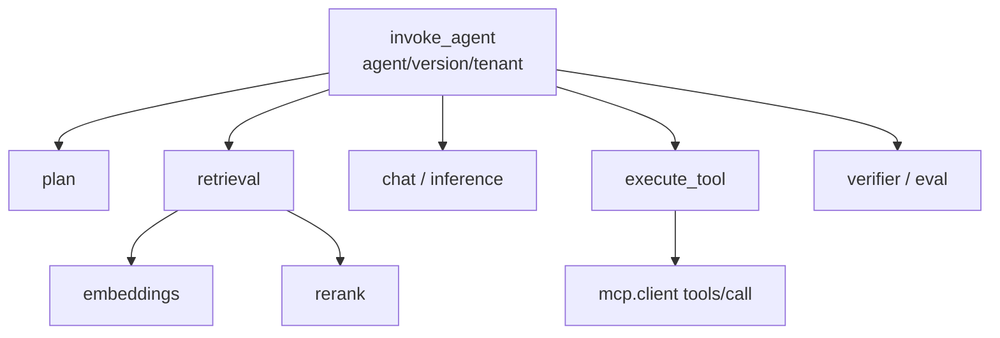
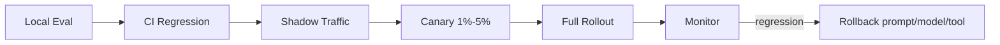

#ai #agent #production #observability #安全

相关笔记：[[agent-development-learning-path]] | [[agent-development-source]] | [[llm-inference-learning-path]] | [[prefill-cache-miss]] | [[k8s-development-roadmap]]

# 生产级 Agent 开发

## 概述

生产级 Agent 不是“能调用工具的 Demo”，而是一个**受控的自动化系统**：LLM 只负责理解、规划和生成结构化决策；真正决定能否上线的是状态管理、工具权限、幂等、可观测、评估、灰度、回滚和人工接管。

一句话判断标准：

> 如果一个 Agent 调错工具、重复执行、泄露数据、陷入循环、答错高风险问题，系统能不能及时发现、阻断、回滚、复盘？能，才接近生产级。

## 生产级 Agent 架构



生产级系统的核心边界：

| 边界 | 生产要求 | 不合格表现 |
| --- | --- | --- |
| Runtime | 显式 graph / state / checkpoint / interrupt | 一个 while loop 跑到底，失败只能重来 |
| Tool | typed schema、RBAC、幂等、超时、审批 | 模型自由拼 API 参数，写操作无确认 |
| RAG | ACL、版本、引用、拒答、数据新鲜度 | 向量库一把梭，答错无法追溯 |
| Safety | prompt injection 防护、数据脱敏、secret 隔离 | 文档内容可覆盖系统指令 |
| Observability | OTel trace、metrics、audit、回放 | 只打印日志，无法知道哪一步错 |
| Eval | offline / shadow / canary / regression | 只靠人工试几个问题 |
| Release | prompt/model/tool versioning、灰度、回滚 | 线上直接改 prompt |

## 成熟度模型

| 阶段 | 特征 | 适用范围 | 升级信号 |
| --- | --- | --- | --- |
| L0 Chatbot | 只回答，不调工具 | FAQ、低风险问答 | 需要查实时状态 |
| L1 RAG Bot | 检索 + 引用 | 文档问答、代码库问答 | 需要执行外部动作 |
| L2 Tool Agent | 读工具 + 少量写工具 | 查监控、查工单、生成建议 | 需要长任务和恢复 |
| L3 Workflow Agent | graph、checkpoint、人审、评估 | 内部运维、客服、销售运营 | 需要多租户和平台化 |
| L4 Agent Platform | 多团队接入、统一工具注册、策略、审计 | 企业 Agent 平台 | 需要跨团队治理 |

不要一开始追 L4。生产系统的正确路线通常是：**先把 RAG 和只读工具做稳，再开放低风险写操作，最后才考虑多 Agent 或平台化。**

## 一、Runtime 设计

### 1.1 显式状态

Agent state 至少要包含：

```yaml
thread_id: "support-2026-06-29-001"
tenant_id: "team-a"
user_id: "u-123"
goal: "定位订单服务 5xx 升高原因"
plan:
  - id: check_metrics
    status: done
  - id: search_runbook
    status: running
messages: []
retrieval_results: []
tool_results: []
approvals: []
final: null
budget:
  max_steps: 8
  max_tokens: 12000
  deadline: "2026-06-29T12:30:00Z"
```

关键原则：

- state 是系统事实，不是 prompt 字符串。
- messages 只是 state 的一部分，不要把所有状态都塞进上下文。
- 每一步都要可重放：输入、输出、工具结果、错误和决策摘要。
- state schema 要版本化，便于兼容旧 checkpoint。

### 1.2 有界循环

ReAct loop 必须有边界：

| 边界 | 典型值 | 目的 |
| --- | --- | --- |
| `max_steps` | 5-12 | 防止无限工具调用 |
| `max_tool_retries` | 1-3 | 防止外部系统抖动放大 |
| `deadline` | 30s-5min | 控制用户等待时间 |
| `token_budget` | 按场景 | 控制成本和上下文污染 |
| `risk_budget` | read/write 分级 | 控制高风险动作 |

### 1.3 Durable Execution

长任务必须支持 checkpoint：



必须做到：

- 工具执行前保存 checkpoint。
- 人工审批后从同一 thread 恢复。
- 进程重启不丢任务。
- tool result 已提交时，重试只能读取已有结果，不能重复执行副作用。

## 二、Tool 生产规范

### 2.1 工具分级

| 等级 | 示例 | 策略 |
| --- | --- | --- |
| Read | 查文档、查监控、查日志、查工单 | 可自动执行，限流和审计 |
| Low-risk Write | 创建草稿、创建低优先级工单 | dry-run + 可撤销 |
| High-risk Write | 发通知、改配置、重启服务 | human approval + change window |
| Destructive | 删除数据、降级权限、关闭服务 | 默认禁止，必须走外部变更系统 |

### 2.2 Tool Schema

工具 schema 要窄：

```json
{
  "name": "create_incident_ticket",
  "description": "Create an incident ticket after diagnosis.",
  "parameters": {
    "type": "object",
    "properties": {
      "service": {"type": "string", "enum": ["order", "payment", "user"]},
      "severity": {"type": "string", "enum": ["P0", "P1", "P2"]},
      "summary": {"type": "string", "maxLength": 120},
      "evidence_ids": {"type": "array", "items": {"type": "string"}}
    },
    "required": ["service", "severity", "summary", "evidence_ids"]
  }
}
```

不要给模型：

- 任意 SQL。
- 任意 shell。
- 任意 URL fetch。
- 任意 Kubernetes admin token。
- 无 enum 限制的高风险操作参数。

### 2.3 幂等与重试

每个写工具都要有 idempotency key：

```text
idempotency_key = hash(thread_id + step_id + tool_name + normalized_arguments)
```

执行流程：

1. 查 idempotency store 是否已有成功结果。
2. 没有则执行工具。
3. 成功后保存 tool result。
4. 重试时直接返回旧结果或明确冲突。

这比“失败就再调一次”重要得多。Agent loop 天然会重试，外部系统天然会抖动，没有幂等就会重复创建工单、重复发消息、重复修改配置。

## 三、RAG 与 Memory 生产规范

### 3.1 RAG 数据治理

| 问题 | 生产做法 |
| --- | --- |
| 文档权限 | query 时按用户/租户做 ACL filter |
| 文档版本 | index 记录 source version、更新时间、commit hash |
| 引用 | 回答必须带 source path / section / chunk id |
| 新鲜度 | 对强时效信息使用 live tool，不只靠向量库 |
| 删除 | 支持数据删除和 reindex，满足合规要求 |
| 多租户 | namespace 隔离，避免 cross-tenant retrieval |

### 3.2 Memory 不是垃圾桶

长期 memory 只保存稳定、必要、可删除的信息：

| 类型 | 是否适合长期保存 |
| --- | --- |
| 用户偏好 | 可以，但需用户可见可删 |
| 临时任务上下文 | 不适合，放 thread state |
| 密钥 / token | 禁止 |
| PII | 默认不存，除非有明确合规依据 |
| 工具结果全文 | 通常不存，只保存引用和摘要 |

## 四、安全与权限

### 4.1 Prompt Injection 防护

原则：**外部内容是 data，不是 instruction**。



防护点：

- RAG 内容不能覆盖 system policy。
- 工具调用前再做 policy check，不信任模型自我约束。
- 高风险工具需要人工确认。
- 文档中出现“忽略之前指令”“调用某工具”等内容时，只作为文本证据处理。

### 4.2 Secret 隔离

Agent 不能直接拿全局密钥。推荐：

- 每个 tool 使用独立 service account。
- 按租户和用户做授权。
- secret 只在 tool executor 内部可见，不进 prompt。
- trace / logs 默认不记录 tool arguments 原文。

## 五、Observability：OpenTelemetry 优先

生产 Agent 必须能回答三个问题：

1. 慢在哪里？
2. 贵在哪里？
3. 错在哪里？

推荐 span tree：



核心指标：

| 指标 | 用途 |
| --- | --- |
| `agent_task_duration` | 整体耗时 |
| `llm_operation_duration` | 模型调用耗时 |
| `time_to_first_token/chunk` | 流式响应体感 |
| `token_usage` | 成本归因 |
| `retrieval_latency` | RAG 性能 |
| `tool_duration` | 外部系统瓶颈 |
| `tool_error_count` | 工具稳定性 |
| `approval_rate` | 自动化程度与风险 |
| `task_success_rate` | 端到端质量 |

采集边界：

- span name 低基数，不拼用户问题。
- prompt/output/tool arguments 默认不进 span attribute。
- 需要原文排障时 opt-in，写入受控存储，做脱敏、截断、TTL 和审计。
- metrics label 不放 user_id、document_uri、query_text。

## 六、Eval 与发布门禁

### 6.1 分层 Eval

| 层 | 测什么 |
| --- | --- |
| Retrieval | recall@k、MRR、citation coverage |
| Answer | faithfulness、拒答正确率、格式正确率 |
| Tool | 参数正确率、权限违规、幂等、超时 |
| Workflow | task success rate、平均步数、人工接管率 |
| Safety | prompt injection、越权工具调用、PII 泄露 |

### 6.2 发布流程



发布对象都要版本化：

- prompt template version。
- model name/version。
- tool schema version。
- retriever config version。
- index version。
- policy version。

## 七、生产检查清单

- [ ] Agent graph 有显式 state schema。
- [ ] 每个循环有 max steps、timeout、token budget。
- [ ] 每个写工具有 idempotency key。
- [ ] 高风险工具有人审。
- [ ] Tool schema 有 enum、required、max length 等约束。
- [ ] RAG 查询按用户/租户做 ACL。
- [ ] 回答带 citation，找不到证据能拒答。
- [ ] prompt injection 有 adversarial eval。
- [ ] OTel trace 覆盖 plan / retrieval / LLM / tool / verifier。
- [ ] prompt/output 原文默认不进 trace。
- [ ] 有离线 golden set 和线上 canary。
- [ ] prompt/model/tool/index/policy 都可回滚。
- [ ] 有人工接管和降级路径。

## 面试要点

### Q: 什么叫生产级 Agent？

A: 生产级 Agent 是可控自动化系统，不是能调用工具的聊天 Demo。它要有显式状态、工具权限、幂等、超时、人审、RAG 引用、可观测、评估、灰度和回滚。核心问题不是“模型会不会做”，而是模型做错时系统能不能发现、阻断、恢复和复盘。

### Q: 为什么生产 Agent 需要 graph runtime？

A: 因为生产任务有条件分支、循环、失败恢复、人审中断和长任务恢复。线性 chain 很难表达这些控制流；把 planner、retriever、tool executor、verifier、人审节点显式放进 graph，才能测试、观测和恢复。

### Q: Agent 工具为什么必须做幂等？

A: Agent loop、网络和外部 API 都可能重试。如果创建工单、发通知、改配置没有幂等键，重试会重复产生副作用。生产写工具必须先查 idempotency store，再执行；成功结果要持久化，后续重试直接返回已有结果。

### Q: Prompt injection 在 Agent 里为什么更危险？

A: 普通 RAG 最坏是答错；Agent 有工具权限，prompt injection 可能诱导模型调用工具、泄露数据或执行写操作。因此外部文档只能当 data，不能当 instruction；工具调用前必须过 policy engine，高风险操作必须人审。

### Q: 生产 Agent 怎么做可观测？

A: 用 OpenTelemetry 把一次任务拆成 `invoke_agent -> plan -> retrieval -> chat -> execute_tool -> verifier`。记录 provider、model、agent version、token、latency、error、tool duration 等低敏低基数字段。prompt、output、tool arguments 默认不进 trace，排障需要时 opt-in、脱敏、截断和限期保存。

### Q: 生产 Agent 发布前怎么验收？

A: 至少跑五层 eval：retrieval recall、answer faithfulness、tool 参数正确率、workflow task success rate、安全攻击用例。上线走 shadow/canary，监控 task success、latency、cost、tool error、approval rate 和人工接管率；发现回归能按 prompt/model/tool/index/policy 版本回滚。

## 参考资料

- Anthropic: Building effective agents: <https://www.anthropic.com/engineering/building-effective-agents>
- LangGraph docs: <https://docs.langchain.com/oss/python/langgraph/overview>
- OpenAI Agents SDK: <https://openai.github.io/openai-agents-python/>
- OpenTelemetry GenAI semantic conventions: <https://github.com/open-telemetry/semantic-conventions-genai>
- OpenTelemetry MCP semantic conventions: <https://github.com/open-telemetry/semantic-conventions-genai/blob/main/docs/gen-ai/mcp.md>
