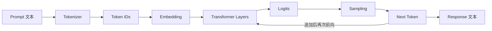
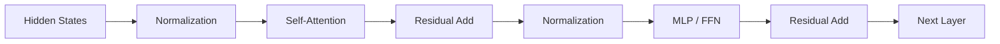
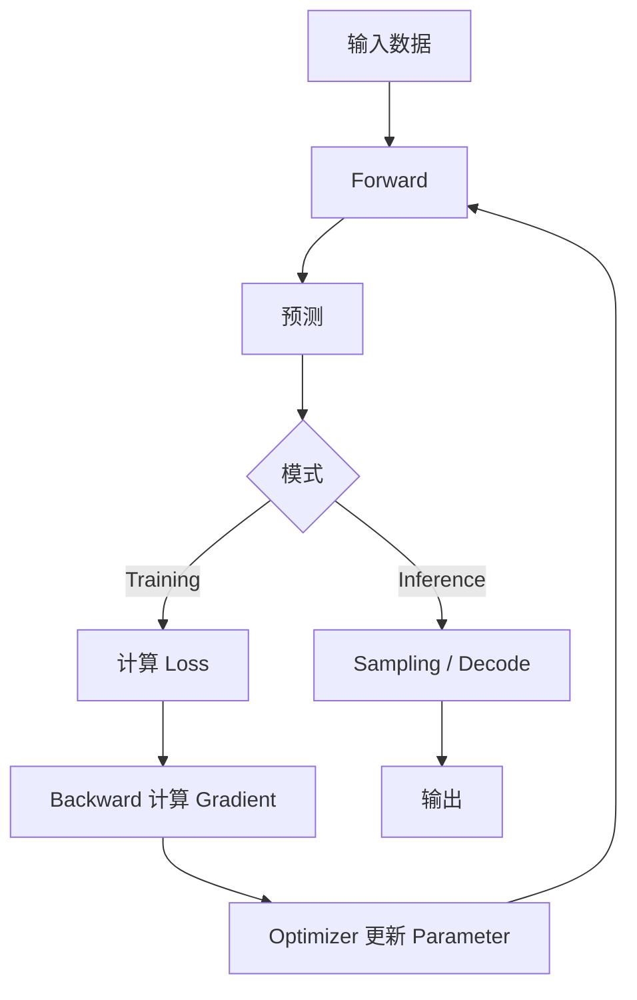

#ai #llm #transformer #基础概念

相关笔记：[[llm-learning-path]] | [[llm-inference-pipeline]] | [[lora-and-qlora]] | [[llm-post-training]] | [[llm-rl-fundamentals]]

# LLM 基础概念

## 概述

本笔记解释后续 LLM 推理与训练都会反复遇到的基础名词，并把它们串成一条真实的数据流。目标不是一次记住全部定义，而是每遇到一个对象，都知道它来自哪里、要去哪里。

## 一次文本生成的最小链路



## Text、Token 与 Tokenizer

**Text** 是人类看到的字符串。模型不能直接处理字符串，需要先通过 **Tokenizer** 切分并映射成整数。

> 基础名词：**Token** 是模型处理文本的基本单位。它可能是一个汉字、一个英文单词的一部分、标点或空格组合，不等同于“字”或“单词”。

> 基础名词：**Vocabulary** 是 Token 与整数 ID 的映射表。不同模型使用不同 Tokenizer，同一句话可能被切成不同数量的 Token。

例如“我爱 AI”可能经过概念化的映射：

```text
Text:      我爱 AI
Tokens:    ["我", "爱", " AI"]
Token IDs: [314, 926, 12041]
```

Token ID 本身没有大小语义，`12041` 并不比 `314`“更重要”，它只是词表中的编号。

## Tensor、Vector、Matrix 与 Parameter

> 基础名词：**Tensor** 是多维数字数组。标量是 0 维、向量是 1 维、矩阵是 2 维，更高维仍统称 Tensor。

> 基础名词：**Parameter** 是训练过程中会被更新的数字。模型所谓的“7B 参数”，表示大约有 70 亿个这类可学习数值。

模型权重通常以矩阵形式存在。一次 Linear 计算可以简化为：

```text
output = input × weight + bias
```

训练会更新 `weight`；普通推理只读取它。

## Embedding：把 ID 变成可计算表示

Token ID 只是索引。Embedding Table 根据 ID 查出一个向量：

```text
Token ID 314 → [0.12, -0.08, 0.44, ...]
```

> 基础名词：**Embedding** 是对象的稠密向量表示。语义或使用方式相近的 Token，经过训练后可能在向量空间中形成相近结构，但不能把单个维度直接解释成某个固定含义。

模型还需要知道 Token 的位置，因此会加入 Position Information，例如 Rotary Position Embedding（RoPE）。

## Transformer Block

LLM 通常由多层 Transformer Block 堆叠。简化后，每层包含：



### Self-Attention 与 Q/K/V

每个 Token 的隐藏向量会通过不同权重矩阵投影成 Query、Key、Value：

- **Query（Q）**：当前 Token 想从上下文查什么。
- **Key（K）**：每个历史 Token 提供的匹配索引。
- **Value（V）**：匹配后真正汇总的信息。

Attention 的核心关系可以先记成：

```text
Attention(Q, K, V) = softmax(QKᵀ / √d) V
```

先用 Q 与 K 算相关程度，再用这些权重对 V 加权求和。

> 基础名词：**Causal Mask** 禁止当前位置看到未来 Token。没有它，训练时模型会提前看到答案，无法学习自回归生成。

### MLP、Residual 与 Normalization

- **MLP/FFN**：对每个 Token 的表示独立做非线性变换。
- **Residual Connection**：把模块输入加回输出，帮助深层网络保留信息并稳定训练。
- **Normalization**：控制数值尺度，使多层训练更稳定。

Attention 主要负责 Token 之间的信息交互，MLP 主要负责对单个 Token 表示做变换，两者缺一不可。

## Logits、Softmax 与 Sampling

模型最后为词表中的每个 Token 输出一个原始分数，这组分数叫 **Logits**。

```text
Tokens: ["猫", "狗", "鱼"]
Logits: [3.2, 1.1, -0.5]
```

Softmax 把 Logits 转换成总和为 1 的概率分布。生成时还需要 Sampling Strategy：

| 参数 | 作用 | 直觉 |
| --- | --- | --- |
| `temperature` | 调整概率分布尖锐程度 | 越低越保守，越高越随机 |
| `top_k` | 只在概率最高的 K 个 Token 中采样 | 限制候选数量 |
| `top_p` | 选择累计概率达到 P 的最小候选集合 | 根据分布动态控制候选范围 |
| `max_tokens` | 限制最多生成多少新 Token | 防止无限生成并控制成本 |

`temperature=0` 在很多服务中表示近似确定性解码，但具体边界由实现决定。

## Base、Instruct、Chat 与 Reasoning Model

| 名称 | 主要特征 |
| --- | --- |
| Base Model | 主要完成 Pre-training，擅长续写但不一定遵循指令 |
| Instruct/Chat Model | 经 SFT 和对齐训练，更擅长按指令对话 |
| Reasoning Model | 经专门数据与 Post-training，倾向生成更长的推理过程或使用隐藏思考机制 |

模型名称只是入口，真正使用前还要检查 Chat Template、Tokenizer、推理参数与许可协议。

## Training 与 Inference



> 基础名词：**Loss** 是预测与训练目标之间差异的数值表达。训练要最小化 Loss，但 Loss 更低不保证真实任务一定更好。

> 基础名词：**Gradient** 表示每个参数朝哪个方向改变能让 Loss 下降。Backward 负责计算梯度，Optimizer 根据梯度更新参数。

> 基础名词：**Learning Rate** 控制每次更新幅度。过大可能训练发散，过小可能学习太慢或停滞。

普通推理不会执行 Backward 和参数更新，因此显存与计算需求通常低于训练，但长上下文的 KV Cache 仍可能占用大量显存。

## 模型文件与服务

- **Model Weights**：训练得到的参数。
- **Model Config**：层数、隐藏维度、Attention Heads 等结构配置。
- **Tokenizer Files**：词表与切分规则。
- **Checkpoint**：某个训练时刻保存的权重与相关状态。
- **Adapter**：LoRA 等方法额外训练的小规模参数，通常依赖 Base Model。
- **Inference Server**：加载模型文件并通过 API 接收请求的进程，例如 vLLM 或 SGLang。

“下载了模型”和“模型服务可调用”是两个不同状态。

## 自检清单

- [ ] 能解释 Token 与单词的区别。
- [ ] 能说明 Token ID 为什么要先变成 Embedding。
- [ ] 能用一句话说明 Q、K、V 各自作用。
- [ ] 能区分 Logits、Probability 和最终 Token。
- [ ] 能解释 Training 为什么需要 Loss、Gradient 和 Optimizer。
- [ ] 能区分 Checkpoint、Adapter 与 Inference Server。

## 面试要点

### Q：LLM 为什么不能直接处理字符串？

A：GPU 上的神经网络执行数值计算。Tokenizer 先把字符串转换为 Token IDs，Embedding Table 再把 ID 映射成连续向量，后续 Transformer 才能对这些向量做矩阵运算。

### Q：Attention 中 Q、K、V 的直觉是什么？

A：Q 表示当前位置的查询，K 表示上下文中每个位置可被匹配的索引，V 表示真正被聚合的信息。Q 与 K 的相似度决定对每个 V 赋予多大权重。

### Q：训练与推理的核心区别是什么？

A：训练包含 Forward、Loss、Backward 和 Optimizer 更新，目标是改变参数；推理通常只执行 Forward 与自回归 Decode，目标是使用固定参数生成结果。
