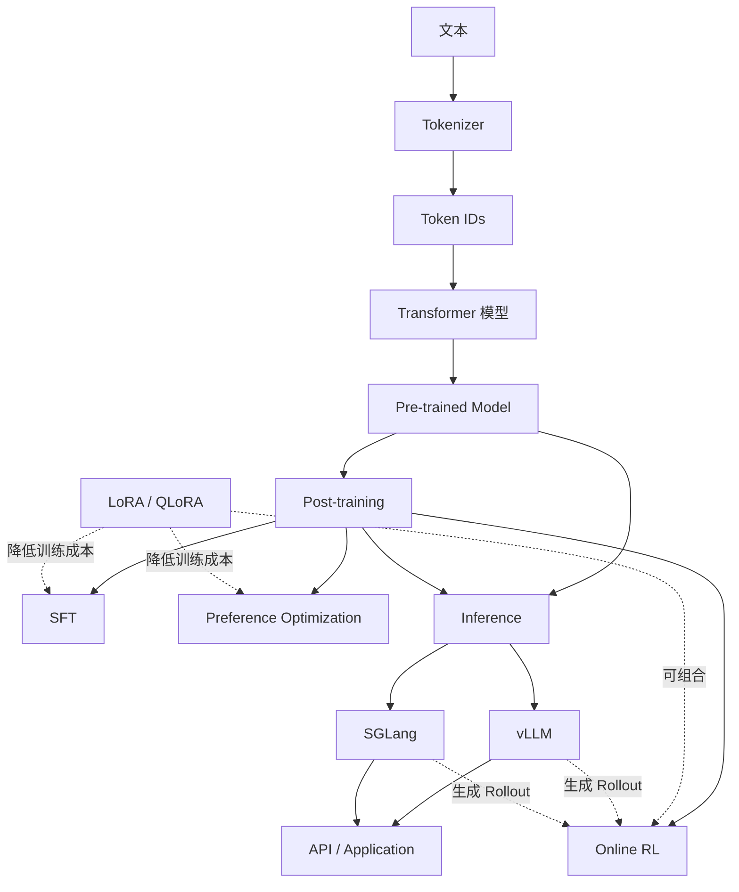
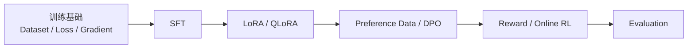

#ai #llm #学习路线 #vllm #sglang #lora #post-training #rl

相关笔记：[[llm-fundamentals]] | [[llm-inference-pipeline]] | [[vllm-and-sglang]] | [[lora-and-qlora]] | [[llm-post-training]] | [[llm-rl-fundamentals]] | [[llm-inference-learning-path]]

# LLM 零基础学习路线

## 概述

这是一条面向零基础读者的 LLM 学习主线。目标不是先记住工具名称，而是理解一个模型从“文本如何变成数字”，到“如何训练、微调、生成、评测和部署”的完整生命周期。

vLLM、SGLang、LoRA 和 RL 不属于同一层：vLLM/SGLang 是推理与生成系统，LoRA 是参数高效训练方法，RL 是 Post-training 中的一类优化方法。先建立分类，再选择方向，可以避免把命令、算法和系统概念混在一起。

## 全局知识地图

## 阶段 0：建立最小数学与工程直觉

不要求先学完整高等数学，但需要知道下面这些词在做什么：

| 名词 | 最小理解 |
| --- | --- |
| 向量 | 一组有顺序的数字，可以表示一个 Token 的特征 |
| 矩阵 | 多组向量组成的二维数字表，模型大量计算都是矩阵乘法 |
| 概率 | 模型对“下一个 Token 是什么”的不确定性表达 |
| 导数/梯度 | 参数往哪个方向变化能让 Loss 下降 |
| GPU | 擅长并行执行大量矩阵运算的设备 |
| 显存 | GPU 可直接高速访问的内存，模型权重、激活值和 KV Cache 都会占用它 |

**完成标准**：能解释“训练为什么需要梯度，推理为什么通常不需要梯度”。

## 阶段 1：文本如何进入模型

阅读 [[llm-fundamentals]]，依次理解：

1. Text → Token → Token ID。
2. Token ID → Embedding。
3. Embedding 如何经过多层 Transformer。
4. Logits 如何经过 Sampling 变成下一个 Token。
5. 为什么模型要重复这个过程才能生成一段文本。

这一阶段不要急着背 Attention 公式。先能沿着数据流说清每个对象的输入和输出，再补 Q、K、V 的计算关系。

**完成标准**：能画出“Prompt → Token IDs → Model → Logits → Token → Response”的流程。

## 阶段 2：区分模型生命周期

需要区分五件经常混用的事：

| 阶段 | 输入 | 模型发生什么变化 | 典型目标 |
| --- | --- | --- | --- |
| Pre-training | 大规模原始文本 | 更新全部或大量参数 | 学语言、知识和模式 |
| Continued Pre-training | 特定领域原始文本 | 继续做语言建模训练 | 补充领域知识与表达 |
| SFT | 指令与标准回答 | 学习遵循指令 | 把 Base Model 变成可对话模型 |
| Preference / RL | 偏好对、Reward 或环境反馈 | 调整回答策略 | 更符合偏好、约束或任务结果 |
| Inference | 用户输入 | 权重通常不更新 | 生成实际回答 |

> 基础名词：**Checkpoint** 是某一训练时刻保存的模型状态，通常包含权重和配置；它不是一个正在运行的服务。vLLM/SGLang 加载 Checkpoint 后，才把它变成可调用的推理服务。

**完成标准**：拿到一个需求时，能判断它需要 Prompt、RAG、SFT、LoRA、RL，还是只需要更好的推理服务。

## 阶段 3：先用最小模型完成一次推理

阅读 [[llm-inference-pipeline]]，先跑通一个小模型或已有推理 API，观察：

- 输入被切成多少 Token。
- `max_tokens`、`temperature`、`top_p` 如何影响输出。
- 非流式和流式返回有什么区别。
- 输入长度和输出长度分别如何影响延迟。
- TTFT 与 TPOT 各自对应哪个阶段。

**完成标准**：同一个 Prompt 分别用确定性参数和随机采样参数运行，能够解释结果为什么不同。

## 阶段 4A：推理系统分支

阅读 [[vllm-and-sglang]]，先做相同输入、相同模型的对照实验，再进入引擎内部：

1. vLLM/SGLang 各启动一个 OpenAI-compatible Server。
2. 记录 TTFT、TPOT、吞吐、显存占用。
3. 理解 Continuous Batching、KV Cache 和 Prefix Cache。
4. 对比 PagedAttention 与 RadixAttention 的设计目标。
5. 再进入 [[llm-inference-learning-path]] 学习调度器、分布式 KV、PD 分离与 Router。

**完成标准**：能够根据工作负载描述选择引擎和关键参数，而不是只比较未经控制的 benchmark 数字。

## 阶段 4B：训练与 Post-training 分支

训练分支按下面顺序学习：

先读 [[lora-and-qlora]]，再读 [[llm-post-training]]。LoRA 解决的是“哪些参数被训练、如何降低成本”，SFT/DPO/RL 解决的是“用什么训练目标改变模型行为”，两者可以组合。

**完成标准**：能解释“LoRA 不是一种数据集，也不是和 SFT 并列的训练阶段”。

## 阶段 5：RL for LLM

阅读 [[llm-rl-fundamentals]]，按以下依赖逐步推进：

1. Policy、Action、Reward、Trajectory。
2. Rollout、Return、Advantage。
3. Policy Gradient。
4. KL Divergence 与训练稳定性。
5. PPO 的 clipped objective。
6. GRPO 的组内相对优势。
7. Reward Hacking、长度偏置和评测泄漏。

不要从背 PPO/GRPO 公式开始。先把一个数学题训练任务映射成“问题 → 多个回答 → 自动判分 → 更新模型”的闭环。

**完成标准**：能解释为什么 Online RL 需要不断生成新回答，以及推理引擎为什么会出现在训练系统里。

## 阶段 6：端到端实践

选择一个小而可验证的任务，例如结构化问答或可自动判分的数学题：

1. 建立训练集、验证集和测试集。
2. 用 Base Model 建立基线。
3. 使用 SFT + LoRA 训练第一个 Adapter。
4. 选择 DPO 或 GRPO 做第二阶段训练。
5. 用未见过的测试集比较正确率、格式合规率与输出长度。
6. 用 vLLM 或 SGLang 部署最终模型。
7. 记录 TTFT、TPOT、吞吐和显存占用。

最终产出不是“模型启动成功”，而是一份可以复现的报告：数据版本、模型版本、训练参数、评测结果、服务参数和失败案例都能对应起来。

## 常见误区

- 先学框架命令，没理解模型生命周期，结果无法判断一个参数属于训练还是推理。
- 把 LoRA 当成一种训练目标；实际上它主要改变参数更新方式。
- 把 DPO、PPO、GRPO 都统称为 RL，忽略离线偏好优化与 Online RL 的数据生成差异。
- 用训练集评测，或者只看 Reward，不看真实任务指标和失败案例。
- 比较 vLLM/SGLang 时使用不同模型、精度、输入分布或并发，得出无效结论。

## 面试要点

### Q：vLLM、SGLang、LoRA 和 RL 分别处于哪一层？

> [!question]- 参考答案（点击展开）
>
> vLLM/SGLang 负责高性能推理与生成；LoRA 是参数高效训练方法；RL 是 Post-training 中根据 Reward 或环境反馈优化 Policy 的方法。Online RL 会调用推理引擎生成 Rollout，因此训练系统与推理系统会发生连接，但它们仍不是同一类技术。

### Q：零基础为什么不能直接从 vLLM 源码开始？

> [!question]- 参考答案（点击展开）
>
> 源码里的 Scheduler、KV Cache 和 Batch 管理都依赖对 Token、Prefill、Decode、显存和吞吐/延迟的理解。缺少这些数据流概念时只能记住类名，无法解释设计权衡。

### Q：如何判断自己真正学会了一个阶段？

> [!question]- 参考答案（点击展开）
>
> 至少做到三点：能用自己的话解释完整链路；能运行最小实验并观察关键指标；能说明一个参数变化为何导致结果变化。只阅读文档或成功启动进程不算完成。
