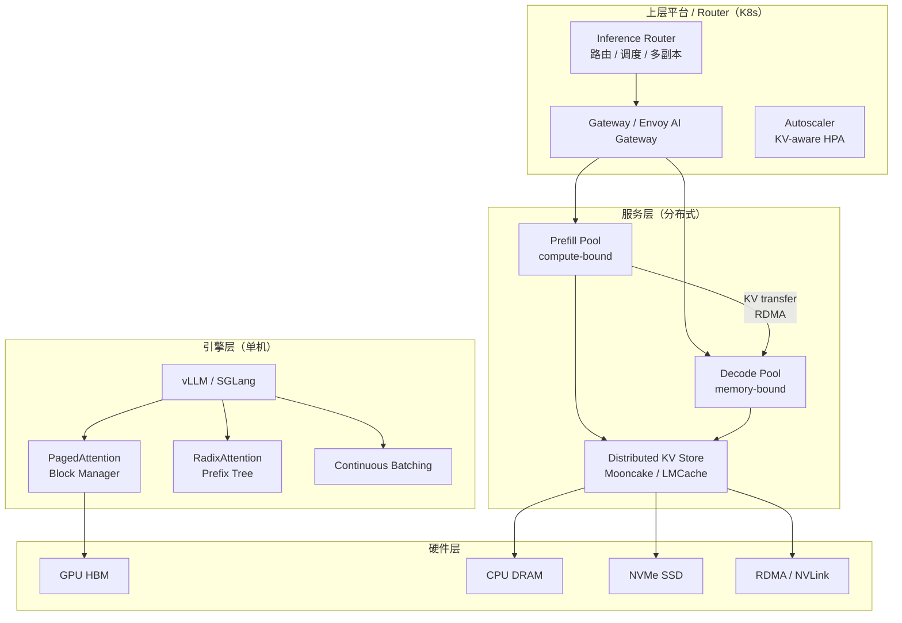
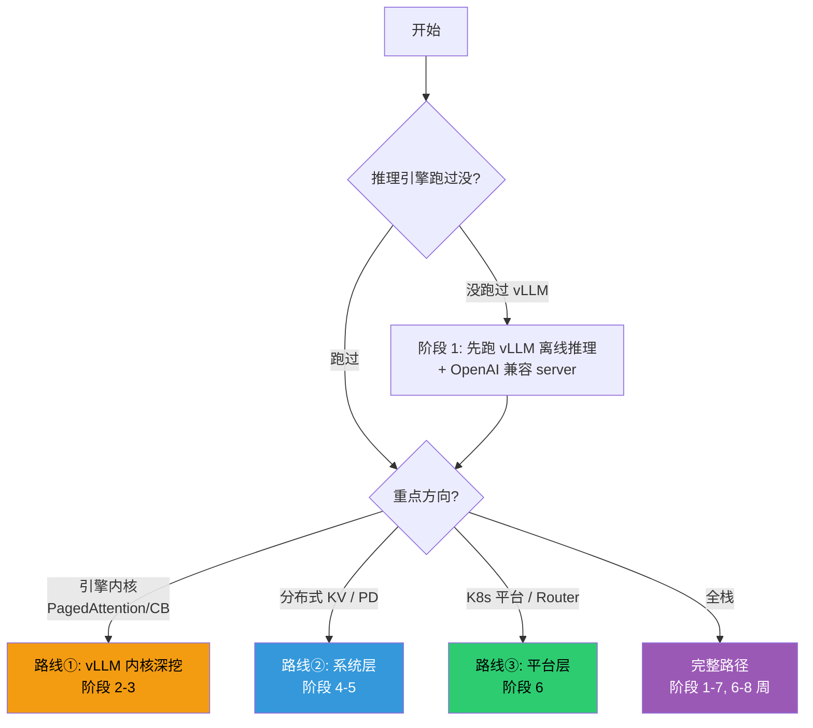
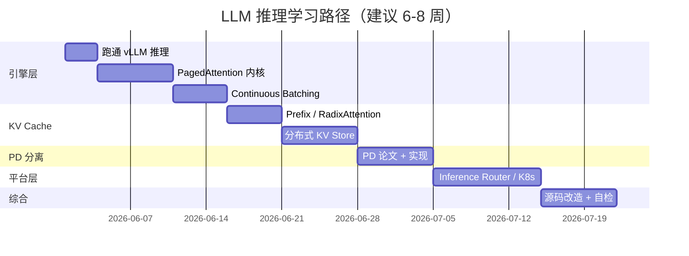
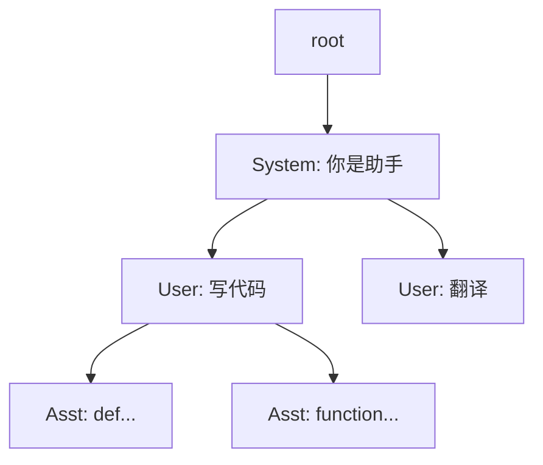
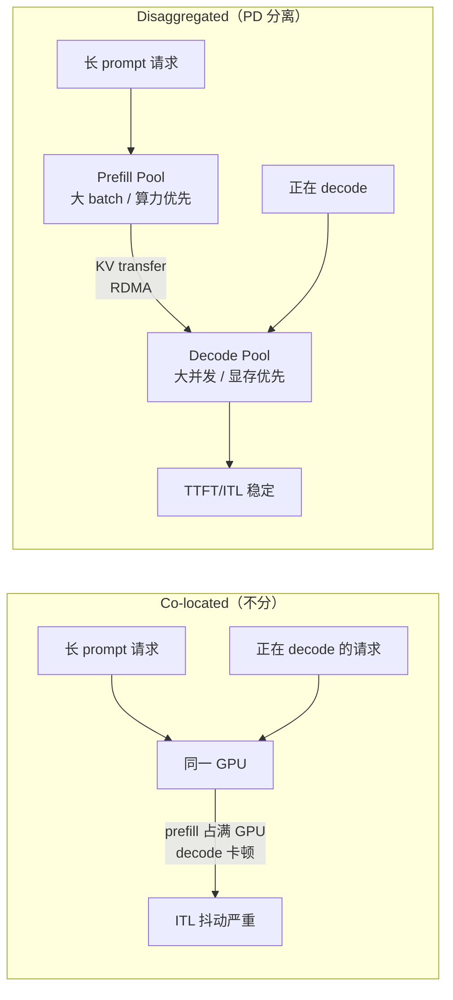

#ai #llm #inference #kv-cache #pd-disaggregation #router #学习计划

相关笔记：[[llm-inference-progress]] | [[llm-inference-pipeline]] | [[prefill-cache-miss]] | [[k8s-development-roadmap]] | [[hami-learning-path]] | [[scheduler-framework-source]] | [[gpu-scheduling-source]]

# LLM 推理系统学习路线

## 概述

LLM 推理系统的三件大事——**Inference Router（请求路由层）**、**KV Cache（显存最大的金山）**、**PD 分离（Prefill/Decode 解耦）**——是 2024 年以后大模型基础设施的核心战场。本笔记给一条「自下而上」的学习路径：先把单机推理引擎（vLLM / SGLang）的内部机制吃透，再上升到分布式 KV Cache 存储，最后落到 K8s 上的路由层与平台（llm-d / AIBrix / KServe / NVIDIA Dynamo / vLLM Production Stack）。

> 版本提示：推理引擎目录、配置项和默认值变化很快。本路线固定的是问题拆解与阅读顺序；执行源码练习时，以所选 release 的官方文档和代码为准，并在笔记中记录 commit 或版本号。

> 适用前提：你已经过 [[llm-inference-pipeline]]（Prefill/Decode/Prefix Cache 三件事），并且会读 K8s 源码（参考 [[k8s-development-roadmap]] 的 Phase 1-3）。如果只想做平台层、不深入引擎，可以从阶段 5 直接切入；想吃透引擎内部，按阶段 0-7 顺着走。

## 三个主题与你已有笔记的对应关系



| 主题 | 关键问题 | 已有笔记 | 难度 |
| --- | --- | --- | --- |
| Inference Router | 路由层怎么知道哪台机器有 KV cache？怎么 PD 分流？怎么做 KV-aware 负载均衡？ | [[scheduler-framework-source]] [[gpu-scheduling-source]]（K8s 调度类比） | ★★★ |
| KV Cache | PagedAttention 的 block 怎么分配？Prefix Cache 怎么命中？怎么做 GPU↔CPU↔SSD 的多级缓存？ | [[llm-inference-pipeline]] [[prefill-cache-miss]] | ★★★★ |
| PD 分离 | 为什么要分？分了之后 KV 怎么传？谁负责调度？ | 无（新知识） | ★★★★ |
| 引擎内部 | Continuous Batching 怎么并发不同长度的请求？speculative decoding 怎么用？ | [[llm-inference-pipeline]] | ★★★ |

三大主题里，Router 层最像 K8s 调度（[[scheduler-framework-source]] 的思路完全适用），KV Cache 和 PD 分离是全新知识，靠论文 + 真实仓库读出来。

## 你该走哪条路？（决策图）



- **路线①：引擎内核**——只关心 vLLM/SGLang 内部，做引擎贡献或自研引擎。走阶段 1-3 + 阶段 7 的源码改造。
- **路线②：系统层**——关心 PD 分离、分布式 KV、跨节点传输。走阶段 1（跑通） → 阶段 4-5。需要 RDMA 基础。
- **路线③：平台层**——做 K8s 上的推理平台、Inference Gateway、自动扩缩容。走阶段 1（跑通） → 阶段 6，引擎层只需理解输入输出契约。
- **完整路径**：全职 6-8 周 / 在职 12-16 周，所有阶段串起来——这是 AI Infra 岗位最完整的路径。

## 阶段清单



## 阶段 0：先决条件检查（半天）

下面这些不达标，后面看源码会一头雾水：

- ✅ 已读 [[llm-inference-pipeline]]：Prefill 计算密集 / Decode 内存带宽密集 / Prefix Cache 复用前缀 KV
- ✅ 已读 [[prefill-cache-miss]]：理解为什么 1 个 token 差异就 miss 全部缓存
- ✅ 知道 Transformer Attention 的 Q/K/V 计算公式（不需要会推导，知道 KV 是从输入投影出来的就行）
- ✅ 用过 OpenAI 兼容的 chat API（`/v1/chat/completions`）
- ✅ 知道一些基础概念：TTFT（首 token 延迟）、TPOT（每 token 延迟）、ITL（inter-token latency）、吞吐 vs 延迟的权衡
- ✅ 有一台 GPU 机器（消费卡 RTX 3090/4090 / 24GB 显存够跑 7B 模型，14B 以上模型需要 A100/H100）

**产出**：能用一句话解释清楚：「为什么 LLM 推理需要 KV Cache？没有 KV Cache 会怎样？」

---

## 阶段 1：跑通最小推理引擎（2-3 天）

**目标**：先让 vLLM 跑起来，体感「Prefill 慢、Decode 流式快」的实际差别。

### 1.1 vLLM 离线推理（30 分钟）

```python
from vllm import LLM, SamplingParams

llm = LLM(model="Qwen/Qwen2.5-7B-Instruct", gpu_memory_utilization=0.85)
out = llm.generate(
    ["介绍下 Kubernetes 的调度器"],
    SamplingParams(temperature=0.7, max_tokens=512),
)
print(out[0].outputs[0].text)
```

跑通之后，注意观察：
- 启动时打印的 `# GPU blocks: xxxxx`、`# CPU blocks: xxxxx` —— 这就是 **PagedAttention 的 block 池**，是 KV Cache 的物理单元
- 启动时打印的 `Maximum concurrency for X tokens per request: Y` —— 这是 block 池能支撑的最大并发

### 1.2 起 OpenAI 兼容 server

```bash
python -m vllm.entrypoints.openai.api_server \
    --model Qwen/Qwen2.5-7B-Instruct \
    --gpu-memory-utilization 0.85 \
    --max-model-len 8192 \
    --enable-prefix-caching
```

```bash
curl http://localhost:8000/v1/chat/completions \
  -H "Content-Type: application/json" \
  -d '{
    "model": "Qwen/Qwen2.5-7B-Instruct",
    "messages": [{"role": "user", "content": "你好"}],
    "stream": true
  }'
```

**第一次请求和第二次请求（同样的 prompt）的 TTFT 对比** —— 第二次因为 prefix cache 命中，TTFT 应该明显短。这就是 Prefix Cache 的实际效果，亲眼看到比读 10 篇论文记得牢。

### 1.3 看 metrics

```bash
curl http://localhost:8000/metrics | grep vllm
```

重点关注：
- `vllm:gpu_cache_usage_perc` —— GPU 上 KV cache 占用率
- `vllm:num_requests_running` / `vllm:num_requests_waiting` —— 正在处理 / 排队
- `vllm:prefix_cache_hit_rate` —— 前缀缓存命中率
- `vllm:time_to_first_token_seconds` —— TTFT 分布
- `vllm:time_per_output_token_seconds` —— TPOT 分布

这些指标后面 Router 层做调度决策时要用到，先眼熟。

### 1.4 同时跑 SGLang 对照

```bash
python -m sglang.launch_server \
    --model-path Qwen/Qwen2.5-7B-Instruct \
    --port 30000
```

vLLM 和 SGLang 都是主流开源推理引擎。PagedAttention 首先解决 KV Cache 的分页式物理内存管理，RadixAttention 强调共享前缀的索引与复用；两者关注层次不同，现代引擎也会相互吸收能力，不能把它们简单理解为互斥方案。早跑早对比，后面源码读起来才有抓手。

**产出**：
- 一份 benchmark 记录：vLLM/SGLang 对同一组 prompt 的 TTFT、TPOT、吞吐
- 解释为什么开了 `--enable-prefix-caching` 后第二次请求快

---

## 阶段 2：源码 1 — PagedAttention 与 Block Manager（5-7 天）

**目标**：读懂 vLLM 最核心的设计——把 KV Cache 切成定长 block 像虚拟内存一样管理。

### 2.1 论文：vLLM / PagedAttention (SOSP'23)

读论文：[Efficient Memory Management for Large Language Model Serving with PagedAttention](https://arxiv.org/abs/2309.06180)

核心思想：
- **传统问题**：KV cache 按 max_seq_len 预留连续显存，碎片严重（内部碎片 + 外部碎片），实际利用率经常 < 40%
- **PagedAttention**：KV 按固定大小 block（默认 16 token）切片存储，类比 OS 的 page，逻辑连续物理可分散
- **block table**：每个 sequence 维护一个 block table，记录逻辑 token 位置 → 物理 block 编号
- **CoW（Copy-on-Write）**：beam search / parallel sampling 时共享 block，写时复制

### 2.2 vLLM 源码切入

```bash
git clone https://github.com/vllm-project/vllm
cd vllm
```

**关键目录**：
- `vllm/core/block_manager.py` —— BlockManager（最核心）
- `vllm/core/block/` —— BlockPool、BlockAllocator
- `vllm/attention/backends/` —— FlashAttention / xformers / FlashInfer backend
- `vllm/worker/` —— Worker / ModelRunner
- `vllm/engine/llm_engine.py` —— 顶层调度
- `csrc/attention/paged_attention_v2.cu` —— CUDA kernel 实现

**阅读顺序**：
1. `LLMEngine.step()` —— 看一轮迭代干什么（Schedule → Execute → Process Output）
2. `Scheduler.schedule()` —— 选哪些 sequence 进这一轮、给它们分配 block
3. `BlockManager.allocate()` / `BlockManager.append_slot()` —— block 怎么分配 / 追加
4. `BlockManager.swap_in()` / `swap_out()` —— GPU 满了怎么换到 CPU

### 2.3 关键问题

读完应该能答：
- block size 为什么默认 16？改成 1 / 128 各有什么权衡？
- waiting / running / swapped 三个队列各自的角色？
- preemption（抢占）什么时候发生？recompute vs swap 怎么选？
- block table 在 attention kernel 里怎么用？（提示：indirect addressing，每读一个 token 先查 block table）

### 2.4 联系到你已学的

- BlockManager 的 free list + lookup table 设计 = OS page table 的简化版
- Scheduler 三队列状态机 = K8s scheduler activeQ/backoffQ/unschedulableQ 的同构思想（[[scheduler-framework-source]]）
- preemption 重算 vs 换出 = 缺页中断的 swap-in/swap-out

**产出**：
- 自己画一张 PagedAttention 的 block table 示意图（不抄论文）
- 解释清楚：一个 1024 token 的 sequence 进入引擎时，block manager 干了什么

---

## 阶段 3：源码 2 — Continuous Batching 与 Scheduler（3-5 天）

**目标**：读懂 vLLM 怎么把不同进度的请求拼成一个 batch。

### 3.1 论文：Orca (OSDI'22)

读论文：[Orca: A Distributed Serving System for Transformer-Based Generative Models](https://www.usenix.org/conference/osdi22/presentation/yu)

核心思想：
- **传统 static batching**：等齐 batch 里所有请求生成完才放下一批，慢的拖累快的
- **iteration-level scheduling（即 continuous batching）**：每个 iteration 决定哪些 seq 参与，刚生成完的立刻让位
- **selective batching**：Attention 算子在 sequence 维度做（不同 seq 长度不同，无法直接 batch），其他算子在 token 维度做

### 3.2 vLLM 调度循环

`vllm/core/scheduler.py` 的 `_schedule()`：

```python
# 伪代码（实际更复杂）
def schedule():
    # 1. 先把已 running 的请求拿出来（continuous batching 主场）
    running = self.running_queue.pop_all()
    # 2. 给 running 请求追加 block（每个请求需要 1 个新 token 的 slot）
    for seq in running:
        if not block_manager.can_append_slot(seq):
            # GPU 满了，preempt 一个低优先级的
            preempt(seq)
    # 3. 把 waiting 队列里能塞进来的新请求加入
    while waiting and block_manager.can_allocate(waiting[0]):
        running.append(waiting.pop(0))
    return running
```

**关键设计点**：
- prefill 和 decode 在同一个 batch 里跑吗？—— 早期 vLLM 是 chunked prefill（混跑），后来引入 PD 分离思路
- prefill chunk size 怎么定？—— `max_num_batched_tokens` 控制
- 长 prompt（比如 32k）怎么处理？—— chunked prefill，切成多个 chunk

### 3.3 关键问题

- chunked prefill 解决了什么问题？（提示：长 prompt 阻塞 decode 导致 ITL 抖动）
- max_num_seqs / max_num_batched_tokens 这两个旋钮分别控制什么？
- vLLM 的 throughput-first 模式和 latency-first 模式有什么参数差异？

**产出**：
- 画一张时序图：3 个不同长度的请求（短/中/长 prompt）在 continuous batching 下如何并行
- 解释为什么 chunked prefill 能改善 P99 ITL

---

## 阶段 4：KV Cache 进阶 — Prefix Cache 与 RadixAttention（3-5 天）

**目标**：理解多请求之间怎么复用 KV，不同引擎的不同思路。

### 4.1 vLLM 的 Prefix Caching

`vllm/core/block/prefix_caching_block.py`：
- 每个 block 计算一个 hash（基于 token id + 父 block hash）
- 哈希命中 → 直接复用物理 block，引用计数 +1
- evict 用 LRU，当显存满了驱逐引用计数为 0 的

读源码重点：
- `PrefixCachingBlockAllocator.allocate_immutable_block()` —— hash 命中怎么判定
- `compute_block_hash()` —— hash 怎么算（影响命中率，细微差别参考 [[prefill-cache-miss]]）

### 4.2 SGLang 的 RadixAttention

论文：[SGLang: Efficient Execution of Structured Language Model Programs](https://arxiv.org/abs/2312.07104)

**核心创新**：用 **Radix Tree（基数树）** 而不是哈希表组织 KV cache。
- 每个节点是一段 token 序列（不是单个 token）
- 共享前缀自动合并到同一路径
- match 操作是树上的最长前缀匹配，比 vLLM 的 block hash 更细粒度



读源码：`python/sglang/srt/mem_cache/radix_cache.py`

### 4.3 两种思路的本质差异

| 维度 | vLLM PagedAttention | SGLang RadixAttention |
| :--- | :--- | :--- |
| 物理单元 | 固定 size block（16 token） | 变长 segment |
| 共享判定 | block hash 精确匹配 | 树上最长前缀匹配 |
| 适合场景 | 通用，并发数高 | 多轮对话、prompt 模板分支多 |
| 实现难度 | 中 | 高（树维护 + 锁） |

### 4.4 关键问题

- 哪些场景 RadixAttention 命中率明显高于 Block Hash？
- prefix cache 在 多 LoRA 场景怎么处理？
- 如果两个请求 token id 完全一样但 sampling 参数不同，能共享 KV 吗？

**产出**：
- 跑一个对比实验：同样的 system prompt + 10 个不同 user query，记 vLLM/SGLang 各自的命中率与 TTFT
- 解释为什么 RadixAttention 适合 agent / 多轮场景

---

## 阶段 5：分布式 KV Cache Store（5-7 天）

**目标**：理解 KV cache 怎么扩展到 GPU↔CPU↔SSD↔对象存储多级，跨节点共享。

### 5.1 为什么要分布式 KV

单机 GPU 显存 80GB（H100），KV cache 占大头。两个核心问题：
1. **跨副本复用**：副本 A 算过的前缀，副本 B 收到相同 prompt 时也想复用，但 KV 在 A 的显存里
2. **超长上下文**：128k context 的 KV cache 一个 sequence 就 GB 级，要分层存储

### 5.2 LMCache

仓库：https://github.com/LMCache/LMCache

设计要点（按重要性排序）：
- **CPU offload**：GPU 显存满了的 block 下沉到 CPU DRAM
- **NVMe offload**：CPU 也满了下沉到 NVMe SSD
- **跨实例共享**：通过 redis/etcd 注册 KV 位置，副本间 CPU↔CPU 互拉
- **non-prefix sharing**：能在中间 chunk 复用 KV（论文 CacheBlend / CacheGen），不局限于前缀

读源码：
- `lmcache/lmcache_engine.py` —— 入口
- `lmcache/storage_backend/` —— 各级存储后端
- vLLM 集成：vLLM 0.7+ 的 `vllm/distributed/kv_transfer/`

### 5.3 Mooncake

论文：[Mooncake: A KVCache-centric Disaggregated Architecture for LLM Serving](https://arxiv.org/abs/2407.00079)

仓库：https://github.com/kvcache-ai/Mooncake

Mooncake 是 Kimi（月之暗面）的生产系统，**KVCache-centric** 是它的核心设计哲学：
- **Mooncake Store**：分布式 KV cache 池，用所有节点的空闲 DRAM + SSD
- **Transfer Engine**：RDMA / NVLink 高速传输 KV 块
- **Conductor**：调度器，KV-aware 选实例

读源码：
- `mooncake-transfer-engine/` —— 传输引擎（C++，RDMA-heavy）
- `mooncake-store/` —— 分布式 KV 池
- `mooncake-integration/` —— 和 vLLM/SGLang 的集成层

### 5.4 关键问题

- CPU offload 的瓶颈在哪？（提示：PCIe 带宽，H100 PCIe 5.0 约 128GB/s 单向）
- RDMA 比走 TCP 快多少？为什么 Mooncake 必须用 RDMA？
- 跨实例拉 KV 和直接重算 prefill 怎么决策？
- KV cache 的 staleness 问题：模型权重更新后旧 cache 怎么办？

**产出**：
- 自己画一张「冷热分层」图：GPU HBM / CPU DRAM / NVMe / 远端节点 各自存什么
- 算一笔账：100 个副本，每个副本 80GB GPU，加上 1TB CPU + 4TB NVMe，总 KV 池能存多少 token 的 KV

---

## 阶段 6：PD 分离（Prefill/Decode Disaggregation）（5-7 天）

**目标**：理解为什么要把 Prefill 和 Decode 拆到不同实例，以及它们之间怎么传 KV。

### 6.1 三篇必读论文

1. **DistServe（OSDI'24）**：[DistServe: Disaggregating Prefill and Decoding for Goodput-optimized Large Language Model Serving](https://arxiv.org/abs/2401.09670)
   - 核心论点：Prefill 是 compute-bound、Decode 是 memory-bound，混跑互相干扰
   - 拆开后各自的 batching 策略、并行策略（TP/PP/DP）独立优化
2. **Splitwise（ISCA'24）**：[Splitwise: Efficient Generative LLM Inference Using Phase Splitting](https://arxiv.org/abs/2311.18677)
   - 微软方案，重点是 KV 传输怎么不阻塞 Decode
3. **Mooncake**（前面读过）：生产级 PD 分离，KV-centric

### 6.2 为什么要分



### 6.3 KV 传输的工程难点

- **格式**：Prefill 实例的 layer-by-layer KV 怎么序列化？
- **传输**：必须 RDMA / NVLink，不能走 TCP
- **重叠**：传输能不能和 Decode 的下一层计算重叠（layer-wise streaming）
- **故障**：Decode 实例挂了，正在传的 KV 怎么办？

### 6.4 真实实现的源码

读至少其中一个：

**a) vLLM PD 分离**：vLLM 0.7+ 有 `vllm/distributed/kv_transfer/`
- KVConnector 抽象：拉 / 推 KV
- LMCacheConnector / MooncakeConnector / NixlConnector 等实现
- 起 vLLM 时 `--kv-transfer-config` 配置

**b) NVIDIA Dynamo**：https://github.com/ai-dynamo/dynamo
- 开源的高性能 PD 分离推理框架，2025 年发布
- 用 NIXL（NVIDIA Inference eXchange Library）做 KV 传输
- 内置 router / planner / autoscaler

**c) llm-d**：https://github.com/llm-d/llm-d
- IBM/Red Hat 主导的 K8s 上的 PD 分离方案
- 用 vLLM 当引擎，K8s 当编排，Gateway API Inference Extension 当路由

### 6.5 关键问题

- PD 分离一定比 co-located 好吗？什么时候不该分？
- Prefill 和 Decode 的并行策略可以不同吗？（提示：可以，Prefill 适合 TP，Decode 长上下文适合 SP）
- KV 传输延迟 vs 重算延迟，怎么选？
- 1P:N D 还是 1P:1D？比例怎么定？

**产出**：
- 部署一个 PD 分离的最小集群（1 prefill + 1 decode，本地两块 GPU 或单卡用 MPS 模拟）
- 测量 KV 传输延迟（layer 数 × layer size / 带宽）和实际 RTT 的差距
- 解释清楚 Mooncake 的「KV-centric」和 DistServe 的「phase-disaggregated」核心差异

---

## 阶段 7：Inference Router 与 K8s 平台层（7-10 天）

**目标**：理解 K8s 上的 LLM 推理平台怎么组装，重点是路由层（router）的设计。

### 7.1 Router 干什么

LLM 路由跟传统 HTTP 负载均衡有四个本质不同：

| 维度 | 传统 LB | LLM Router |
| :--- | :--- | :--- |
| 请求大小 | 均匀 | 极不均匀（128 token vs 32k token） |
| 处理时长 | ms 级 | s ~ min 级 |
| 实例状态 | 无状态 | 有状态（KV cache、LoRA、模型版本） |
| 路由维度 | URL/header | model + LoRA + prefix hash + KV 位置 |

**关键能力**：
1. **Model-aware routing**：按模型/LoRA 路由
2. **Prefix-aware routing**：把相同前缀的请求路到同一实例（命中 Prefix Cache）
3. **Load-aware routing**：看实例的 KV cache 占用率、排队长度
4. **PD-aware routing**：先路到 Prefill Pool，再到 Decode Pool
5. **Disaggregated metrics**：把 TTFT、TPOT、KV usage 暴露给 autoscaler

### 7.2 主流方案对照

| 方案 | 路由层 | 编排 | 引擎 | 主导方 |
| :--- | :--- | :--- | :--- | :--- |
| **KServe** | KServe Predictor + Knative | K8s | 任意（vLLM/TGI/Triton） | CNCF |
| **vLLM Production Stack** | vLLM Router（HTTP, prefix-aware） | K8s | vLLM | UChicago + vLLM 社区 |
| **llm-d** | Gateway API Inference Extension (GIE) + Envoy AI Gateway | K8s | vLLM | IBM + RedHat + Google |
| **AIBrix** | AIBrix Gateway / Router | K8s | vLLM | ByteDance |
| **NVIDIA Dynamo** | Dynamo Router | 自带 / K8s | TRT-LLM + vLLM | NVIDIA |

### 7.3 必读：Gateway API Inference Extension（GIE）

K8s 官方推进的 LLM 推理 Gateway 标准，仓库：https://github.com/kubernetes-sigs/gateway-api-inference-extension

核心 CRD：
- `InferenceModel`：声明一个模型 / LoRA 服务
- `InferencePool`：声明实例池
- 配合 Gateway API 的 `HTTPRoute` 做路由

读源码：
- `pkg/epp/`（endpoint picker plugin）—— 路由决策点
- `pkg/scheduling/` —— filter / scorer 链（**这是 K8s scheduler framework 思路的复用，对 [[scheduler-framework-source]] 熟的人零成本切入**）

### 7.4 vLLM Production Stack

仓库：https://github.com/vllm-project/production-stack

特色：
- Router 是单独的 Go 程序，做 prefix-aware + load-aware 路由
- 自带 LMCache 集成
- 提供 helm chart 一键部署

读源码：
- `src/router/` —— Go 实现的路由器
- `helm/` —— 部署清单

### 7.5 AIBrix

仓库：https://github.com/vllm-project/aibrix

特色：
- ByteDance 生产系统开源版
- Gateway 层做 LoRA 动态加载、KV cache 多级管理
- Autoscaler 用 KV-aware 指标（不是只看 CPU/QPS）

读源码：
- `pkg/plugins/gateway/` —— Envoy gateway 插件
- `pkg/controller/` —— K8s controller（用 controller-runtime，对 [[controller-runtime-source]] 熟的人直接看懂）

### 7.6 NVIDIA Dynamo

仓库：https://github.com/ai-dynamo/dynamo

特色：
- 用 Rust 写，性能为先
- 内置 KV-aware Router、Disaggregated Planner（PD 比例自动调整）
- 走 NIXL 做 KV 传输（不必走 LMCache/Mooncake）

读源码（即使不熟 Rust 也要扫一眼）：
- `lib/llm/src/kv_router/` —— KV-aware 路由
- `components/planner/` —— PD 比例规划器
- `lib/runtime/src/transports/` —— NIXL 集成

### 7.7 关键问题

- Prefix-aware routing 在 router 端怎么知道哪个实例有哪个 prefix？（提示：定期 sync 还是事件推送）
- 一个请求路错了（命中率不如预期）怎么 fallback？
- KV-aware autoscaler 怎么定义「过载」？（QPS / TTFT P99 / queue 长度都有局限）
- LoRA 动态加载场景：router 怎么决定要不要在某实例上 warm up 一个 LoRA？

### 7.8 联系到你已学的

- GIE 的 epp scheduling chain = K8s scheduler framework 的 filter/score plugin 思路（[[scheduler-framework-source]]）
- AIBrix Controller = controller-runtime 的标准用法（[[controller-runtime-source]]）
- KV-aware HPA = 自定义 metrics adapter 那一套
- LoRA 动态分配 = Device Plugin 的另一种形态（[[gpu-scheduling-source]]）

**产出**：
- 部署 vLLM Production Stack 或 llm-d 最小集群（2-3 个 vLLM 实例 + Router）
- 用 wrk / k6 压一组带前缀重叠的请求，看 prefix cache 命中率有没有起来
- 画一张完整端到端图：用户 → Gateway → Router → Prefill Pool → KV Transfer → Decode Pool → 流式返回

---

## 阶段 8：源码改造 + 综合实战（5-7 天）

**目标**：选一个小切入点，做一次真实改造或贡献。

### 8.1 候选题目（任选其一）

1. **给 vLLM Router 加一个新策略**：在 vLLM Production Stack 的 router 里加一个 "lora-aware" 路由策略
2. **给 GIE 写一个 scheduler plugin**：参考 K8s scheduler framework，写一个 PD-aware scorer
3. **给 LMCache 加一个存储后端**：比如 Redis / S3
4. **复现 DistServe 论文的 PD 分配实验**：在 vLLM 上模拟 1P:2D vs 2P:1D 的吞吐对比
5. **写一个 KV cache 监控 dashboard**：抓 `/metrics`，做 prefix cache 命中率、KV usage 的实时可视化

### 8.2 综合实战：用 K8s 拼一个推理平台

参考 hami-learning-path 的「完成后能做什么」，给一个综合题：

> 拼一个最小可用的 LLM 推理平台：
> - 1 个 K8s 集群（kind 多节点，或真集群）
> - 部署 vLLM Production Stack 或 llm-d
> - 接入 Prometheus + Grafana，画出 TTFT / TPOT / KV usage / prefix cache hit rate
> - 写一个简单的 CRD（用 kubebuilder）声明 "InferenceWorkload"，控制器把它翻译成 vLLM Deployment + InferenceModel
> - 故意触发一次 KV cache 满，看 preemption / swap 行为

**产出**：仓库 + README + 一张端到端架构图 + 一篇 200 字的「最让我意外的设计是什么」。

---

## 阶段对照检查表

| 阶段 | 关键问题 | 通过标准 |
| --- | --- | --- |
| 1 | 跑通 vLLM 没？看到 prefix cache 实际效果没？ | 第二次请求 TTFT 明显短，能解释为什么 |
| 2 | block manager 怎么分块？ | 默写一张 block table 图，解释 swap/recompute |
| 3 | continuous batching 调度？ | 画三个不同长度请求的 iteration-level 时序 |
| 4 | vLLM vs SGLang 怎么不同？ | 列出 block hash vs radix tree 的本质差异 |
| 5 | 分布式 KV 分层？ | 画 GPU/CPU/NVMe/远端的冷热图，算容量 |
| 6 | PD 分离的传输与权衡？ | 解释 1P:N D 比例、KV transfer 重叠 decode |
| 7 | Router 的四种 awareness？ | model / prefix / load / PD 各举一个实现案例 |
| 8 | 真改造一次？ | 提一个 PR 或交付一个可跑的小项目 |

## 学习资源

### 论文（按重要性排）

1. **PagedAttention / vLLM**（SOSP'23）—— 必读
2. **Orca**（OSDI'22）—— continuous batching 鼻祖
3. **DistServe**（OSDI'24）—— PD 分离必读
4. **Splitwise**（ISCA'24）—— PD 分离另一视角
5. **Mooncake**（FAST'25）—— 生产级分布式 KV
6. **SGLang / RadixAttention**（NeurIPS'24）
7. **SARATHI**（OSDI'24）—— chunked prefill 系统化
8. **CacheBlend / CacheGen**—— 非前缀 KV 复用

### 仓库

| 类型 | 仓库 | 看点 |
| :--- | :--- | :--- |
| 引擎 | https://github.com/vllm-project/vllm | PagedAttention / 调度 / 多硬件后端 |
| 引擎 | https://github.com/sgl-project/sglang | RadixAttention / 高吞吐 |
| KV Store | https://github.com/LMCache/LMCache | 多级 KV cache |
| KV Store | https://github.com/kvcache-ai/Mooncake | 分布式 KV、RDMA |
| 平台 | https://github.com/vllm-project/production-stack | vLLM 官方 K8s 栈 |
| 平台 | https://github.com/llm-d/llm-d | K8s + GIE 路由 |
| 平台 | https://github.com/vllm-project/aibrix | ByteDance 平台 |
| 平台 | https://github.com/ai-dynamo/dynamo | NVIDIA PD 分离 |
| 标准 | https://github.com/kubernetes-sigs/gateway-api-inference-extension | GIE 官方 |

### 其他

- vLLM 官方文档：https://docs.vllm.ai/
- SGLang 文档：https://sgl-project.github.io/
- NVIDIA Inference Microservice (NIM)：商业方案，但架构可学
- 论文跟踪：[Awesome-LLM-Inference](https://github.com/DefTruth/Awesome-LLM-Inference)

## 完成全部 8 阶段后能做什么

- 面试时能 30 分钟讲清楚「一次 LLM 请求从用户到 GPU 再回到用户的完整链路」
- 能在 K8s 上从零搭一个生产级的 LLM 推理平台
- 能 review 一个 vLLM PR 或给 GIE / llm-d / AIBrix 提 issue
- 能根据 workload 特性（高 QPS 短 prompt / 低 QPS 长 prompt / agent 多轮 / RAG）给出合理的部署方案
- 能解释什么时候 PD 该分、什么时候不该分

## 面试要点

| 问题 | 回答要点 |
| :--- | :--- |
| **为什么 LLM 推理要 KV Cache？** | Decode 每生成 1 个 token 都要对所有历史 token 做 attention，没 cache 就要重算 O(N²)，有了 cache 是 O(N)。代价是显存——KV 大小 = 2 × layer × head × dim × seq_len × dtype，128k context 一个 sequence 就 GB 级。 |
| **PagedAttention 解决了什么？** | 传统 KV 按 max_seq_len 预留连续显存，浪费严重（30-60% 碎片）。PagedAttention 把 KV 切 block（默认 16 token），像 OS page 一样按需分配，碎片率压到个位数，并发数翻几倍。 |
| **Continuous Batching 与传统 batching 的本质差异？** | 传统按 batch 等齐：所有 seq 必须同时开始同时结束，慢的拖累快的。Continuous batching 是 iteration-level scheduling：每个 iteration 决定哪些 seq 参与，刚结束的立刻让位给新请求，GPU 利用率从 30% 拉到 70%+。 |
| **vLLM 的 prefix cache 怎么命中？** | 按 block 算 hash（基于 block 内 token + 父 block hash），新请求 prefill 时按 block 查 hash 表，命中的 block 直接复用引用计数 +1，跳过这部分的 prefill 计算。block size 是 hash 粒度的下限，所以差 1 个 token 也可能 miss 整个 block。 |
| **SGLang RadixAttention 比 vLLM 强在哪？** | Radix tree 上做最长前缀匹配，比固定 block hash 粒度更细，多分支共享（多轮对话、agent）命中率明显高。代价是树维护 + 并发锁更复杂。 |
| **PD 分离解决什么？** | Prefill 是 compute-bound、Decode 是 memory-bound，混跑时长 prompt 占满 GPU 导致 decode ITL 抖动。拆开后各自的 batch 策略、并行策略、扩缩容独立优化，TTFT 和 ITL 同时改善。代价是要传 KV，靠 RDMA / NVLink。 |
| **PD 比例怎么定？** | 取决于 workload：长 prompt + 短输出 → Prefill 多；短 prompt + 长输出（agent / 写作）→ Decode 多。Dynamo 的 planner、Mooncake 的 conductor 都能动态调整。生产经验常见 1P:2D ~ 1P:4D。 |
| **跨实例怎么共享 KV？** | 两条路：① 走分布式 KV Store（Mooncake / LMCache），用 redis/etcd 注册位置，RDMA 拉；② PD 分离的 KV transfer，Prefill 算完直接 push 到 Decode。瓶颈在 PCIe / RDMA 带宽和 layer-wise 重叠程度。 |
| **LLM Router 为什么不能复用普通 HTTP LB？** | 4 个本质不同：① 请求大小差几个量级（128 vs 32k token）；② 处理时长秒级 vs 毫秒级；③ 有状态（KV/LoRA/模型版本）；④ 路由维度多了 prefix hash、KV 位置、Pool 类型。所以要 prefix-aware + load-aware + KV-aware。 |
| **KV-aware autoscaler 跟普通 HPA 区别？** | HPA 看 CPU/QPS，LLM 要看 KV cache 占用率、queue 长度、TTFT P99。AIBrix / Dynamo 都自定义了 metrics，关键挑战是 KV 占用是 stateful 的——缩容前要把 KV 迁出去或重算，不能直接 kill pod。 |
| **GIE（Gateway API Inference Extension）是什么？** | K8s 官方推的 LLM 推理 Gateway 标准，定义 InferenceModel / InferencePool CRD，配合 Gateway API HTTPRoute。endpoint picker plugin（epp）做路由决策，scheduling chain 复用 K8s scheduler framework 的 filter/scorer 思路。llm-d 等基于它。 |
| **大模型推理面试常被问的最难问题？** | "你怎么诊断一个推理服务 P99 TTFT 突然变高？" —— 检查路径：① 看 prefix cache 命中率掉了没；② 看 KV cache 占用率是否接近满（导致 preempt）；③ 看 prefill chunk size 是否被某些长 prompt 拖住；④ 看 router 路由分布是否倾斜；⑤ 看 GPU 利用率是不是因为 batch 抖动忽高忽低；⑥ 看 KV transfer 链路（PD 分离场景）。 |
