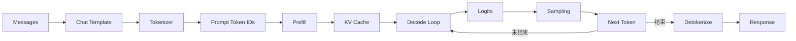
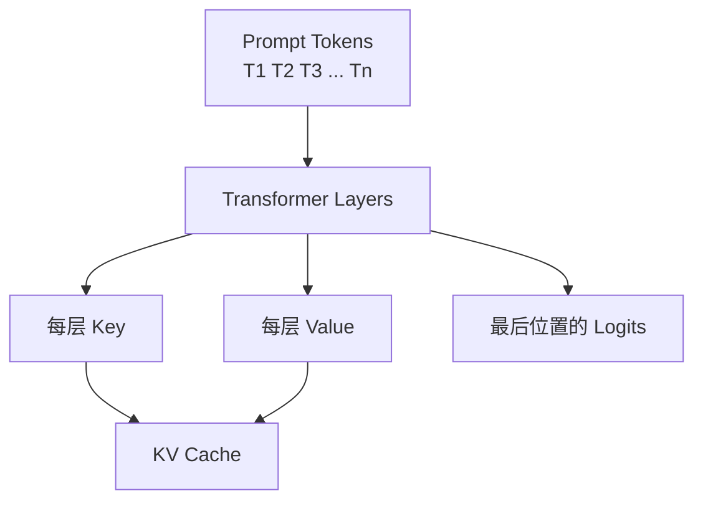
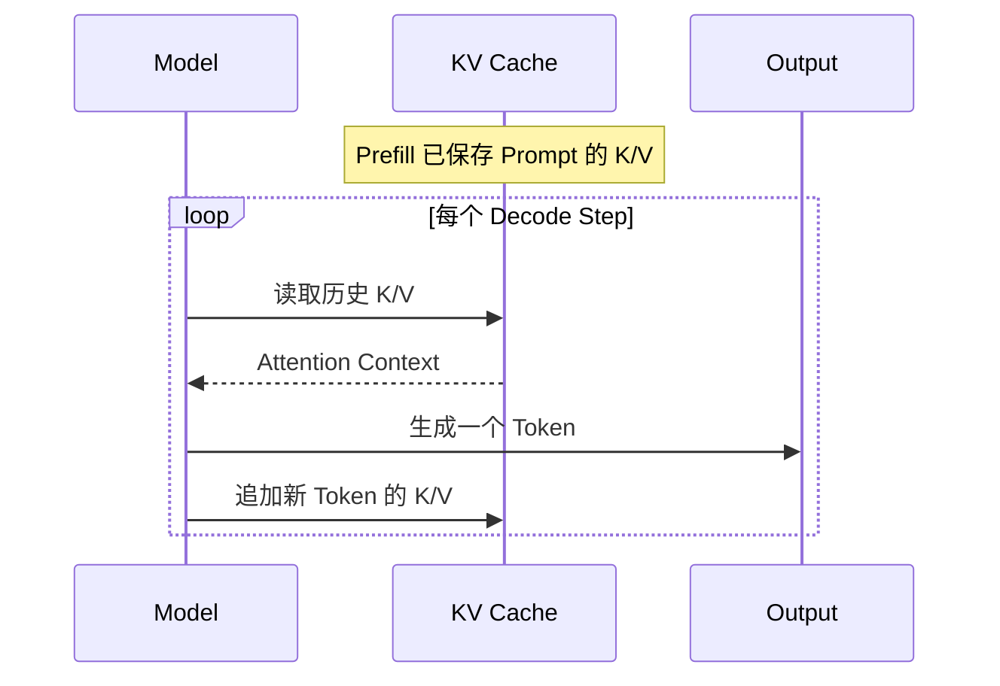
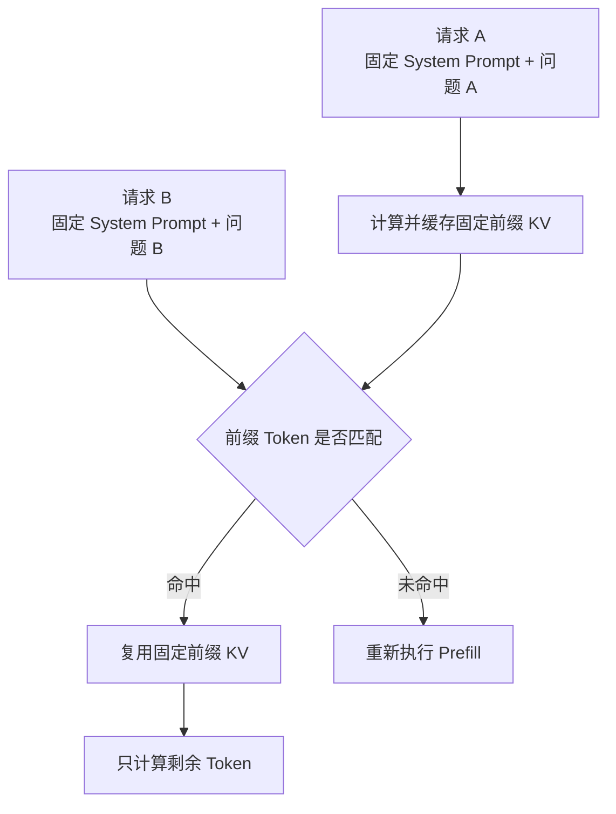
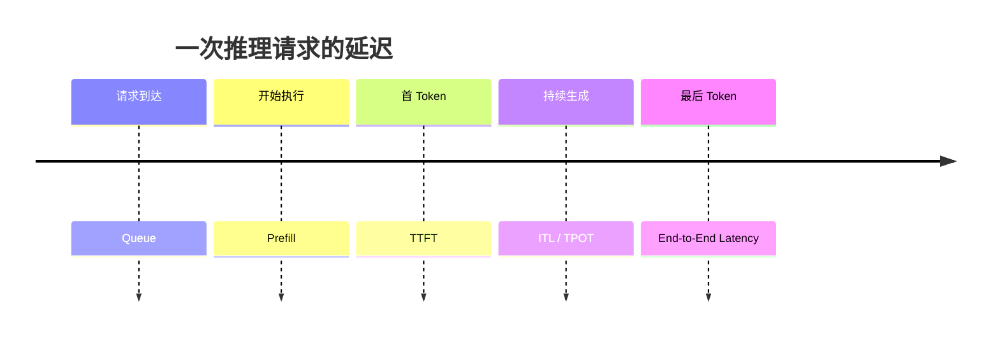

#ai #llm #inference #prefill #decode #kv-cache

相关笔记：[[llm-learning-path]] | [[llm-fundamentals]] | [[vllm-and-sglang]] | [[prefill-cache-miss]] | [[llm-inference-learning-path]] | [[llm-inference-progress]]

# LLM 推理完整链路

## 概述

本笔记从一次真实请求出发，解释 LLM 如何把用户文字变成 Token，经过 Prefill 和 Decode 逐步生成回答，再由推理服务返回。第一次阅读只需要掌握数据流；PagedAttention、RadixAttention、PD 分离等系统优化放到后续笔记。

![[prefill&decode.webp]]

## 一次请求的完整链路



这条链路可以分成四层：

1. **输入层**：Messages 经过 Chat Template 变成模型认识的文本格式。
2. **编码层**：Tokenizer 把文本转换为 Token IDs。
3. **模型层**：Prefill 建立上下文状态，Decode 逐 Token 生成。
4. **服务层**：推理引擎负责排队、Batch、缓存、流式传输和指标。

## 输入不是直接进入模型的字符串

应用通常发送结构化 Messages：

```json
{
  "messages": [
    {"role": "system", "content": "你是一个简洁的助手"},
    {"role": "user", "content": "什么是 KV Cache？"}
  ]
}
```

**Chat Template** 先把角色和内容拼成模型训练时使用的控制格式，再由 Tokenizer 转换为 Token IDs。

> 基础名词：**Chat Template** 是把结构化对话转换成模型输入序列的规则。模型、Tokenizer 和 Template 必须匹配；同样的 Messages 使用不同 Template，得到的 Token 序列可能完全不同。

> 基础名词：**Prompt Tokens** 是输入模型的 Token 数；**Completion Tokens** 是模型新生成的 Token 数。两者对延迟、显存和计费的影响不同。

Token、Embedding、Logits 等前置概念见 [[llm-fundamentals]]。

## Prefill：一次读完输入

Prefill 接收整个 Prompt Token 序列，并行计算各层 Hidden States，同时为 Attention 产生 Key 和 Value。



Prefill 的主要特征：

- 一次处理多个输入 Token，矩阵计算并行度高。
- 长 Prompt 会增加计算量和 TTFT。
- 会建立后续 Decode 需要的 KV Cache。
- 常被描述为 **Compute-bound**，但真实瓶颈仍受模型、Batch、硬件、Kernel 和输入长度影响。

> 基础名词：**Compute-bound** 表示性能主要受计算吞吐限制；**Memory-bound** 表示性能主要受数据读写带宽限制。这是性能分析结论，不是对所有配置永远成立的标签。

## KV Cache：保存历史 Attention 状态

如果没有 KV Cache，每生成一个新 Token，都需要重新为全部历史 Token 计算各层 Key 和 Value。KV Cache 保存已算出的 K/V，后续只为新 Token 追加一份。



KV Cache 是用显存换计算：避免重复计算，但它会随以下因素增长：

- Sequence Length。
- Concurrent Sequences。
- Transformer Layer 数量。
- KV Heads 与 Head Dimension。
- K/V 的数据精度。

> 基础名词：**KV Cache 不包含模型的全部“知识”**。它只是当前上下文在各层 Attention 中已经计算出的 Key/Value 状态，模型知识主要存放在权重中。

## Decode：一次生成一个 Token

Prefill 之后进入自回归 Decode Loop。每一步：

1. 使用当前 Token 与历史 KV 进行 Attention。
2. 得到词表上所有候选 Token 的 Logits。
3. 根据 Sampling 参数选出 Next Token。
4. 把新 Token 的 K/V 追加到 Cache。
5. 遇到停止 Token、停止字符串或长度上限后结束。

Decode 每一步只新增一个 Token，但要反复读取模型权重和不断增长的 KV Cache，因此常表现为显存带宽敏感。将多个请求放进同一个 Decode Batch，可以提高硬件利用率。

## Sampling：模型分数如何变成文字

模型输出 Logits 后，推理引擎根据参数选择下一个 Token：

| 参数 | 主要作用 |
| --- | --- |
| `temperature` | 调整分布尖锐程度 |
| `top_p` | 只在累计概率达到阈值的候选集合中采样 |
| `top_k` | 只保留概率最高的 K 个候选 |
| `max_tokens` | 限制最多生成的新 Token 数 |
| `stop` | 遇到指定序列时停止 |

Sampling 参数改变的是生成策略，不会修改模型权重。对 benchmark 和回归测试，应固定随机种子与采样参数，或使用确定性设置减少噪声。

## Streaming 与非 Streaming

- **非流式**：完整生成后一次返回，客户端实现简单。
- **流式**：生成一个或一小段 Token 就发送，用户更早看到结果。

Streaming 通常改善感知延迟，但不会自动减少模型完成全部生成所需的计算量。

## Prefix Cache：跨请求复用 Prefill 结果

KV Cache 首先服务于单个 Sequence 的 Decode；Prefix Cache 则尝试在不同请求之间复用相同前缀对应的 KV Cache。



命中比较的是 Token 序列，而不是人类认为的“语义相同”。空格、换行、Template、动态时间戳、字段顺序或 Tokenizer 版本都可能改变序列。工程案例见 [[prefill-cache-miss]]。

## 服务层如何同时处理多个请求

vLLM/SGLang 等引擎还要处理：

- Admission 与 Queue。
- Continuous Batching。
- KV Cache Block 分配与回收。
- Prefix Cache。
- Quantization 与多 GPU Parallelism。
- LoRA Adapter 加载与路由。
- Metrics、Tracing 和错误处理。

这也是“直接调用 Transformers `generate()`”与“运行生产推理服务”的主要差别。详见 [[vllm-and-sglang]]。

## 核心指标



| 指标 | 回答的问题 |
| --- | --- |
| TTFT | 用户多久能看到第一个 Token？ |
| TPOT | 首 Token 后，平均生成一个 Token 要多久？ |
| ITL | 相邻 Token 的输出间隔是否稳定？ |
| E2E Latency | 整个请求多久完成？ |
| Token Throughput | 系统每秒生成多少 Token？ |
| Queue Time | 延迟来自模型计算还是排队？ |

输入越长通常越影响 Prefill/TTFT，输出越长通常越影响 Decode 和总时长，但生产环境还必须分离 Queue、Cache Hit、Batch 与硬件因素。

## 最小观察实验

1. 使用同一模型，固定 `temperature=0`。
2. 准备短 Prompt 与长 Prompt，输出都限制为 32 Token，比较 TTFT。
3. 固定 Prompt，分别生成 32 与 256 Token，比较总时长与 TPOT。
4. 对相同固定前缀重复请求，观察 Prefix Cache 命中与 TTFT。
5. 从并发 1 增加到并发 4/16，记录吞吐与 P99 延迟。

只有同时记录模型、精度、硬件、Token 数、并发和参数，结果才可解释。

## 自检清单

- [ ] 能画出 Messages 到 Response 的完整数据流。
- [ ] 能解释 Prefill 与 Decode 的输入输出。
- [ ] 能区分 KV Cache 与 Prefix Cache。
- [ ] 能说明 Sampling 参数不会修改模型权重。
- [ ] 能区分 TTFT、TPOT、ITL 与总延迟。
- [ ] 能解释 Streaming 为什么主要改善感知延迟。

## 面试要点

### Q：Prefill 和 Decode 为什么分开理解？

A：Prefill 并行处理全部输入 Token 并建立 KV Cache，主要影响 TTFT；Decode 自回归地逐 Token 生成并反复读取模型权重与 KV Cache，主要影响 TPOT、ITL 和输出吞吐。两者的计算形态不同，因此调度和部署优化也不同。

### Q：KV Cache 与 Prefix Cache 有什么区别？

A：KV Cache 保存当前 Sequence 已计算的 Key/Value，避免 Decode 重算历史；Prefix Cache 在不同请求间复用相同前缀的 KV Cache，减少重复 Prefill。Prefix Cache 建立在 KV Cache 之上，但属于跨请求优化。

### Q：为什么相同语义的 Prompt 可能无法命中 Prefix Cache？

A：缓存匹配依据 Token 序列，而不是语义。字符、空格、Template、字段顺序和 Tokenizer 的任何变化都可能产生不同 Token IDs，导致差异位置之后无法复用。

### Q：为什么吞吐提高后延迟可能变差？

A：更大的 Batch 和更激进的排队可以提高 GPU 利用率与总 Token Throughput，但单个请求可能等待更久。生产系统要同时观察吞吐、TTFT、TPOT 和 P99，而不是只优化一个平均值。
