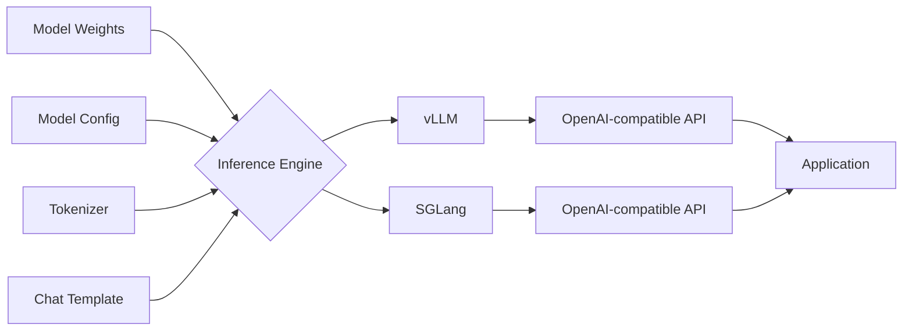
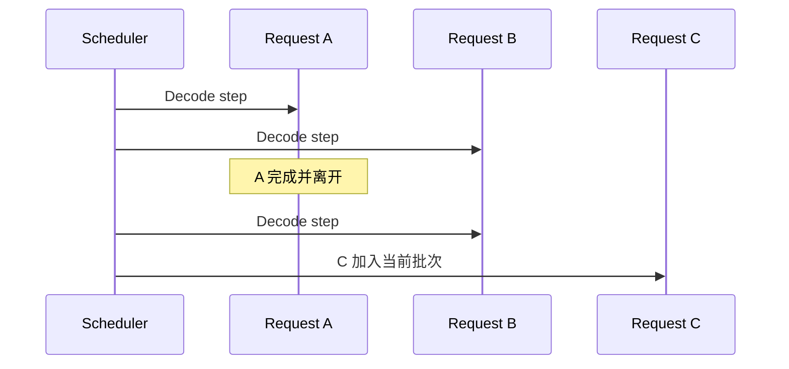
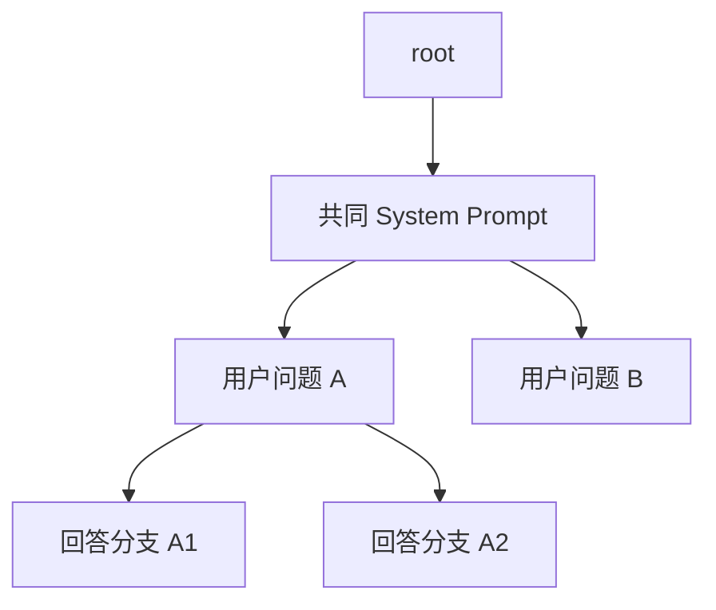

#ai #llm #inference #vllm #sglang

相关笔记：[[llm-learning-path]] | [[llm-fundamentals]] | [[llm-inference-pipeline]] | [[prefill-cache-miss]] | [[llm-inference-learning-path]]

# vLLM 与 SGLang

## 概述

vLLM 和 SGLang 都能把模型权重变成高吞吐、低延迟的推理服务。学习顺序应当是：先用同一个模型跑通两个服务，再用可控实验观察差异，最后才读 Scheduler、KV Cache 和 Kernel 源码。

它们不是“模型”：同一份 Qwen、Llama 或其他兼容 Checkpoint，可以由不同推理引擎加载。

## 从模型文件到 API



> 基础名词：**OpenAI-compatible API** 表示服务使用与 OpenAI API 相近的请求和响应结构。它降低客户端迁移成本，但不代表所有扩展参数和边界行为完全相同。

## 先建立可比较的实验

比较两个引擎时必须固定：

- 模型与模型版本。
- Tokenizer 和 Chat Template。
- 权重精度或量化方式。
- GPU 型号和数量。
- `max_model_len`、并行策略和显存利用率上限。
- 输入/输出长度分布、并发数、请求数量和预热方式。

否则 benchmark 只能说明两次配置不同，不能说明引擎优劣。

## 最小启动：vLLM

安装方式和硬件兼容性变化较快，应以 [vLLM 官方文档](https://docs.vllm.ai/) 为准。概念化的最小启动命令是：

```bash
vllm serve Qwen/Qwen3-0.6B \
  --host 0.0.0.0 \
  --port 38000
```

调用服务：

```bash
curl http://127.0.0.1:38000/v1/chat/completions \
  -H 'Content-Type: application/json' \
  -d '{
    "model": "Qwen/Qwen3-0.6B",
    "messages": [{"role": "user", "content": "用一句话解释 KV Cache"}],
    "temperature": 0,
    "max_tokens": 128
  }'
```

先观察服务能否稳定启动、模型是否正确加载、请求是否返回，再调整性能参数。

## 最小启动：SGLang

安装与启动方式以 [SGLang 官方文档](https://docs.sglang.io/) 为准：

```bash
python3 -m sglang.launch_server \
  --model-path Qwen/Qwen3-0.6B \
  --host 0.0.0.0 \
  --port 30000
```

调用时只需把 `base_url` 换成对应端口。对照实验应发送完全相同的请求数据。

## 必须理解的服务指标

| 指标             | 含义                         | 主要受什么影响                    |
| -------------- | -------------------------- | -------------------------- |
| TTFT           | 从请求到第一个输出 Token 的时间        | 排队、Prefill、Prefix Cache 命中 |
| TPOT           | 首 Token 之后平均每个输出 Token 的耗时 | Decode、Batch、显存带宽          |
| ITL            | 相邻输出 Token 之间的延迟           | Decode 调度与抖动               |
| Throughput     | 单位时间完成的请求数或 Token 数        | Batch、并行、工作负载分布            |
| Queue Length   | 等待执行的请求数                   | 到达速率与服务能力是否匹配              |
| KV Cache Usage | KV Cache 池使用比例             | 上下文长度、并发、精度和模型结构           |

> 基础名词：**Latency** 关注一个请求等多久，**Throughput** 关注系统单位时间处理多少。提高 Batch 往往能提升吞吐，但可能增加单个请求的排队延迟。

## vLLM 的学习重点

### Continuous Batching

传统 Static Batching 会等同一批请求全部结束。Continuous Batching 在每个推理迭代重新选择请求，已经完成的请求立即离开，新请求可以进入。



### PagedAttention 与 KV Cache 管理

vLLM 将每个 Sequence 的 KV Cache 组织为可按需分配的 Block，并维护从逻辑位置到物理 Block 的映射。核心收益是降低连续预留造成的浪费，并让高并发请求更灵活地共享显存池。

> 基础名词：**Block** 是 KV Cache 管理的固定粒度，不等同于 Transformer Block。前者是缓存分配单位，后者是模型网络层。

学习问题：

- 为什么每个 Sequence 的实际长度不同会产生显存碎片？

  > [!question]- 参考答案（点击展开）
  > 传统实现若按 `max_seq_len` 为每个 Sequence 预留连续 KV 空间，短请求会留下大量未使用空间；请求结束和增长的时机又不同，连续区域容易形成不能被当前请求利用的空洞。分页式 Block Pool 把分配粒度缩小到 Block，主要减少这种外部碎片和过量预留。

- Block Size 太小或太大分别有什么成本？

  > [!question]- 参考答案（点击展开）
  > 小 Block 的尾部浪费少、复用粒度细，但 Block Table、分配次数和 Kernel 间接寻址开销更高；大 Block 的元数据和寻址开销低，但尾部碎片更多、Prefix Cache 的命中粒度更粗。最佳值取决于引擎版本、上下文分布和压测结果。

- KV Cache 不足时，Scheduler 如何排队、抢占或重算？

  > [!question]- 参考答案（点击展开）
  > 新请求先在 waiting queue 等待 admission；运行中的请求若无法再分配 KV Block，Scheduler 可延后调度或抢占较低优先级请求。被抢占请求可以丢弃 KV 后重新 Prefill，也可以把 KV 换到 CPU；选择取决于上下文长度、主存容量、PCIe 带宽和具体引擎版本。

- Prefix Cache 命中为什么受 Block 边界影响？

  > [!question]- 参考答案（点击展开）
  > Block-based cache 通常按完整 Token Block 计算 key。只有内容和父前缀都一致的完整 Block 才能直接复用；首个不同 Token 所在的 Block 可能整体重算，后续 Block 也会因父 hash 改变而失效。因此 Block Size 同时决定缓存复用的最小粒度。

## SGLang 的学习重点

### RadixAttention

SGLang 用 Radix Tree 组织可复用前缀，使共享 System Prompt、多轮对话和分支生成能够进行最长前缀匹配。学习重点不只是“它用了树”，而是 Token Prefix 如何成为可复用 KV Cache 的索引。



### Structured Generation 与 Reasoning Support

SGLang 还提供 JSON/Regex/Grammar 等结构化输出、Reasoning Parser、Speculative Decoding 和分布式推理能力。学习时先问：功能改变了模型本身，还是只约束/加速生成过程？

- Structured Generation 通常约束可选择的下一个 Token。
- Reasoning Parser 负责把模型输出按约定拆分，不等于模型因此获得推理能力。
- Speculative Decoding 用较便宜的草稿生成减少昂贵模型的逐 Token 步数，但收益取决于接受率与工作负载。

## PagedAttention 与 RadixAttention 不应简单二选一

两者强调的层次不同：PagedAttention 首先解决 KV Cache 的物理内存管理；RadixAttention 强调跨请求的前缀索引与复用。现代引擎会持续吸收彼此的优化，因此不要把早期论文中的功能边界当作永久产品边界。

比较时使用问题导向：

| 问题 | 应观察什么 |
| --- | --- |
| 大量请求共享固定前缀 | Prefix Cache Hit、TTFT |
| 高并发短请求 | Queue、Throughput、P99 Latency |
| 长 Prompt + 短输出 | Prefill 时间、Chunked Prefill |
| 短 Prompt + 长输出 | TPOT、Decode Throughput |
| 多 LoRA | Adapter 加载、显存、路由与冷启动 |
| 分布式推理 | 通信开销、并行策略与故障边界 |

## 继续深入的顺序

1. API 与 Sampling。
2. Metrics 与 Benchmark。
3. Scheduler 与 Continuous Batching。
4. KV Cache、Prefix Cache。
5. Quantization 与 Parallelism。
6. Multi-LoRA Serving。
7. PD Disaggregation、Distributed KV 与 Router。
8. 最后进入 [[llm-inference-learning-path]] 的源码和平台层。

## 自检实验

- [ ] 同一请求分别以流式和非流式调用两个引擎。
- [ ] 用相同固定前缀连续请求，比较第一次与后续请求的 TTFT。
- [ ] 分别以并发 1、4、16 测量吞吐和 P99 延迟。
- [ ] 记录模型权重、精度、输入/输出长度和启动参数，确保结果可复现。
- [ ] 解释性能变化来自哪里，而不是只记录“哪个数字更快”。

## 面试要点

### Q：vLLM 和 SGLang 解决的核心问题是什么？

> [!question]- 参考答案（点击展开）
>
> 它们把模型 Checkpoint 转换为高性能推理服务，通过动态调度、Batch、KV Cache 管理、并行和优化 Kernel 提高吞吐并控制延迟，同时提供应用可调用的 API。

### Q：为什么不能只看单次请求延迟比较两个引擎？

> [!question]- 参考答案（点击展开）
>
> 生产推理同时关心 TTFT、TPOT、P99、吞吐、显存和稳定性。单请求结果无法反映并发调度、Prefix Cache 和队列行为，而且模型、精度或输入分布不同会让比较失效。

### Q：PagedAttention 与 RadixAttention 的主要关注点有什么不同？

> [!question]- 参考答案（点击展开）
>
> PagedAttention 主要解决 KV Cache 的分页式物理内存管理和碎片问题；RadixAttention 主要解决共享前缀的索引和自动复用。二者处于不同层次，现代实现可能同时具备相似能力。
