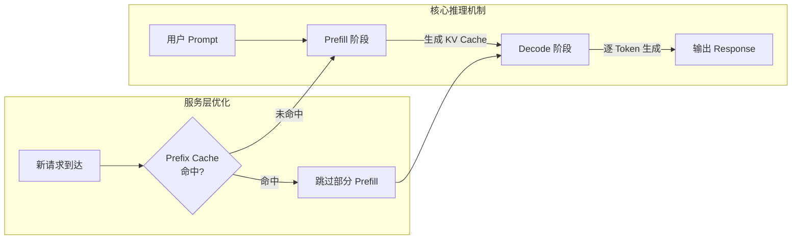
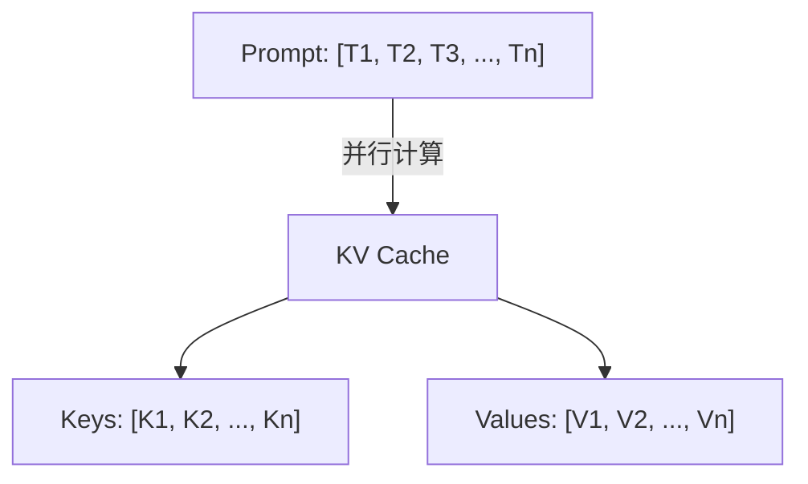
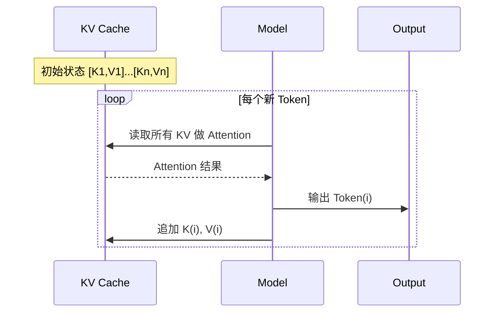
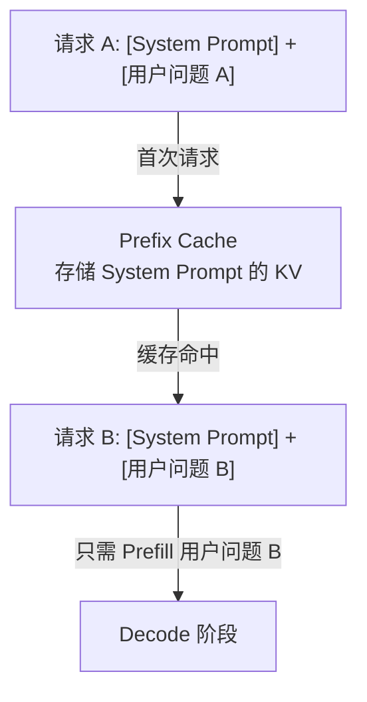

#ai #prefill #decode

相关笔记：[[prefill-cache-miss]]

## LLM 推理全流程：从核心机制到服务层优化

![[prefill&decode.webp]]

### 整体架构概览

---

### 第一部分：核心推理机制（单次请求内）

这是模型处理任何一次请求都必须遵循的内部工作流程。

#### 1. Prefill（预填充）— 计算初始状态

当模型接收到用户的 Prompt 时，进入 Prefill 阶段：

- **并行处理**：此阶段会并行处理输入的所有 Token
- **生成 KV Cache**：为每一个输入 Token 计算并生成一组 Key-Value 向量，统称 **KV Cache**
- **记忆快照**：KV Cache 可以理解为整个 Prompt 在模型内部的"记忆快照"

> Prefill 是**计算密集型 (Compute-Bound)** 步骤，需要一次性处理整个输入序列，GPU 算力是瓶颈。

#### 2. Decode（解码）— 增量生成与状态更新

Prefill 完成后，模型进入逐 Token 生成的 Decode 阶段。每生成一个新 Token，执行两个核心操作：

**Step A：利用现有状态（Attention 计算）**

1. 为当前位置计算 **Query 向量**
2. 将 Query 与 KV Cache 中**所有**历史 Token 的 Key-Value 做 Attention 计算
3. 基于 Attention 结果，预测下一个最可能的 Token

**Step B：更新状态（追加 KV）**

1. 仅为刚生成的新 Token 计算其 KV 向量
2. 将新 KV 追加到 Cache 末尾，供下一轮使用

> Decode 是**内存带宽密集型 (Memory-Bound)** 步骤，每次只处理 1 个 Token，但需要读取整个 KV Cache，显存带宽是瓶颈。

---

### 第二部分：服务层优化（跨请求间）

在理解了单次请求的内部机制后，我们来看更上层的优化技术——**Prefix Cache（前缀缓存）**。

#### Prefix Cache 工作原理

核心思想：Prefill 计算昂贵，如果多个请求共享相同的前缀（如 System Prompt），就把这部分 KV Cache 存起来复用。

具体流程：

1. **Prefix Matching**：服务端收到新请求时，将 Prompt 的 Token 序列与已缓存的 KV 记录进行前缀匹配
2. **Cache Hit**：如果前缀完全对应，直接加载预先计算好的 KV Cache
3. **Skip Prefill**：模型跳过共享前缀的 Prefill 计算，只需处理剩余部分，然后立即进入 Decode

#### 适用场景

| 场景 | 效果 |
|------|------|
| 大量请求共享同一 System Prompt | 显著降低首 Token 延迟 (TTFT) |
| 多轮对话（历史上下文不变） | 只需 Prefill 最新一轮输入 |
| 批量处理相似模板任务 | 大幅降低推理成本 |

> 前缀缓存的命中依赖于 Token 序列的**精确匹配**，任何细微差异都会导致 Cache Miss。详见 [[prefill-cache-miss]]。

## 面试要点

### 高频问题

**Q: LLM 推理为什么要拆成 Prefill 和 Decode 两个阶段？**
A: 因为两个阶段的计算特性截然不同。Prefill 一次性并行处理整个输入 Prompt，为所有 Token 计算 KV 向量，属于 **Compute-Bound（计算密集型）**，瓶颈在 GPU 算力（FLOPs）。Decode 是自回归逐 Token 生成，每步只算 1 个新 Token 但要读取全部 KV Cache，属于 **Memory-Bound（显存带宽密集型）**，瓶颈在显存带宽。拆开后才能针对性优化（如 Continuous Batching、Chunked Prefill、PD 分离部署）。

**Q: KV Cache 是什么？为什么需要它？**
A: KV Cache 缓存的是每个历史 Token 在各层 Attention 中算出的 Key 和 Value 向量，相当于整个上下文在模型内部的“记忆快照”。有了它，Decode 阶段每生成新 Token 时只需为当前位置算 Query，再与缓存中所有历史 KV 做 Attention，**无需把前面所有 Token 重新跑一遍完整前向**。这就把单步的注意力计算从 O(n²)（重算全序列）降到 O(n)（1 个 Query 对 n 个 KV），整段生成的总计算量从 O(n³) 降到 O(n²)，本质是用显存换算力。

**Q: Decode 阶段生成一个 Token 具体做了哪两件事？**
A: 一是**利用现有状态**：为当前位置计算 Query，与 KV Cache 中所有历史 Token 的 Key-Value 做 Attention，预测下一个 Token。二是**更新状态**：仅为刚生成的新 Token 计算其 KV 向量，追加到 Cache 末尾供下一轮使用。KV Cache 随生成长度线性增长，这也是长序列推理显存压力的主要来源。

**Q: Prefix Cache（前缀缓存）的核心思想是什么？它和 KV Cache 是一回事吗？**
A: 不是同一层面。KV Cache 是单次请求内、Decode 复用 Prefill 结果的机制；Prefix Cache 是**跨请求**的服务层优化。其思想是：Prefill 计算昂贵，若多个请求共享相同前缀（如同一 System Prompt），就把这段前缀对应的 KV Cache 存下来复用。新请求命中后可 Skip Prefill，跳过共享前缀的计算，只需 Prefill 剩余部分再进入 Decode。

**Q: Prefix Cache 命中后能带来什么收益？典型适用场景有哪些？**
A: 核心收益是显著降低 **TTFT（Time To First Token，首 Token 延迟）** 和整体推理成本，因为省掉了最重的前缀 Prefill 计算。典型场景包括：大量请求共享同一 System Prompt、多轮对话（历史上下文不变，只需 Prefill 最新一轮输入）、批量处理相似模板任务。

**Q: 为什么前缀里一个微小改动就会导致 Cache Miss？**
A: Prefix Cache 命中依赖 Token 序列的**精确前缀匹配**——逐 Token、按相同顺序比对。任何细微差异（多一个空格、改一个字、System Prompt 里插入了动态时间戳/用户名，甚至 Go map 序列化导致 JSON key 顺序抖动）都会让该位置之后的前缀失配，从而 Miss。因此实践中要把固定内容前置、动态内容后置，最大化可复用前缀。详见 [[prefill-cache-miss]]。

**Q: Prefill 和 Decode 哪个决定 TTFT，哪个决定吞吐和 TPOT？**
A: Prefill 决定 **TTFT（首 Token 延迟）**，输入越长 Prefill 越慢，TTFT 越高，Prefix Cache 正是为优化它。Decode 阶段每步耗时决定 **TPOT（Time Per Output Token，逐 Token 延迟）** 和整体生成吞吐；由于 Decode 是 Memory-Bound，提升吞吐主要靠 Batching 把多个请求的 KV 读取摊薄到同一次显存访问上。

### 面试加分点

- 能区分 **Compute-Bound vs Memory-Bound**：Prefill 受限于算力（FLOPs），Decode 受限于显存带宽，这是 vLLM/TensorRT-LLM 做 PD 分离（Prefill/Decode 分离部署）、Chunked Prefill 的根本动因。
- 了解 **PagedAttention**：vLLM 用分页方式管理 KV Cache，解决传统连续显存分配带来的碎片和浪费，使 Prefix Cache 共享与高并发 Batching 成为可能。
- 能把 Prefix Cache 命中和 **Hash/前缀树（Radix Tree）匹配** 联系起来，如 SGLang 的 RadixAttention 用前缀树自动复用任意共享前缀，而不局限于 System Prompt。
- 理解 Decode 的 Memory-Bound 本质决定了 **Continuous Batching**（动态拼批）能在几乎不增加单步延迟的前提下大幅提升吞吐——多请求共享一次 KV 权重读取的带宽。
- 能说出工程上提升 Prefix Cache 命中率的手段：固定 System Prompt 前置、避免在前缀注入时间戳/随机 ID、模板参数后置，以及保证序列化确定性（用 struct 或会排序 key 的 JSON 库）。
- 清楚 KV Cache 显存占用与 `序列长度 × 层数 × KV 头数 × head_dim × 2(K和V) × 精度字节数 × batch` 成正比，是长上下文推理 OOM 的主因，进而引出 MQA/GQA（减少 KV 头数）、KV 量化等压缩手段。
