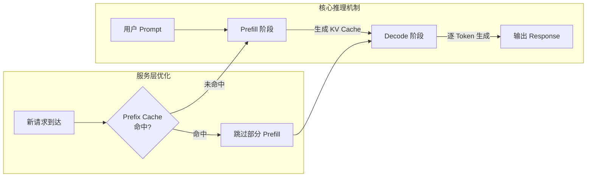
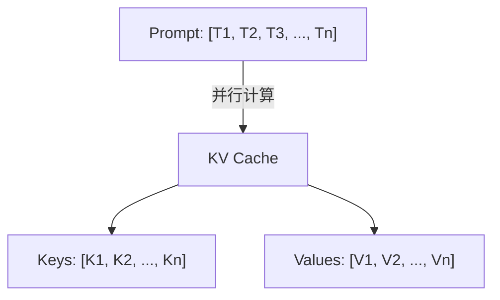
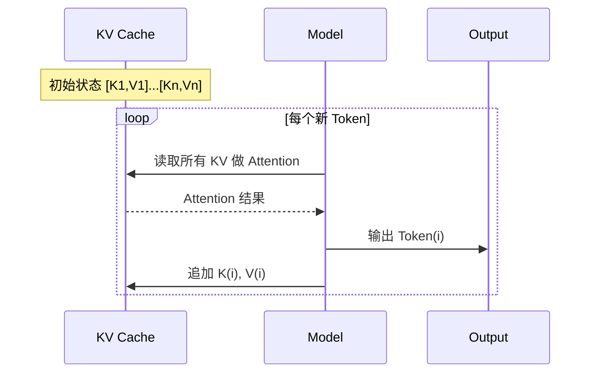
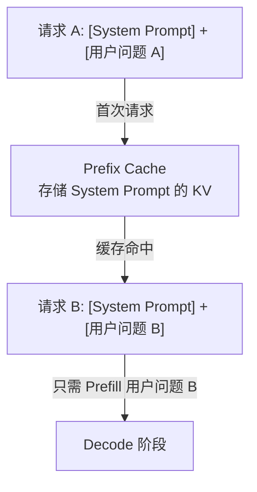

#ai #prefill #decode

相关笔记：[[prefill-cache-miss]]

## LLM 推理全流程：从核心机制到服务层优化

![[prefill&decode.webp]]

### 整体架构概览

---

### 第一部分：核心推理机制（单次请求内）

这是模型处理任何一次请求都必须遵循的内部工作流程。

#### 1. Prefill（预填充）— 计算初始状态

当模型接收到用户的 Prompt 时，进入 Prefill 阶段：

- **并行处理**：此阶段会并行处理输入的所有 Token
- **生成 KV Cache**：为每一个输入 Token 计算并生成一组 Key-Value 向量，统称 **KV Cache**
- **记忆快照**：KV Cache 可以理解为整个 Prompt 在模型内部的"记忆快照"

> Prefill 是**计算密集型 (Compute-Bound)** 步骤，需要一次性处理整个输入序列，GPU 算力是瓶颈。

#### 2. Decode（解码）— 增量生成与状态更新

Prefill 完成后，模型进入逐 Token 生成的 Decode 阶段。每生成一个新 Token，执行两个核心操作：

**Step A：利用现有状态（Attention 计算）**

1. 为当前位置计算 **Query 向量**
2. 将 Query 与 KV Cache 中**所有**历史 Token 的 Key-Value 做 Attention 计算
3. 基于 Attention 结果，预测下一个最可能的 Token

**Step B：更新状态（追加 KV）**

1. 仅为刚生成的新 Token 计算其 KV 向量
2. 将新 KV 追加到 Cache 末尾，供下一轮使用

> Decode 是**内存带宽密集型 (Memory-Bound)** 步骤，每次只处理 1 个 Token，但需要读取整个 KV Cache，显存带宽是瓶颈。

---

### 第二部分：服务层优化（跨请求间）

在理解了单次请求的内部机制后，我们来看更上层的优化技术——**Prefix Cache（前缀缓存）**。

#### Prefix Cache 工作原理

核心思想：Prefill 计算昂贵，如果多个请求共享相同的前缀（如 System Prompt），就把这部分 KV Cache 存起来复用。

具体流程：

1. **Prefix Matching**：服务端收到新请求时，将 Prompt 的 Token 序列与已缓存的 KV 记录进行前缀匹配
2. **Cache Hit**：如果前缀完全对应，直接加载预先计算好的 KV Cache
3. **Skip Prefill**：模型跳过共享前缀的 Prefill 计算，只需处理剩余部分，然后立即进入 Decode

#### 适用场景

| 场景 | 效果 |
|------|------|
| 大量请求共享同一 System Prompt | 显著降低首 Token 延迟 (TTFT) |
| 多轮对话（历史上下文不变） | 只需 Prefill 最新一轮输入 |
| 批量处理相似模板任务 | 大幅降低推理成本 |

> 前缀缓存的命中依赖于 Token 序列的**精确匹配**，任何细微差异都会导致 Cache Miss。详见 [[prefill-cache-miss]]。
