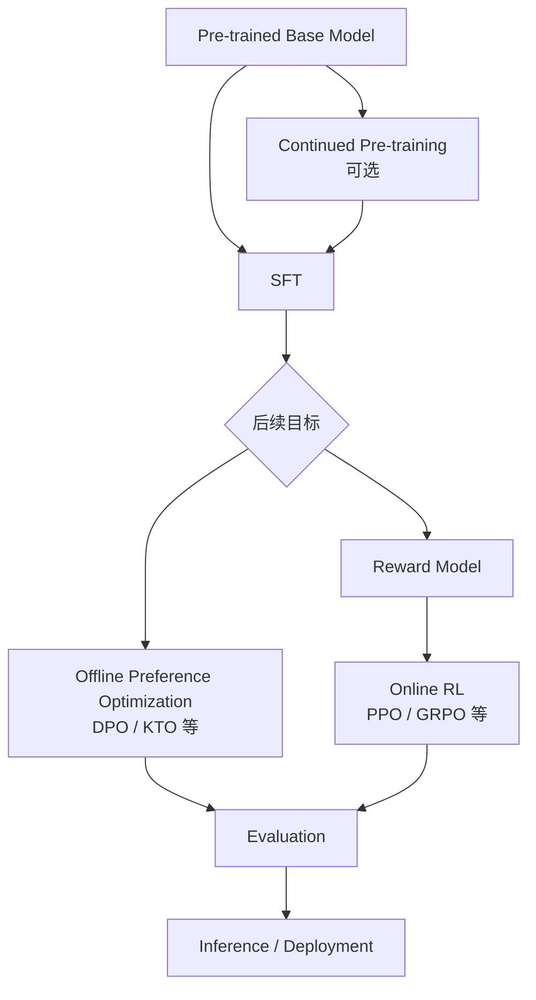
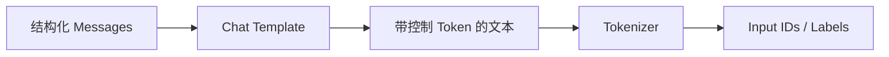
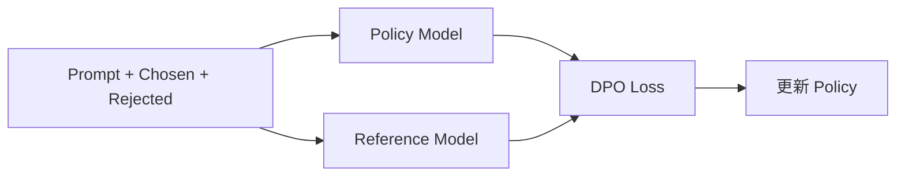
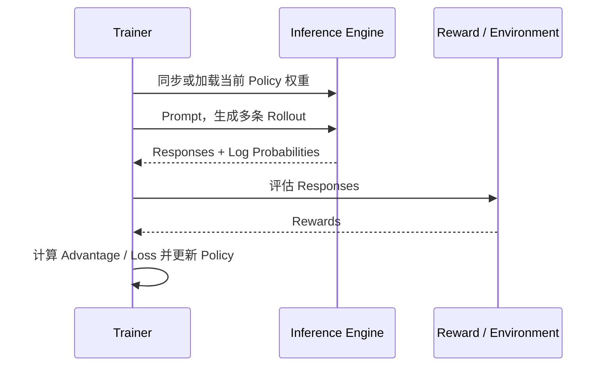

#ai #llm #post-training #sft #dpo #rlhf

相关笔记：[[llm-learning-path]] | [[llm-fundamentals]] | [[lora-and-qlora]] | [[llm-rl-fundamentals]] | [[vllm-and-sglang]]

# LLM Post-training

## 概述

Post-training 指 Pre-training 之后，为了让模型更好地遵循指令、符合偏好、使用工具或完成特定任务而进行的一组训练过程。它不是单一算法，常见方法包括 SFT、Preference Optimization、Reward Modeling 和 Online RL。

学习 Post-training 的关键是始终回答三个问题：训练数据从哪里来、优化目标是什么、模型是否需要在训练过程中生成新数据。

## 全景图



这不是所有模型都必须完整走一遍的固定流水线。具体选择取决于数据、可验证 Reward、计算预算和目标行为。

## Continued Pre-training

Continued Pre-training 使用领域原始文本继续进行语言建模目标，例如让通用模型接触更多法律、医学或代码语料。

它主要补充领域分布和知识表达，不直接保证模型会遵循指令。领域知识不足与指令遵循不足是两个不同问题：前者可能需要 Continued Pre-training 或 RAG，后者更接近 SFT/Post-training。

## SFT：Supervised Fine-Tuning

SFT 使用“输入 → 目标回答”的监督数据，让模型模仿期望输出。

```text
Input:  请把下面文本总结成三点：...
Target: 1. ...
        2. ...
        3. ...
```

训练时仍然是在做 Next-token Prediction，只是 Loss 通常只计算目标回答或指定区域。

> 基础名词：**Label Masking** 决定哪些 Token 参与 Loss。把用户 Prompt、Padding 或不希望学习的部分错误纳入 Loss，会改变模型实际学习目标。

### Chat Template

对话数据不能只靠肉眼看起来像聊天。Chat Template 会把 `system/user/assistant` 结构转换成模型训练时约定的控制 Token：



训练与推理使用不同 Template，可能导致模型表现显著下降。必须保存并验证实际 Tokenized 结果。

## LoRA 在 Post-training 中的位置

SFT、DPO、Online RL 描述“用什么目标训练”；LoRA/QLoRA 描述“如何以较低成本更新参数”。因此可以组合：

- SFT + LoRA。
- DPO + LoRA。
- 某些 Online RL + LoRA。
- SFT + Full Fine-tuning。

详见 [[lora-and-qlora]]。

## Preference Data

偏好数据常见形式是同一 Prompt 下的一对回答：

```text
prompt:   问题
chosen:   更符合目标的回答
rejected: 较差的回答
```

偏好可能来自人工标注、强模型判断、规则、自动验证器或多种信号组合。标签质量决定模型学到的是目标偏好还是标注器偏差。

> 基础名词：**Preference** 表示两个或多个回答之间的相对选择，不一定包含一个精确分数。

## DPO：Direct Preference Optimization

DPO 直接用 `chosen/rejected` 对训练 Policy，让模型提高 chosen 的相对概率并降低 rejected 的相对概率，同时通过 Reference Policy 控制偏移。



DPO 使用离线偏好数据，不要求每个训练 Step 都让当前 Policy 与环境交互。因此它属于 Offline Preference Optimization，不应仅因为名称里涉及“偏好”就自动称为 Online RL。

> 基础名词：**Reference Model** 通常是训练前的固定模型，用于衡量新 Policy 偏离原始行为的程度。

> 基础名词：**`beta`** 在 DPO 中控制偏好优化与偏离 Reference 的权衡。不同实现的具体参数化需要查看对应文档。

## Reward Model

Reward Model 接收 Prompt 与回答，输出一个标量或分数，用于近似人类偏好或任务质量：

```text
reward_model(prompt, response) -> score
```

它可以用偏好对训练，使 chosen 的分数高于 rejected。Reward Model 不是最终聊天模型，而是训练或评测中的打分器。

Reward 来源可以分为：

| Reward 来源 | 示例 | 风险 |
| --- | --- | --- |
| Learned Reward Model | 人类偏好模型 | 继承标注偏差，可能被 Policy 利用 |
| Verifiable Reward | 数学答案、单元测试 | 只覆盖可自动验证任务 |
| Rule-based Reward | JSON 格式、长度、关键词 | 容易被投机满足 |
| Environment Reward | 工具调用或交互任务结果 | 环境设计与可复现性复杂 |

## RLHF 与 Online RL

经典 RLHF 流程通常包含：

1. SFT 得到初始 Policy。
2. 收集人类偏好。
3. 训练 Reward Model。
4. Policy 生成 Rollout。
5. Reward Model 为 Rollout 打分。
6. 使用 PPO 等方法更新 Policy。

现代训练也可能使用规则或验证器而非人类偏好模型，并使用 GRPO 等算法。真正的共同点是：当前 Policy 在训练过程中生成新样本，再根据反馈更新。

## 为什么需要 vLLM/SGLang

Online RL 往往需要对每个 Prompt 生成多个候选回答。模型生成会成为主要计算开销，因此训练系统会集成 vLLM 或 SGLang 作为 Rollout Engine：



这里的难点包括权重同步、训练与生成的 GPU 资源分配、旧 Policy 数据的时效性，以及推理 Log Probability 与训练实现的一致性。

## Evaluation 不是最后补一个分数

Post-training 前先定义评测，否则 Reward 上升并不等于目标变好。至少需要：

- Train/Validation/Test 严格切分。
- 任务正确率或可验证成功率。
- 格式合规率、拒答率、输出长度。
- 通用能力回归测试。
- 人工抽样与失败案例分类。
- 推理成本、延迟和模型大小。

> 基础名词：**Data Contamination** 是评测样本或高度相似内容进入训练数据，导致测试结果虚高。

## 方法选择

| 目标与条件 | 优先尝试 |
| --- | --- |
| 有高质量标准答案，先学会任务格式 | SFT |
| 有成对偏好数据，预算有限 | DPO 等 Offline Preference Optimization |
| 有可靠自动判分器，需要探索新策略 | Online RL，例如 GRPO/PPO |
| 领域知识缺失，但没有问答数据 | Continued Pre-training 或 RAG，视知识更新方式而定 |
| 训练资源受限 | 在合适训练目标上结合 LoRA/QLoRA |

最小方案通常是先建立 Base Model 基线，再做 SFT；只有确认 SFT 的上限来自策略优化而非数据或评测问题时，才进入更昂贵的 RL。

## 常见失败模式

- 数据格式正确但语义质量差，模型只学会模板噪声。
- Reward 只奖励格式，模型生成空洞但格式完美的答案。
- 在训练集上选择最佳 Checkpoint，造成评测泄漏。
- 只看平均 Reward，忽略长度偏置和困难样本退化。
- 没有保存数据、模型和代码版本，无法复现实验。
- 认为算法名称越新越好，跳过 Base/SFT/DPO 基线。

## 面试要点

### Q：Post-training 与 SFT 是什么关系？

> [!question]- 参考答案（点击展开）
>
> Post-training 是 Pre-training 之后的一组训练方法，SFT 是其中最基础的一类。Post-training 还包括偏好优化、Reward Modeling、Online RL 和蒸馏等。

### Q：DPO 为什么不等于 Online RL？

> [!question]- 参考答案（点击展开）
>
> DPO 直接使用预先收集的 chosen/rejected 数据优化 Policy，不要求当前 Policy 在每个训练阶段与环境交互并生成新 Rollout。Online RL 的数据分布会随 Policy 更新而变化。

### Q：为什么 Reward 上升不一定表示模型更好？

> [!question]- 参考答案（点击展开）
>
> Reward 只是目标的近似。模型可能利用 Reward Model 或规则漏洞，牺牲未被度量的能力。必须用独立测试集、真实任务指标和失败案例验证。
