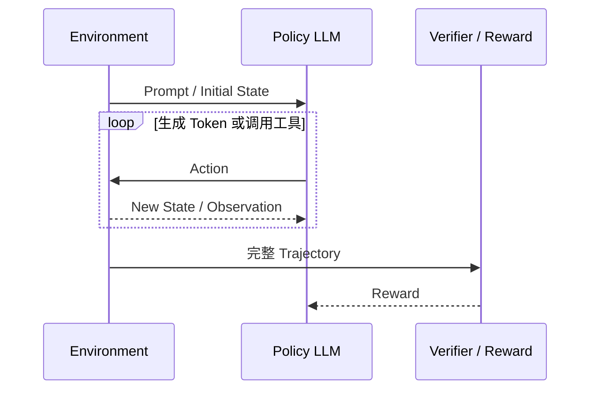
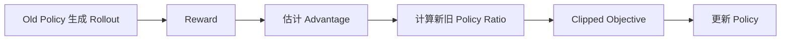
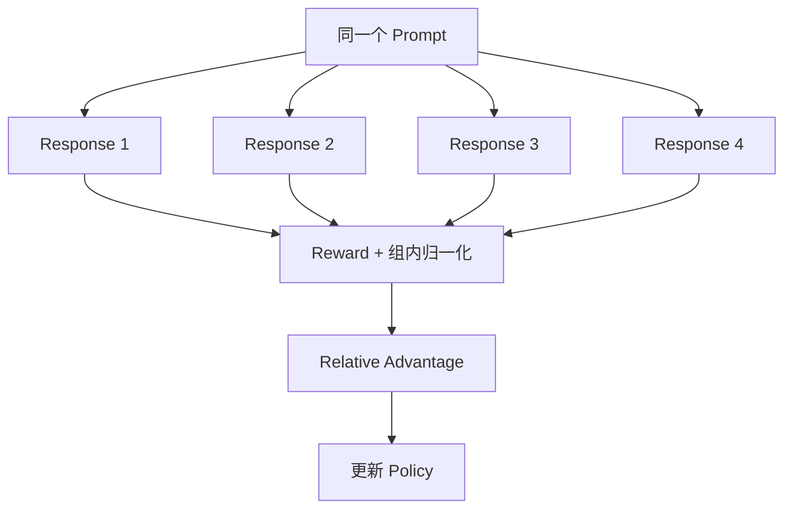
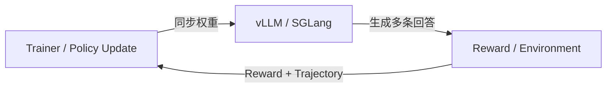

#ai #llm #reinforcement-learning #ppo #grpo #rlhf

相关笔记：[[llm-learning-path]] | [[llm-fundamentals]] | [[llm-post-training]] | [[lora-and-qlora]] | [[vllm-and-sglang]]

# LLM 强化学习基础

## 概述

强化学习（Reinforcement Learning，RL）研究 RL Agent 如何通过与 Environment 交互，根据 Reward 改进 Policy。这里的 **RL Agent** 指被训练的 Policy Model，不是仓库 Agent 应用章节中的工具调用框架。映射到 LLM 后，Policy 是语言模型，Action 可以视为生成 Token，Trajectory 是完整回答或多轮工具交互，Reward 来自验证器、规则、Reward Model 或环境结果。

学习本笔记的目标是理解数据如何产生、Reward 如何变成参数更新信号，以及为什么训练可能不稳定，而不是先背 PPO/GRPO 公式。

## 从经典 RL 映射到 LLM

| RL 名词 | LLM 中的对应物 |
| --- | --- |
| RL Agent | 正在训练的语言模型，不是 Agent 应用 Runtime |
| Environment | 数据集、判题器、工具、沙箱或交互系统 |
| State | Prompt 与当前已经生成的上下文 |
| Action | 下一个 Token，或更高层的工具调用动作 |
| Policy `π` | 给定上下文后，对下一个 Token 的概率分布 |
| Trajectory | 从 Prompt 到完整回答/交互终止的序列 |
| Reward | 正确性、偏好、格式、任务成功等反馈 |



## Policy 与 Log Probability

Policy 不是一条固定答案，而是条件概率分布：

```text
π(token_t | prompt, token_1, ..., token_t-1)
```

一段回答的概率可以理解为每一步条件概率的乘积；工程上通常使用 Log Probability，把乘积转成求和并改善数值稳定性。

> 基础名词：**Log Probability（logprob）** 是概率的对数。它保留概率大小关系，并让长序列概率的连乘变成 logprob 的相加。

## Rollout、Return 与 Reward

> 基础名词：**Rollout** 是当前 Policy 针对 Prompt 实际生成的一条轨迹。一个 Prompt 常生成多条 Rollout，以探索不同回答。

> 基础名词：**Reward** 是某一步或整条轨迹得到的反馈。数学题可以按最终答案判分，代码题可以运行测试，开放问答可能依赖 Reward Model。

> 基础名词：**Return** 是从当前位置开始的累计 Reward。多步环境中可能对未来 Reward 做折扣；只有终局 Reward 的 LLM 任务则会把最终反馈分配回生成序列。

Reward 的数值不是自然真理，而是人为设计或学习得到的代理目标。Reward 设计错误时，模型会优化错误目标。

## Value 与 Advantage

> 基础名词：**Value** 估计从某个 State 出发，未来通常能获得多少 Return。

> 基础名词：**Advantage** 衡量这次 Action/Trajectory 相对于基线表现得多好。

直觉上：同样得到 `reward=1`，如果这是一个极简单问题，未必值得大幅强化；如果模型通常解决不了，而某条回答成功了，它提供的信息可能更大。Advantage 用基线降低 Policy Gradient 的方差。

## Policy Gradient

Policy Gradient 的核心直觉是：

- Advantage 为正，提高这条轨迹中 Action 的概率。
- Advantage 为负，降低这些 Action 的概率。
- 更新幅度还要受到稳定性约束。

概念化目标：

```text
loss ≈ - advantage × log π(action | state)
```

如果直接大幅提高高 Reward 样本概率，Policy 可能迅速偏离原模型、丢失语言能力或坍缩到单一模式，因此需要额外约束。

## KL Divergence 与 Reference Policy

> 基础名词：**KL Divergence** 衡量两个概率分布的差异。在 LLM RL 中常用来约束新 Policy 不要离 Reference Policy 太远。

Reference Policy 通常是固定的初始模型或某个阶段的快照。KL 太弱可能让模型快速漂移，太强则几乎学不到新行为。

注意：不同算法和实现对 KL 的计算、放置位置与系数定义可能不同，不能只比较一个同名参数。

## On-policy 与 Off-policy

- **On-policy**：主要使用当前或非常接近当前 Policy 生成的数据更新模型。
- **Off-policy**：可以使用其他 Policy 或旧 Policy 产生的数据。

Online LLM RL 常接近 On-policy：Policy 更新后，旧 Rollout 与新 Policy 的分布逐渐不一致，因此权重同步和数据新鲜度很重要。

## PPO 的核心问题

PPO（Proximal Policy Optimization）希望利用 Rollout 更新 Policy，同时限制单次更新过大。它会比较新旧 Policy 对同一 Action 的概率比率，并通过 Clip 等机制限制收益。



完整 PPO 系统通常还需要 Value/Critic、Reference/KL 和多轮更新，组件多、显存和工程成本较高。

## GRPO 的核心问题

GRPO（Group Relative Policy Optimization）对同一 Prompt 采样一组回答，根据组内 Reward 的相对关系构造 Advantage，从而避免或减少对独立 Value Model 的依赖。



直觉示例：四条回答 Reward 为 `[1, 1, 0, 0]`，前两条相对组平均更好，后两条更差。组内比较提供更新方向。

GRPO 不是“无需基线且天然稳定”的魔法：Group Size、Reward 方差、答案重复、长度偏置、KL 约束和采样参数都会影响训练。不同库中的 GRPO 变体也可能不同。

## PPO、GRPO 与 DPO

| 维度 | PPO | GRPO | DPO |
| --- | --- | --- | --- |
| 数据 | 当前/近期 Policy Rollout | 同一 Prompt 的多条 Rollout | 离线 chosen/rejected 对 |
| 是否需要在线生成 | 是 | 是 | 否 |
| Advantage 基线 | 常使用 Value/Critic | 常用组内相对 Reward | 不使用 RL Advantage |
| 主要复杂度 | Actor/Critic/Reference/Rollout 协调 | 大量采样、组内 Reward 与稳定性 | 偏好数据质量与 Reference 对比 |
| 分类 | Online RL | Online RL | Offline Preference Optimization |

选择算法前先问是否有可靠 Reward、是否需要探索、能否承担在线生成成本。没有这些条件时，DPO 或更好的 SFT 数据可能更合适。

## Rollout Engine 与训练系统

Online RL 的生成量通常远高于普通 SFT，因此会把 vLLM/SGLang 作为 Rollout Engine：



需要重点理解：

- **Colocate**：训练与推理共享 GPU，资源利用率高但显存和调度更复杂。
- **Disaggregate**：训练与推理使用不同 GPU，边界清楚但需要频繁同步权重。
- **Weight Staleness**：Rollout 使用的权重落后于当前训练 Policy。
- **Generation/Training Consistency**：Tokenizer、Chat Template、Logprob 与模型版本必须一致。

## Reward Hacking

> 基础名词：**Reward Hacking** 是模型找到提高 Reward 但不满足真实目标的策略。

例子：

- 格式 Reward 过高，模型输出正确 JSON 但内容为空。
- Reward Model 偏爱长答案，模型不断增加无用解释。
- 代码任务只检查少量样例，模型针对样例硬编码。
- 工具调用只奖励“调用成功”，模型反复调用无关工具。

应对方式包括多维 Reward、独立测试、对抗样本、长度与成本指标、人工抽检，以及持续分析高 Reward 失败案例。

## 最小学习实验

选择可自动判分的小任务，例如整数加法：

1. 用小模型生成每题 4 条回答。
2. 从输出中解析最终答案。
3. 正确得 1 分，错误得 0 分。
4. 记录每组 Reward 分布和输出长度。
5. 先只观察 Rollout 与 Reward，不更新模型。
6. 再用成熟库完成少量 GRPO Step。
7. 用独立题目检查正确率、格式和长度是否同时改善。

先验证 Reward Pipeline，再运行训练。否则 Reward 解析 Bug 会被模型当成真正目标优化。

## 自检清单

- [ ] 能把 Policy、State、Action、Trajectory、Reward 映射到 LLM。
- [ ] 能解释 Rollout 为什么必须来自当前或近期 Policy。
- [ ] 能说明 Advantage 与原始 Reward 的区别。
- [ ] 能解释 PPO 为什么限制单次更新幅度。
- [ ] 能解释 GRPO 为什么要对同一 Prompt 生成一组回答。
- [ ] 能区分 DPO 与 Online RL。
- [ ] 能举出一个 Reward Hacking 例子和检测方法。

## 面试要点

### Q：LLM 的 Action 是一个 Token 还是一整段回答？

> [!question]- 参考答案（点击展开）
>
> 数学建模上通常把每个 Token 视为一步 Action，Policy 给出下一个 Token 的分布；工程与 Reward 设计中常把完整回答或工具调用轨迹当作一个 Rollout 统一评分。两种粒度需要通过 Credit Assignment 连接。

### Q：GRPO 为什么可以不依赖独立 Critic？

> [!question]- 参考答案（点击展开）
>
> 它通过同一 Prompt 下多条回答的组内 Reward 构造相对 Advantage，用组内基线替代独立 Value Estimate。但这依赖足够的组内多样性和有效 Reward，并不自动消除训练不稳定性。

### Q：为什么 Online RL 需要推理引擎？

> [!question]- 参考答案（点击展开）
>
> 训练要不断用当前 Policy 对大量 Prompt 生成多条 Rollout，生成吞吐会成为主要瓶颈。vLLM/SGLang 负责高效 Batch 和 KV Cache 管理，Trainer 再使用 Reward 与 Logprob 更新参数。

### Q：Reward Model 分数提高后还要做什么验证？

> [!question]- 参考答案（点击展开）
>
> 必须在独立测试集上检查真实任务指标、格式、长度、拒答、安全和通用能力回归，并人工分析高 Reward 失败样本，排除 Reward Hacking 和数据泄漏。
