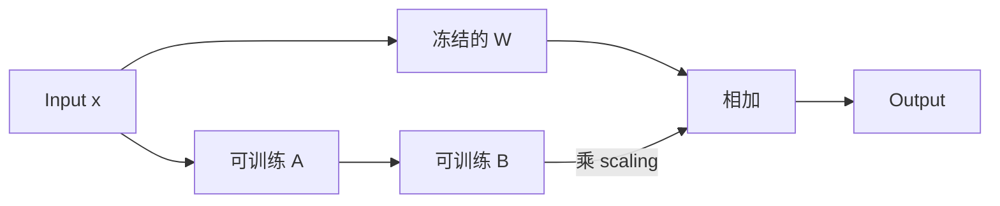
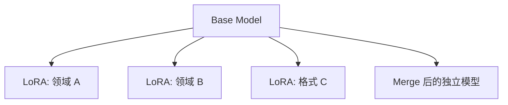
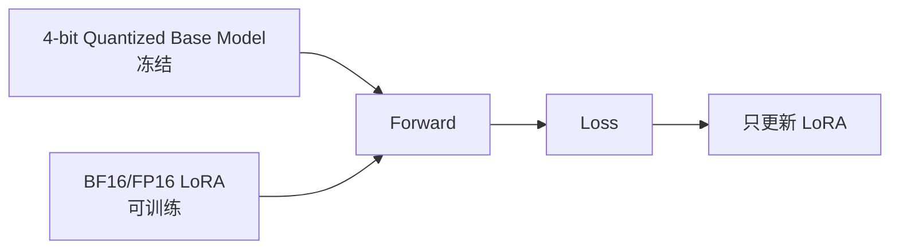
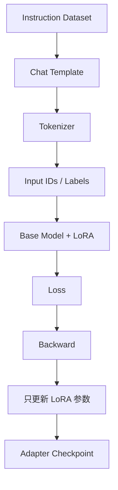

#ai #llm #lora #qlora #peft #fine-tuning

相关笔记：[[llm-learning-path]] | [[llm-fundamentals]] | [[llm-post-training]] | [[llm-rl-fundamentals]] | [[vllm-and-sglang]]

# LoRA 与 QLoRA

## 概述

LoRA（Low-Rank Adaptation）是一种 Parameter-Efficient Fine-Tuning（PEFT）方法。它不改变训练目标，而是改变“哪些参数需要更新”：冻结 Base Model 的原始权重，只训练额外插入的低秩矩阵，从而减少可训练参数、梯度和 Optimizer State 的成本。

LoRA 可以用于 SFT，也可以与 DPO 等 Post-training 方法组合。它不与 SFT、DPO、RL 处于同一分类层级。

## 为什么 Full Fine-tuning 很贵

训练一个参数通常不只保存权重，还可能需要：

- Gradient。
- Optimizer State，例如 Adam 的一阶和二阶矩估计。
- Forward 中为 Backward 保留的 Activation。

因此“7B 参数 × 每参数 2 Byte”只是在某种精度下权重本身的近似大小，不是训练总显存。Batch、Sequence Length、Precision、Optimizer 和并行策略都会改变真实占用。

## LoRA 的核心公式

对一个冻结的权重矩阵 `W`，LoRA 不直接更新 `W`，而是学习两个更小的矩阵 `A` 和 `B`：

```text
W' = W + scaling × B × A
scaling = lora_alpha / r
```

如果 `W` 的形状是 `d_out × d_in`，则可以令：

```text
A: r × d_in
B: d_out × r
```

当 `r` 远小于 `d_in` 和 `d_out` 时，需要训练的参数显著减少。



> 基础名词：**Rank（秩）** 可以先理解为低秩更新允许表达的独立变化方向数量。`r` 越大，Adapter 容量通常越大，但训练参数和显存也增加。

## 关键参数

| 参数 | 作用 | 常见误区 |
| --- | --- | --- |
| `r` | 低秩矩阵的 Rank | 不是越大一定越好 |
| `lora_alpha` | 控制 LoRA 更新的缩放 | 需要结合 `r` 理解实际 scaling |
| `target_modules` | 指定在哪些 Linear 层插入 LoRA | 模块名依赖具体模型结构 |
| `lora_dropout` | 训练时对 LoRA 分支做 Dropout | 推理时不启用 |
| `modules_to_save` | 额外保持可训练并保存的模块 | 新增任务 Head 时可能需要 |

学习 `target_modules` 时，应先打印模型结构，确认 `q_proj`、`k_proj`、`v_proj`、`o_proj`、MLP Projection 等真实名称，而不是从其他模型复制配置。

## Adapter 与 Base Model 的关系

LoRA Checkpoint 通常只保存 Adapter 参数和配置，不包含完整 Base Model：



因此加载时必须保证：

- Base Model 身份和版本正确。
- Tokenizer 与训练时一致。
- LoRA 配置与目标模块兼容。
- 推理引擎支持所需的 Adapter 加载方式。

## Merge 与动态加载

| 方式 | 优点 | 代价 |
| --- | --- | --- |
| Adapter 独立加载 | 一个 Base Model 可以切换多个 LoRA，存储小 | 运行时要管理 Adapter，可能有加载与路由成本 |
| Merge 到 Base Model | 得到普通完整模型，部署路径简单 | 每个任务都产生完整模型，失去共享和快速切换优势 |

多租户推理常希望动态加载多个 LoRA，但需要额外考虑显存、热度、并发安全、Adapter Cache 和路由。

## QLoRA

QLoRA 在 LoRA 基础上进一步把冻结的 Base Model 以低比特形式加载，从而降低权重显存；LoRA 参数通常仍以更高精度训练。

> 基础名词：**Quantization** 是用更少的比特表示数值。它降低存储和带宽成本，但会引入量化误差，并受硬件与 Kernel 支持影响。



QLoRA 不等于“整个训练都用 4-bit”。需要区分：权重存储精度、计算精度、LoRA 参数精度与 Optimizer State 精度。

## 最小训练数据流



训练前先建立 Base Model 基线；训练后必须在未参与训练的数据上比较，否则无法判断模型是学会了任务还是记住了训练样本。

## 一个最小 PEFT 配置

下面展示参数关系，具体模型名称、设备映射和训练参数要根据环境调整：

```python
from peft import LoraConfig, get_peft_model
from transformers import AutoModelForCausalLM

model = AutoModelForCausalLM.from_pretrained(
    "Qwen/Qwen3-0.6B",
    torch_dtype="auto",
)

config = LoraConfig(
    r=16,
    lora_alpha=32,
    lora_dropout=0.05,
    target_modules=["q_proj", "k_proj", "v_proj", "o_proj"],
    task_type="CAUSAL_LM",
)

model = get_peft_model(model, config)
model.print_trainable_parameters()
```

这段代码只完成模型包装，还没有准备 Dataset、Labels、Trainer、Evaluation 或 Checkpoint 策略，不能把“成功创建 PEFT Model”当成训练完成。

## 如何做有效实验

至少记录：

- Base Model 与 revision。
- Dataset 版本、样本数和切分方法。
- Chat Template 与最大长度。
- `r`、`lora_alpha`、`target_modules`。
- Batch Size、Gradient Accumulation、Learning Rate、Epoch/Steps。
- 训练/验证 Loss 与真实任务指标。
- Adapter Checkpoint 和是否 Merge。

先使用小模型和小数据验证数据流，再扩大规模。参数数量越大，错误的数据格式只会更昂贵，不会自动变正确。

## 常见失败模式

- Chat Template 错误，模型学到控制 Token 或角色格式的噪声。
- Labels 没有正确 Mask，Loss 计算范围与目标不一致。
- `target_modules` 复制自其他架构，实际没有命中或遗漏关键层。
- 训练集与测试集泄漏，离线结果虚高。
- 学习率过大导致遗忘，过小则几乎没有变化。
- 只看 Training Loss，不检查生成结果与回归任务。
- Adapter 对应错 Base Model，加载成功但结果异常。

## 自检清单

- [ ] 能说明 LoRA 改变的是参数更新方式，不是训练目标。
- [ ] 能画出 `W + BA` 的两条计算分支。
- [ ] 能解释 `r`、`lora_alpha` 与 `target_modules`。
- [ ] 能区分 Adapter 独立加载和 Merge。
- [ ] 能解释 QLoRA 中哪些参数被量化、哪些参数被训练。

## 面试要点

### Q：LoRA 为什么能减少训练成本？

> [!question]- 参考答案（点击展开）
>
> 它冻结原始权重，只训练两个低秩更新矩阵，使可训练参数、梯度和 Optimizer State 大幅减少。Activation 成本仍然存在，因此显存不会按可训练参数比例无限下降。

### Q：LoRA 与 SFT 有什么关系？

> [!question]- 参考答案（点击展开）
>
> SFT 定义训练数据和目标，即用标准回答监督模型；LoRA 定义参数如何被更新。可以用 LoRA 做 SFT，也可以 Full Fine-tuning 做 SFT。

### Q：QLoRA 与普通 LoRA 的关键区别是什么？

> [!question]- 参考答案（点击展开）
>
> QLoRA 还会以低比特形式加载冻结的 Base Model 权重以降低显存，而 LoRA Adapter 通常保持较高精度训练。它不是把所有计算和状态都简单变成 4-bit。
