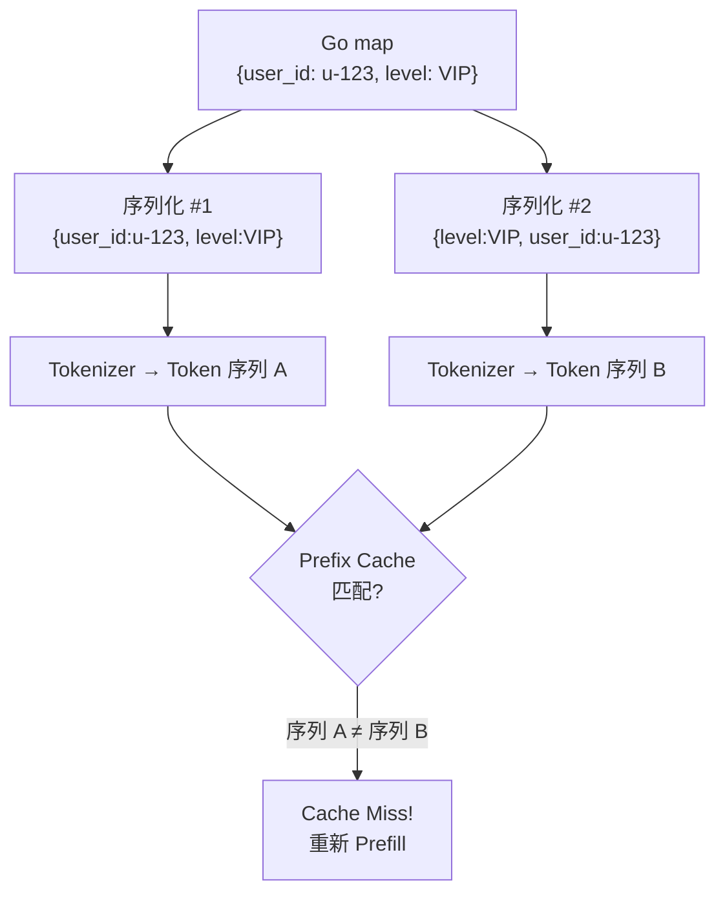
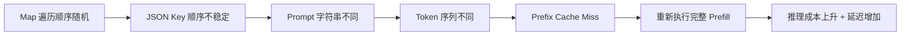

#prefill #ai #go

相关笔记：[[llm-inference-pipeline]]

## Go Map 序列化导致 Prefill Cache Miss 问题分析

### 问题背景

LLM 推理引擎通过 Prefix Cache 缓存 Prefill 阶段的 KV 状态，避免重复计算。Cache 命中的前提是：**Prompt 的 Token 序列必须精确匹配**。

如果你在用 Go 开发 LLM 应用，map 的序列化行为可能在不知不觉中破坏这个前提，导致大量不必要的 Cache Miss，直接推高推理成本。

---

### 根因：Go Map 遍历顺序不确定

Go 语言中，map 的遍历顺序是**随机的**（语言规范刻意为之，防止开发者依赖不确定的顺序）。

当你把 map 序列化为 JSON 并拼入 Prompt 时，不同的 JSON 库行为不同：

| JSON 库 | Key 排序 | 输出稳定性 |
|---------|---------|-----------|
| `encoding/json`（标准库） | 自动按 key 字母排序 | 稳定 |
| 部分第三方高性能库 | 不排序，按内部顺序输出 | **不稳定** |



---

### 复现示例

假设程序中有如下 map：

```go
userInfo := map[string]string{
    "user_id": "u-123",
    "level":   "VIP",
}
```

使用不排序的第三方 JSON 库，两次请求可能产生不同的 JSON：

```
请求 A 的 Prompt: "context": {"user_id":"u-123", "level":"VIP"}
请求 B 的 Prompt: "context": {"level":"VIP", "user_id":"u-123"}
```

从逻辑上看完全等价，但对 Tokenizer 而言是两个不同的字符串，产生不同的 Token 序列，缓存无法命中。

---

### 影响链路



---

### 解决方案

#### 方案 1：使用标准库 `encoding/json`

```go
import "encoding/json"

data, err := json.Marshal(userInfo) // key 自动排序，输出稳定
```

#### 方案 2：使用 struct 代替 map

```go
type UserInfo struct {
    UserID string `json:"user_id"`
    Level  string `json:"level"`
}

info := UserInfo{UserID: "u-123", Level: "VIP"}
data, err := json.Marshal(info) // struct 字段顺序固定
```

#### 方案 3：手动排序 key

```go
import "sort"

keys := make([]string, 0, len(userInfo))
for k := range userInfo {
    keys = append(keys, k)
}
sort.Strings(keys)
// 按 keys 顺序构建 JSON
```

---

### 核心结论

> 追求输入的**确定性**，本质上是在守护 LLM Prefix Cache 高效命中的根基。一个由序列化库导致的微小差异，就能让缓存形同虚设，在账单上造成显著的成本增长。

**检查清单：**
- [ ] 确认 JSON 序列化库是否对 map key 排序
- [ ] Prompt 模板中避免直接嵌入 map 序列化结果
- [ ] 优先使用 struct 保证字段顺序稳定

## 面试要点

### 高频问题

**Q: 什么是 Prefill 阶段的 Prefix Cache？它命中的前提是什么？**
A: LLM 推理分为 Prefill 和 Decode 两个阶段，Prefill 阶段会一次性并行计算整个 Prompt 的 KV Cache。Prefix Cache 把这些已算好的 KV 状态缓存下来，让后续具有相同前缀的请求直接复用、跳过重复计算。命中的硬性前提是：两次请求的 **Token 序列必须从开头逐个精确匹配**（实现上通常按前缀逐 block 比对其 hash），从第一个 Token 差异点之后全部失效——哪怕只差一个字符也会从差异点开始 Cache Miss。

**Q: 为什么 Go 的 map 序列化会导致 Prefix Cache Miss？**
A: Go 运行时刻意让 map 的遍历顺序**随机化**，目的是防止开发者依赖这个不确定的顺序。如果用「不对 key 排序」的第三方 JSON 库序列化 map 并拼进 Prompt，同样的数据两次可能输出不同的 key 顺序，对 Tokenizer 而言就是两个不同的字符串，产生不同的 Token 序列，缓存自然命中不了。注意：随机化的是 map 的遍历顺序，序列化结果是否随机取决于所用 JSON 库是否在内部对 key 做了排序。

**Q: Go 标准库 `encoding/json` 序列化 map 时 key 顺序是怎样的？**
A: `encoding/json` 对 map 序列化时会**自动按 key 的字典序（字符串排序）**输出，因此输出是稳定的、可复现的，与底层 map 的随机遍历顺序无关。这是它和部分第三方高性能库的关键区别：后者在默认或某些配置下不保证对 map key 排序，而是按内部遍历顺序输出。所以换库做性能优化时，可能引入这种隐蔽的 Cache Miss，需要确认目标库是否开启了 key 排序。

**Q: 有哪些方法可以保证序列化输出的确定性？**
A: 主要三种。一是直接用标准库 `encoding/json`，靠它对 map key 自动排序；二是用 **struct 代替 map**，struct 的字段顺序在编译期固定，序列化时按字段定义顺序输出，天然稳定；三是手动 `sort.Strings` 对 key 排序后再拼 JSON。生产中最推荐 struct，字段顺序固定且语义清晰，从根上消除了 map 随机性带来的不确定。

**Q: 这个问题对线上推理服务有什么实际影响？**
A: 影响链路是「map 遍历随机 → JSON key 顺序不稳定 → Prompt 字符串不同 → Token 序列不同 → Prefix Cache Miss → 重新执行完整 Prefill → 成本上升 + 延迟增加」。Prefill 是计算密集型阶段（compute-bound），大量本可命中的请求退化为完整重算，会直接推高 GPU 占用、TTFT（Time To First Token，首 Token 延迟）和账单。

**Q: 除了 map 顺序，还有哪些常见因素会破坏 Prefix Cache 命中？**
A: 任何让 Prompt 前缀产生字符级差异的因素都会破坏命中：浮点数/时间戳/随机 ID 等动态内容前置、空格与换行不一致、System Prompt 频繁变更、更换或升级 tokenizer。工程原则是把稳定的公共前缀（如固定的 System Prompt、模板）放最前，把易变部分放最后，以最大化前缀复用。

**Q: 为什么说「追求输入确定性」是守护 Prefix Cache 的根基？**
A: 因为缓存命中本质是「相同输入 → 相同结果」的假设，而一个序列化库的微小非确定性差异，就能让逻辑上完全等价的两次请求在 Token 层面不一致，使缓存形同虚设。确定性是缓存收益的前置条件，工程上应把它当作可观测、可校验的不变量来对待。

### 面试加分点

- 能区分 Prefill（compute-bound、并行批量算 KV）与 Decode（memory-bandwidth-bound、逐 Token 自回归）两个阶段，并解释为什么 Prefix Cache 主要优化的是 Prefill 的重复计算成本。
- 理解 Prefix Cache 通常以 **block/页为粒度**做前缀匹配（如 vLLM 的 PagedAttention，默认 block_size 16 个 token），命中是「最长公共前缀」式的——从第一个 Token 差异点之后整段失效，所以易变内容越靠后越好。
- 能从架构上给出工程实践：Prompt 模板里避免直接嵌入 map 序列化结果、对动态字段做规范化（normalize）、把稳定前缀与可变后缀分离、并在 CI 中加序列化稳定性的回归测试。
- 知道 Go map 的遍历随机化自 Go 1.0 起就由运行时刻意引入（遍历起始 bucket 随机），并非 bug，因此不能依赖任何「碰巧稳定」的顺序。
- 能把这个案例上升为通用原则：分布式/缓存场景中，所有作为 cache key 或参与 hash、签名的序列化输出都应保证**确定性**（canonical/deterministic serialization），同理适用于幂等键、签名校验、etcd 写入等场景。
