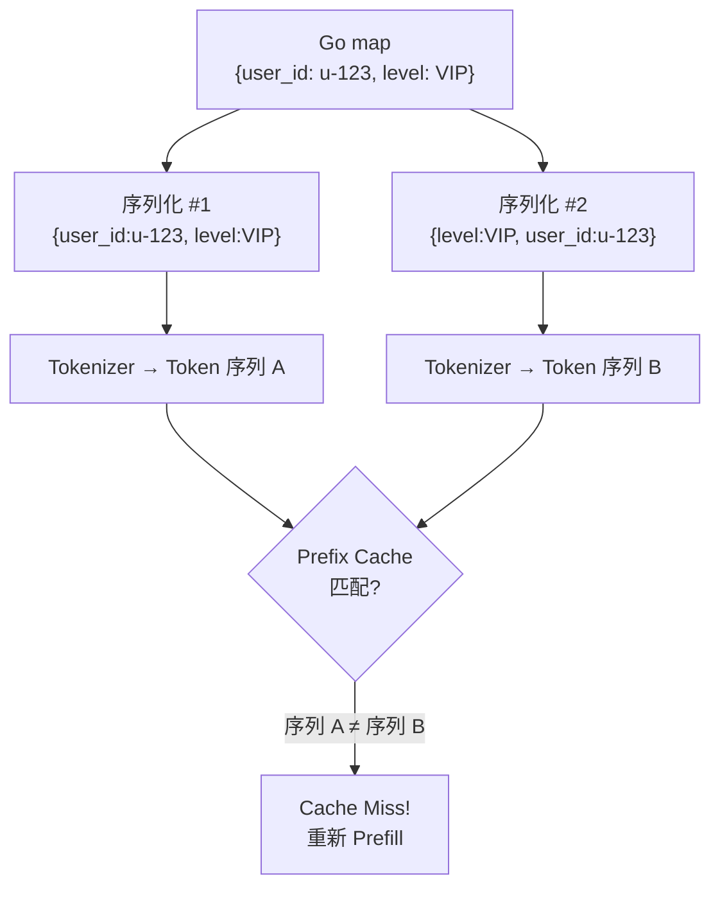
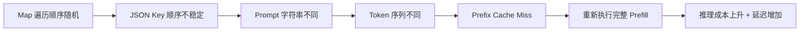

#prefill #ai #go

相关笔记：[[llm-inference-pipeline]]

## Go Map 序列化导致 Prefill Cache Miss 问题分析

### 问题背景

LLM 推理引擎通过 Prefix Cache 缓存 Prefill 阶段的 KV 状态，避免重复计算。Cache 命中的前提是：**Prompt 的 Token 序列必须精确匹配**。

如果你在用 Go 开发 LLM 应用，map 的序列化行为可能在不知不觉中破坏这个前提，导致大量不必要的 Cache Miss，直接推高推理成本。

---

### 根因：Go Map 遍历顺序不确定

Go 语言中，map 的遍历顺序是**随机的**（语言规范刻意为之，防止开发者依赖不确定的顺序）。

当你把 map 序列化为 JSON 并拼入 Prompt 时，不同的 JSON 库行为不同：

| JSON 库 | Key 排序 | 输出稳定性 |
|---------|---------|-----------|
| `encoding/json`（标准库） | 自动按 key 字母排序 | 稳定 |
| 部分第三方高性能库 | 不排序，按内部顺序输出 | **不稳定** |



---

### 复现示例

假设程序中有如下 map：

```go
userInfo := map[string]string{
    "user_id": "u-123",
    "level":   "VIP",
}
```

使用不排序的第三方 JSON 库，两次请求可能产生不同的 JSON：

```
请求 A 的 Prompt: "context": {"user_id":"u-123", "level":"VIP"}
请求 B 的 Prompt: "context": {"level":"VIP", "user_id":"u-123"}
```

从逻辑上看完全等价，但对 Tokenizer 而言是两个不同的字符串，产生不同的 Token 序列，缓存无法命中。

---

### 影响链路



---

### 解决方案

#### 方案 1：使用标准库 `encoding/json`

```go
import "encoding/json"

data, err := json.Marshal(userInfo) // key 自动排序，输出稳定
```

#### 方案 2：使用 struct 代替 map

```go
type UserInfo struct {
    UserID string `json:"user_id"`
    Level  string `json:"level"`
}

info := UserInfo{UserID: "u-123", Level: "VIP"}
data, err := json.Marshal(info) // struct 字段顺序固定
```

#### 方案 3：手动排序 key

```go
import "sort"

keys := make([]string, 0, len(userInfo))
for k := range userInfo {
    keys = append(keys, k)
}
sort.Strings(keys)
// 按 keys 顺序构建 JSON
```

---

### 核心结论

> 追求输入的**确定性**，本质上是在守护 LLM Prefix Cache 高效命中的根基。一个由序列化库导致的微小差异，就能让缓存形同虚设，在账单上造成显著的成本增长。

**检查清单：**
- [ ] 确认 JSON 序列化库是否对 map key 排序
- [ ] Prompt 模板中避免直接嵌入 map 序列化结果
- [ ] 优先使用 struct 保证字段顺序稳定
