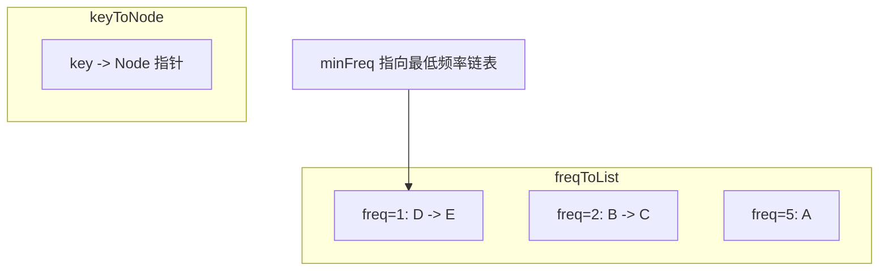

#LFU #缓存策略

## LFU Cache (Least Frequently Used)

相关笔记：[[lru]] | [[linked-list]]

LFU 缓存淘汰策略根据数据被访问的**频率**来决定淘汰哪些数据，优先淘汰访问次数最少的。与 LRU 不同，LFU 关注的是访问频率而不是访问时间顺序。

### 数据结构



### 复杂度分析

| 操作 | Time | Space |
|:---:|:---:|:---:|
| Get | O(1) | O(capacity) |
| Put | O(1) | O(capacity) |

## 实现

### 结构体定义

- `capacity`：缓存容量
- `minFreq`：当前所有条目中最小的访问频率
- `keyToNode`：key -> 链表节点的映射，用于 O(1) 查找
- `freqToList`：频率 -> 双向链表的映射，相同频率的条目在同一链表中

### 工作流程

1. **Get**：查找 key，存在则更新频率（freq++），移动到新频率链表头部
2. **Put**：
   - key 已存在：更新 value 和频率
   - key 不存在且已满：淘汰 `minFreq` 链表尾部的条目，添加新条目
   - key 不存在且未满：直接添加，`minFreq = 1`
3. 频率链表变空时，删除该链表并可能更新 `minFreq`

```go
type entry struct {
    key, value, freq int // freq 表示访问次数
}

type LFUCache struct {
    capacity   int
    minFreq    int
    keyToNode  map[int]*list.Element
    freqToList map[int]*list.List
}

func Constructor(capacity int) LFUCache {
    return LFUCache{
        capacity:   capacity,
        keyToNode:  map[int]*list.Element{},
        freqToList: map[int]*list.List{},
    }
}

func (c *LFUCache) pushFront(e *entry) {
    if _, ok := c.freqToList[e.freq]; !ok {
        c.freqToList[e.freq] = list.New()
    }
    c.keyToNode[e.key] = c.freqToList[e.freq].PushFront(e)
}

func (c *LFUCache) getEntry(key int) *entry {
    node := c.keyToNode[key]
    if node == nil {
        return nil
    }
    e := node.Value.(*entry)
    lst := c.freqToList[e.freq]
    lst.Remove(node) // 从当前频率链表中移除
    if lst.Len() == 0 {
        delete(c.freqToList, e.freq) // 移除空链表
        if c.minFreq == e.freq {
            c.minFreq++ // 更新最小频率
        }
    }
    e.freq++ // 频率+1
    c.pushFront(e) // 放到新频率链表的头部
    return e
}

func (c *LFUCache) Get(key int) int {
    if e := c.getEntry(key); e != nil {
        return e.value
    }
    return -1
}

func (c *LFUCache) Put(key, value int) {
    if e := c.getEntry(key); e != nil {
        e.value = value // 更新 value
        return
    }
    if len(c.keyToNode) == c.capacity { // 容量已满
        lst := c.freqToList[c.minFreq]                                  // 最低频率链表
        delete(c.keyToNode, lst.Remove(lst.Back()).(*entry).key)         // 淘汰尾部条目
        if lst.Len() == 0 {
            delete(c.freqToList, c.minFreq)
        }
    }
    c.pushFront(&entry{key, value, 1}) // 新条目，频率为1
    c.minFreq = 1
}

func init() { debug.SetGCPercent(-1) }
```

## 面试要点

### 高频问题

**Q: LFU 和 LRU 有什么区别？各自适合什么场景？**

> [!question]- 参考答案（点击展开）
>
> LRU（Least Recently Used）淘汰**最久未访问**的数据，关注访问的时间顺序；LFU（Least Frequently Used）淘汰**访问次数最少**的数据，关注访问频率。LRU 适合有时间局部性、热点随时间漂移的场景；LFU 适合长期热点稳定的场景（如固定的热门商品）。但 LFU 对突发流量和历史高频数据不友好（见缓存污染问题），且实现更复杂（需额外维护频率维度）。

**Q: 如何让 LFU 的 Get 和 Put 都达到 O(1)？**

> [!question]- 参考答案（点击展开）
>
> 核心是哈希加双向链表的频率分桶。用 `keyToNode`（key -> 链表节点 `*list.Element`）做 O(1) 定位；用 `freqToList`（freq -> 双向链表）把相同频率的条目串在一起，链表内按插入顺序（即访问新旧）排列；再维护一个 `minFreq` 指向当前最小频率的链表，淘汰时直接取该链表尾部 `Back()`，避免遍历找最小频率。所有操作均为 O(1)。

**Q: 同一频率内有多个条目，淘汰谁？**

> [!question]- 参考答案（点击展开）
>
> 淘汰同频率中**最久未访问**的那个，即用 LRU 作为 tie-breaker。实现上每次访问/插入都 `PushFront` 到该频率链表头部，所以链表尾部（`Back()`）就是该频率下最久未访问的条目，淘汰时取 `lst.Back()` 即可。

**Q: minFreq 如何维护？为什么淘汰后不需要重新搜索 minFreq？**

> [!question]- 参考答案（点击展开）
>
> 三处维护：① `Put` 新增条目频率恒为 1，直接令 `minFreq = 1`；② 访问导致某条目升频时，若它原本所在的 `minFreq` 链表因此变空，则 `minFreq++`——因为该条目升到了 `minFreq+1`，而比 minFreq 更低的频率不可能存在；③ 淘汰只发生在 `Put` 新增满容量时，淘汰后紧接着插入新条目又把 `minFreq` 重置为 1。所以全程无需遍历搜索 minFreq。

**Q: 当一个频率链表变空时要做什么处理？**

> [!question]- 参考答案（点击展开）
>
> 把该空链表从 `freqToList` 中 `delete` 掉，避免遗留空 map 项占用内存，并保证"该频率是否仍有条目"的判断正确。此外，若被清空的恰好是 `minFreq` 对应的链表、且是因访问升频导致的（`getEntry` 路径），需要 `minFreq++` 更新最小频率指针；若是淘汰路径（`Put` 中删 `Back()`）导致变空，则不必更新，因为随后插入会把 `minFreq` 重置为 1。

**Q: Put 一个已存在的 key 时，频率会变化吗？**

> [!question]- 参考答案（点击展开）
>
> 会。本实现中 `Put` 已存在 key 复用了 `getEntry`，所以更新 value 的同时也触发 `freq++` 并移动到新频率链表。这符合 LeetCode 460 的语义——更新操作也算一次访问。注意有些实现会区分"读"和"写"是否都计入频率，面试时要先确认题目定义。

**Q: 用计数 + 一个有序结构（如小顶堆/平衡树）实现 LFU 会怎样？复杂度如何？**

> [!question]- 参考答案（点击展开）
>
> 用最小堆按频率排序，Get/Put 时调整堆，淘汰取堆顶，复杂度是 O(log n) 而非 O(1)；且堆中更新某节点频率需先定位（要额外的索引映射 + 上浮/下沉）。所以最优解是哈希 + 频率分桶链表，把"找最小频率"和"同频淘汰"都降为 O(1)。堆方案思路直观但不满足 O(1) 要求。

### 面试加分点

- **LFU 的缓存污染问题**：早期被大量访问的"过气热点"会积累很高频率，长期赖在缓存里不被淘汰，而新热点频率低反被先淘汰。工业级方案用 **LFU with Aging / Decay**（频率随时间衰减）或 **Window-TinyLFU**（Caffeine 采用，结合 LRU 准入窗口 + Count-Min Sketch 概率计数 + 频率衰减）来缓解。
- **频率链表内部用 LRU 做次级淘汰**，是 LFU 的标准工程实现，体现了"频率为主、时间为辅"的双维度淘汰策略。
- **Count-Min Sketch 节省内存**：精确统计每个 key 的频率内存开销大，TinyLFU 用 Count-Min Sketch 以亚线性空间近似统计访问频率，牺牲少量精度换取内存，适合大规模缓存。
- 代码里 `init()` 中 `debug.SetGCPercent(-1)` 关闭了 GC，这是 LeetCode 上为压低运行时间的常见 trick（避免频繁 GC），生产代码绝不应这样写。
- Go 标准库 `container/list` 是双向链表，`PushFront`/`Remove`/`Back` 均为 O(1)，节点用 `Element` 包装、`Element.Value` 存 `*entry` 指针避免拷贝（非侵入式，链接指针在 `Element` 而非业务结构体上）。手写双向链表也可，但要注意哨兵节点（dummy head/tail）简化边界处理。
- 实际生产中 Redis 的 `maxmemory-policy` 提供了 `allkeys-lfu` / `volatile-lfu` 策略，其 LFU 用每个对象 8-bit 的对数计数器（初始值 `LFU_INIT_VAL`，默认 5）配合时间衰减实现近似 LFU，并非精确计数，正是为规避内存开销与缓存污染问题。
