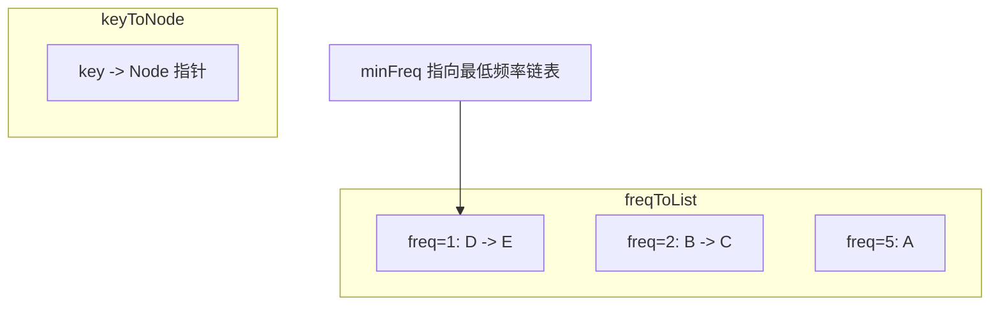

#LFU #缓存策略

## LFU Cache (Least Frequently Used)

相关笔记：[[lru]] | [[linked-list]]

LFU 缓存淘汰策略根据数据被访问的**频率**来决定淘汰哪些数据，优先淘汰访问次数最少的。与 LRU 不同，LFU 关注的是访问频率而不是访问时间顺序。

### 数据结构



### 复杂度分析

| 操作 | Time | Space |
|:---:|:---:|:---:|
| Get | O(1) | O(capacity) |
| Put | O(1) | O(capacity) |

## 实现

### 结构体定义

- `capacity`：缓存容量
- `minFreq`：当前所有条目中最小的访问频率
- `keyToNode`：key -> 链表节点的映射，用于 O(1) 查找
- `freqToList`：频率 -> 双向链表的映射，相同频率的条目在同一链表中

### 工作流程

1. **Get**：查找 key，存在则更新频率（freq++），移动到新频率链表头部
2. **Put**：
   - key 已存在：更新 value 和频率
   - key 不存在且已满：淘汰 `minFreq` 链表尾部的条目，添加新条目
   - key 不存在且未满：直接添加，`minFreq = 1`
3. 频率链表变空时，删除该链表并可能更新 `minFreq`

```go
type entry struct {
    key, value, freq int // freq 表示访问次数
}

type LFUCache struct {
    capacity   int
    minFreq    int
    keyToNode  map[int]*list.Element
    freqToList map[int]*list.List
}

func Constructor(capacity int) LFUCache {
    return LFUCache{
        capacity:   capacity,
        keyToNode:  map[int]*list.Element{},
        freqToList: map[int]*list.List{},
    }
}

func (c *LFUCache) pushFront(e *entry) {
    if _, ok := c.freqToList[e.freq]; !ok {
        c.freqToList[e.freq] = list.New()
    }
    c.keyToNode[e.key] = c.freqToList[e.freq].PushFront(e)
}

func (c *LFUCache) getEntry(key int) *entry {
    node := c.keyToNode[key]
    if node == nil {
        return nil
    }
    e := node.Value.(*entry)
    lst := c.freqToList[e.freq]
    lst.Remove(node) // 从当前频率链表中移除
    if lst.Len() == 0 {
        delete(c.freqToList, e.freq) // 移除空链表
        if c.minFreq == e.freq {
            c.minFreq++ // 更新最小频率
        }
    }
    e.freq++ // 频率+1
    c.pushFront(e) // 放到新频率链表的头部
    return e
}

func (c *LFUCache) Get(key int) int {
    if e := c.getEntry(key); e != nil {
        return e.value
    }
    return -1
}

func (c *LFUCache) Put(key, value int) {
    if e := c.getEntry(key); e != nil {
        e.value = value // 更新 value
        return
    }
    if len(c.keyToNode) == c.capacity { // 容量已满
        lst := c.freqToList[c.minFreq]                                  // 最低频率链表
        delete(c.keyToNode, lst.Remove(lst.Back()).(*entry).key)         // 淘汰尾部条目
        if lst.Len() == 0 {
            delete(c.freqToList, c.minFreq)
        }
    }
    c.pushFront(&entry{key, value, 1}) // 新条目，频率为1
    c.minFreq = 1
}

func init() { debug.SetGCPercent(-1) }
```
