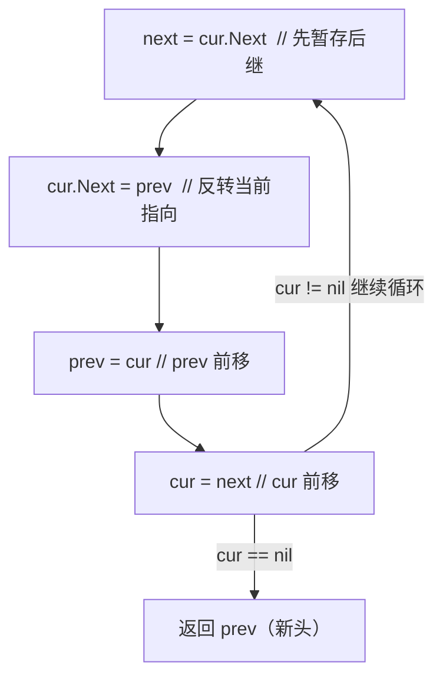

#算法 #链表

## 链表 (Linked List)

相关笔记：[[lru]] | [[lfu]]

链表是一种线性数据结构，每个节点包含数据和指向下一个节点的指针。常用技巧包括 dummy head、快慢指针、递归等。

### 链表节点定义

```go
type ListNode struct {
    Val  int
    Next *ListNode
}
```

### 常用技巧

| 技巧 | 用途 |
|:---|:---|
| Dummy Head | 简化头节点的处理，避免边界判断 |
| 快慢指针 | 找中点、检测环 |
| 递归 | 反转链表、合并链表 |

### 迭代反转链表（最高频考点）

每个节点做四步指针操作，`prev` 从 `nil` 出发逐步带着已反转部分前移：



## 例题：链表相加

[2. 两数相加](https://leetcode.cn/problems/add-two-numbers/)

给你两个**非空**链表，表示两个非负整数。每位数字按**逆序**存储，每个节点只存储一位数字。将两数相加，以相同形式返回一个表示和的链表。

![[addtwonumber1.jpg]]

### 思路

使用 dummy head 简化处理，逐位相加并处理进位。

Time O(max(m, n))，Space O(max(m, n))

```go
func addTwoNumbers(l1 *ListNode, l2 *ListNode) *ListNode {
    dummy := new(ListNode) // 虚拟头节点
    head := dummy
    carry := 0

    for l1 != nil || l2 != nil || carry != 0 {
        if l1 != nil {
            carry += l1.Val
        }
        if l2 != nil {
            carry += l2.Val
        }
        head.Next = &ListNode{Val: carry % 10}
        carry /= 10
        head = head.Next
        if l1 != nil {
            l1 = l1.Next
        }
        if l2 != nil {
            l2 = l2.Next
        }
    }
    return dummy.Next
}
```

## 面试要点

### 高频问题

**Q: dummy head（虚拟头节点）解决了什么问题？**
A: dummy head 是一个指向真实头节点的哨兵节点，作用是统一头节点和中间节点的处理逻辑，避免对头节点单独做空判断或特殊处理。常见于链表插入/删除、两数相加、合并链表等场景，最后返回 `dummy.Next` 即可。

**Q: 如何用快慢指针找链表中点？奇偶长度有什么区别？**
A: slow 每次走一步、fast 每次走两步，当 fast 到达末尾时 slow 正好在中点。若初始 `slow = fast = head` 且循环条件为 `fast != nil && fast.Next != nil`，偶数长度时 slow 停在右中点（第 n/2 个，0-based）；若改为 `fast = head.Next`，则偏向左中点。考点是边界条件，写之前要明确想要哪个中点。

**Q: 如何检测链表是否有环？环的入口怎么找？**
A: 用 Floyd 判圈算法（快慢指针），fast 走两步、slow 走一步，若相遇则有环、若 fast 触达 nil 则无环。找入口：相遇后让一个指针回到 head，两指针同步每次走一步，再次相遇点即为环入口，时间 O(n)、空间 O(1)。

**Q: 两数相加这道题为什么循环条件是 `l1 != nil || l2 != nil || carry != 0`？**
A: 因为两个链表可能不等长，要遍历到较长的那个结束；`carry != 0` 是为了处理最高位进位（如 `99 + 1 = 100` 会多出一个节点）。三个条件用 `||` 连接，确保进位和剩余位都被正确处理，时间和空间都是 O(max(m, n))。

**Q: 如何反转一个单链表？迭代和递归各怎么写？**
A: 迭代法用 prev、cur 两个指针，每步先暂存 `cur.Next`，再把 `cur.Next` 指向 prev，然后 prev、cur 整体后移，时间 O(n)、空间 O(1)。递归法递归到尾节点作为新头，回溯时让 `cur.Next.Next = cur` 并断开 `cur.Next = nil`，空间 O(n)（递归栈）。面试更推荐迭代法，因为空间更优。

**Q: 数组和链表的本质区别是什么？各自的访问/插入复杂度？**
A: 数组是连续内存、支持 O(1) 随机访问，但中间插入/删除需移动元素为 O(n)；链表是非连续内存、靠指针串联，随机访问需遍历为 O(n)，但已知前驱位置时插入/删除是 O(1)。链表额外有指针的内存开销且对 CPU cache 不友好。

**Q: 如何删除链表的倒数第 N 个节点（一次遍历）？**
A: 用 dummy head 加双指针：fast 从 dummy 先走 N 步，然后 fast、slow 同步前进，当 fast 到达末尾（nil）时 slow 正好指向待删节点的前驱，执行 `slow.Next = slow.Next.Next`。配合 dummy 可优雅处理删除头节点的边界情况，时间 O(n)、空间 O(1)。

### 面试加分点

- **dummy head 返回值**：始终返回 `dummy.Next` 而非提前保存的引用，能正确应对头节点被修改/删除的情况；用 `head := dummy` 做游标、`dummy` 不动，逻辑更清晰（与本笔记两数相加代码一致）。
- **快慢指针是一类通用模式**：找中点、判环、找环入口、找倒数第 K 个、判断回文链表都可归约为快慢指针的变体，面试时点明这一抽象能体现归纳能力。
- **空间复杂度权衡**：判环可以用 HashSet 记录访问过的节点（O(n) 空间），但 Floyd 判圈只需 O(1) 空间，面试中主动给出空间更优解是加分项。
- **递归 vs 迭代的取舍**：递归代码简洁但有 O(n) 栈深度，超长链表可能栈溢出；生产/面试中通常优先迭代，必要时说明可改写为尾递归或显式栈。
- **进位与边界**：两数相加要意识到最高位进位需要额外节点；同类问题（大数相加、链表表示数字）都要把 carry 纳入循环终止条件，体现对边界的敏感度。
