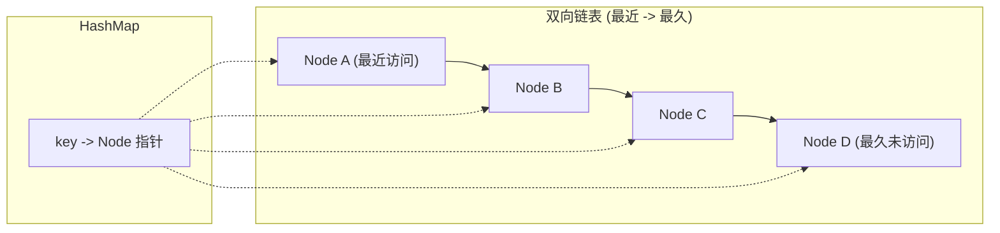

#LRU #缓存策略

## LRU Cache (Least Recently Used)

相关笔记：[[lfu]] | [[linked-list]]

LRU 缓存是一种常见的缓存替换策略，基于最近访问的时间来淘汰最近最少使用的条目。每次访问一个条目时，将其移动到最近使用的位置（链表头部）；当缓存满时，淘汰链表尾部（最久未使用）的条目。

### 数据结构



### 复杂度分析

| 操作 | Time | Space |
|:---:|:---:|:---:|
| Get | O(1) | O(capacity) |
| Put | O(1) | O(capacity) |

## 实现

使用双向链表 (`list.List`) 维护访问顺序 + HashMap (`keyToNode`) 快速查找。

```go
type entry struct {
    key, value int
}

type LRUCache struct {
    capacity  int
    list      *list.List // 双向链表
    keyToNode map[int]*list.Element
}

func Constructor(capacity int) LRUCache {
    return LRUCache{capacity, list.New(), map[int]*list.Element{}}
}

func (c *LRUCache) Get(key int) int {
    node := c.keyToNode[key]
    if node == nil {
        return -1
    }
    c.list.MoveToFront(node) // 移到最前面（最近使用）
    return node.Value.(entry).value
}

func (c *LRUCache) Put(key, value int) {
    if node := c.keyToNode[key]; node != nil {
        node.Value = entry{key, value} // 更新值
        c.list.MoveToFront(node)       // 移到最前面
        return
    }
    c.keyToNode[key] = c.list.PushFront(entry{key, value}) // 新条目放最前面
    if len(c.keyToNode) > c.capacity {                       // 超出容量
        delete(c.keyToNode, c.list.Remove(c.list.Back()).(entry).key) // 淘汰最久未使用
    }
}
```

## 方法解析

- `Constructor`：初始化 LRUCache，创建双向链表和 HashMap
- `Get`：获取 key 对应的 value，并将该条目移到链表头部表示最近使用。不存在返回 -1
- `Put`：插入或更新 key-value 对。若缓存已满则淘汰链表尾部条目（最近最少使用）
