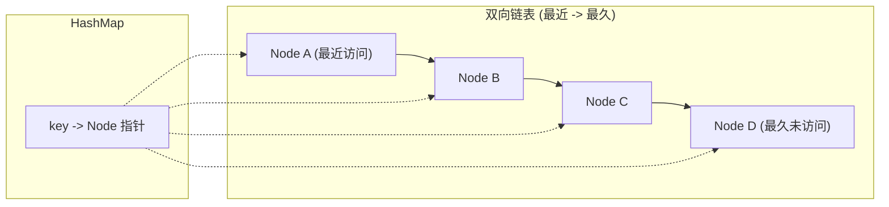

#LRU #缓存策略

## LRU Cache (Least Recently Used)

相关笔记：[[lfu]] | [[linked-list]]

LRU 缓存是一种常见的缓存替换策略，基于最近访问的时间来淘汰最近最少使用的条目。每次访问一个条目时，将其移动到最近使用的位置（链表头部）；当缓存满时，淘汰链表尾部（最久未使用）的条目。

### 数据结构



### 复杂度分析

| 操作 | Time | Space |
|:---:|:---:|:---:|
| Get | O(1) | O(capacity) |
| Put | O(1) | O(capacity) |

## 实现

使用双向链表 (`list.List`) 维护访问顺序 + HashMap (`keyToNode`) 快速查找。

```go
type entry struct {
    key, value int
}

type LRUCache struct {
    capacity  int
    list      *list.List // 双向链表
    keyToNode map[int]*list.Element
}

func Constructor(capacity int) LRUCache {
    return LRUCache{capacity, list.New(), map[int]*list.Element{}}
}

func (c *LRUCache) Get(key int) int {
    node := c.keyToNode[key]
    if node == nil {
        return -1
    }
    c.list.MoveToFront(node) // 移到最前面（最近使用）
    return node.Value.(entry).value
}

func (c *LRUCache) Put(key, value int) {
    if node := c.keyToNode[key]; node != nil {
        node.Value = entry{key, value} // 更新值
        c.list.MoveToFront(node)       // 移到最前面
        return
    }
    c.keyToNode[key] = c.list.PushFront(entry{key, value}) // 新条目放最前面
    if len(c.keyToNode) > c.capacity {                       // 超出容量
        delete(c.keyToNode, c.list.Remove(c.list.Back()).(entry).key) // 淘汰最久未使用
    }
}
```

## 方法解析

- `Constructor`：初始化 LRUCache，创建双向链表和 HashMap
- `Get`：获取 key 对应的 value，并将该条目移到链表头部表示最近使用。不存在返回 -1
- `Put`：插入或更新 key-value 对。若缓存已满则淘汰链表尾部条目（最近最少使用）

## 面试要点

### 高频问题

**Q: LRU Cache 为什么要用双向链表 + HashMap 的组合，能不能只用其中一个？**
A: 单用 HashMap 可以 O(1) 查找，但无法维护访问顺序，找不到「最久未使用」的节点；单用链表能维护顺序，但查找某个 key 需要 O(n) 遍历。两者结合：HashMap 提供 O(1) 定位到链表节点，双向链表提供 O(1) 的节点移动与删除，使 Get/Put 都达到 O(1)。

**Q: 为什么必须是双向链表，单向链表行不行？**
A: 不行。LRU 需要把任意节点从链表中「摘下来」再移到头部，删除一个节点必须知道它的前驱。单向链表找前驱要 O(n) 遍历，而双向链表通过 `prev` 指针可直接 O(1) 拿到前驱，完成断链和重连。

**Q: Get 操作为什么也会修改缓存结构？**
A: 因为 LRU 的「使用」包含读取。每次 Get 命中都意味着该条目被「最近使用」，必须把它移到链表头部（`MoveToFront`），否则淘汰时会错误地把刚被读过的热点数据当成最久未使用而踢掉。所以 Get 本质是写操作，并发场景下也需要写锁保护。

**Q: 容量满时是怎么淘汰的，淘汰链表头还是尾？**
A: 本实现约定头部（front）是最近使用、尾部（back）是最久未使用。Put 新增条目后若 `len(keyToNode) > capacity`，就删除链表尾部节点（`Remove(Back())`），并用尾节点 `entry` 里存的 key 去 HashMap 里 `delete`。关键是节点要同时存 key 和 value，否则只拿到 value 无法反查 HashMap 删除对应项。

**Q: 这道题里 entry 为什么要同时存 key 和 value？只存 value 不够吗？**
A: 不够。淘汰时从链表尾部拿到一个 `*list.Element`，要把它从 HashMap 中也删掉，就必须知道它对应的 key。如果节点只存 value，就无法定位 HashMap 中的键，会导致 map 中残留失效 entry，造成内存泄漏（map 项及其引用的对象无法回收）。所以双向链表节点和 HashMap 之间必须双向可达。

**Q: 这个 LRU 实现是线程安全的吗？如何改造成并发安全？**
A: 不安全。Go 的 `container/list` 和 `map` 都非并发安全，多 goroutine 同时 Get/Put 会 data race。最简单的做法是加一把 `sync.Mutex`（注意 Get 也会改链表结构，必须用互斥锁或写锁，不能用 RWMutex 的读锁）。更高并发可做分片（sharded LRU），按 key hash 分到多个带各自锁的 segment，降低锁竞争。

**Q: LRU 有什么典型缺陷？工程上怎么改进？**
A: LRU 对「偶发的全表扫描」很敏感，一次大批量冷数据访问会把热点数据全部挤出缓存（缓存污染）。改进方案：LRU-K（要被访问 K 次才进入主缓存）、2Q（FIFO 队列过滤一次性访问 + LRU 主队列）、以及结合访问频次的 [[lfu]]。Redis 在开启 LRU 淘汰策略时用的是近似 LRU（采样而非精确维护链表）以节省内存。

### 面试加分点

- 能说清 `MoveToFront`、`PushFront`、`Remove(Back())` 这三个 O(1) 操作分别对应「命中更新顺序」「新增」「淘汰」，并指出时间复杂度恒为 O(1)、空间为 O(capacity)。
- 知道用「哑头哑尾节点（dummy head/tail sentinel）」可以消除链表头尾的边界判空，是手写双向链表版 LRU 的常见简化技巧；Go 标准库 `container/list` 内部正是用一个环形哨兵节点（root）实现的。
- 能对比 LRU 与 LFU：LRU 看「最近一次访问时间」，LFU 看「访问频次」；LRU 实现更简单、对突发热点反应快，LFU 更抗扫描污染但有「历史频次惯性」导致旧热点难淘汰的问题（需要频次衰减来缓解）。
- 了解 Redis 的 `maxmemory-policy`：默认是 `noeviction`，需显式配置才会淘汰；`allkeys-lru`/`volatile-lru` 是基于 `maxmemory-samples` 采样的近似 LRU（用对象上的 LRU clock 估算空闲时间），`allkeys-lfu`/`volatile-lfu` 则是近似 LFU（用对数计数器 + 衰减），都不维护完整链表以节省内存和指针开销。
- 能指出并发场景下 Get 不能用 RWMutex 的读锁，因为它会修改链表顺序，本质是写操作；并能进一步提出分片锁来降低锁粒度。
- 清楚 LRU 是 OS 页面置换、CPU Cache、CDN、数据库 Buffer Pool（MySQL InnoDB 用的就是改良版 LRU，分 young/old 区 + 中点插入来抗全表扫描）等场景的通用淘汰策略。
