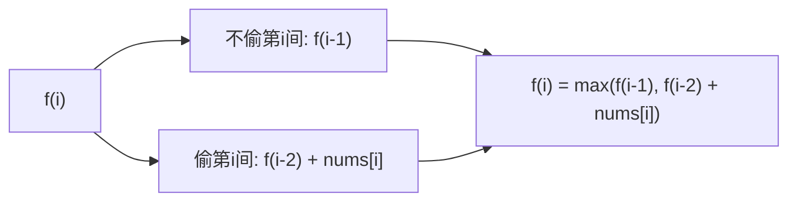

#动态规划

## 打家劫舍 (House Robber)

相关笔记：[[unbounded-knapsack]] | [[binary-search]]

经典 DP 系列题目。核心约束：不能偷相邻的房屋。

### 状态转移



## House Robber I

[198. 打家劫舍](https://leetcode.cn/problems/house-robber/)

沿街房屋排成一排，相邻房屋不能同时偷。求最高金额。

### 记忆化搜索

Time O(N)，Space O(N)

```go
func rob(nums []int) int {
    cache := make([]int, len(nums))
    for i := range cache {
        cache[i] = -1
    }
    var dfs func(int) int
    dfs = func(i int) int {
        if i < 0 {
            return 0
        }
        if cache[i] != -1 {
            return cache[i]
        }
        res := max(dfs(i-1), dfs(i-2)+nums[i])
        cache[i] = res
        return res
    }
    return dfs(len(nums) - 1)
}
```

### 递推（空间优化）

Time O(N)，Space O(1)

```go
func rob(nums []int) int {
    f0, f1 := 0, 0
    for _, x := range nums {
        f0, f1 = f1, max(f1, f0+x)
    }
    return f1
}
```

## House Robber II

[213. 打家劫舍 II](https://leetcode.cn/problems/house-robber-ii/)

房屋**围成一圈**，第一个和最后一个房屋相邻。

思路：分两种情况讨论 -- 偷第一间（不偷最后一间）或不偷第一间，取最大值。

```go
func rob(nums []int) int {
    n := len(nums)
    return max(help(nums, 1, n), nums[0]+help(nums, 2, n-1))
}

func help(nums []int, begin, end int) int {
    f0, f1 := 0, 0
    for i := begin; i < end; i++ {
        f0, f1 = f1, max(f0+nums[i], f1)
    }
    return f1
}
```

## House Robber III

[337. 打家劫舍 III](https://leetcode.cn/problems/house-robber-iii/) (==**二叉树**==)

房屋排列类似二叉树，直接相连的房子不能同时偷。

思路：树形 DP，每个节点返回 (偷, 不偷) 两个值。

Time O(N)，Space O(H)，H 为树高

```go
func rob(root *TreeNode) int {
    return max(dfs(root))
}

func dfs(root *TreeNode) (int, int) {
    if root == nil {
        return 0, 0
    }
    lrob, lnorob := dfs(root.Left)
    rrob, rnorob := dfs(root.Right)
    rob := root.Val + lnorob + rnorob
    nrob := max(lrob, lnorob) + max(rrob, rnorob)
    return rob, nrob
}
```

## House Robber IV

[2560. 打家劫舍 IV](https://leetcode.cn/problems/house-robber-iv/)

定义小偷的**窃取能力**为单间房屋中窃取的最大金额。给定数组 `nums` 和整数 `k`（最少窃取房屋数），返回最小窃取能力。

思路：二分答案 + 贪心验证。二分窃取能力的上限 `mid`，贪心检查在能力为 `mid` 时能否偷至少 `k` 间房。

Time O(N log M)，M 为数组最大值，Space O(1)

```go
func minCapability(nums []int, k int) int {
    lo, hi := 1, 0
    for _, v := range nums {
        if v > hi {
            hi = v
        }
    }
    for lo < hi {
        mid := lo + (hi-lo)/2
        if canRob(nums, mid, k) {
            hi = mid
        } else {
            lo = mid + 1
        }
    }
    return lo
}

func canRob(nums []int, cap, k int) bool {
    count := 0
    i := 0
    for i < len(nums) {
        if nums[i] <= cap {
            count++
            i += 2 // 跳过相邻
        } else {
            i++
        }
    }
    return count >= k
}
```

## 面试要点

### 高频问题

**Q: House Robber I 的状态转移方程是什么？为什么这样定义？**
A: `f(i) = max(f(i-1), f(i-2) + nums[i])`。对第 `i` 间房有偷/不偷两种选择：不偷则继承 `f(i-1)`；偷则因为不能偷相邻的第 `i-1` 间，只能加上 `f(i-2) + nums[i]`。这是无后效性的线性 DP，时间 O(N)。

**Q: 为什么递推版本可以把空间从 O(N) 优化到 O(1)？**
A: 因为 `f(i)` 只依赖前两个状态 `f(i-1)` 和 `f(i-2)`，所以只需用 `f0`、`f1` 两个滚动变量保存。每轮 `f0, f1 = f1, max(f1, f0+x)` 即可，无需保留整个数组，Space 降到 O(1)。

**Q: House Robber II 房屋围成一圈，怎么处理首尾相邻的约束？**
A: 第一间和最后一间相邻、不能同时偷，所以按「是否偷第一间」拆成两个 House Robber I 子问题取最大值。本笔记的写法是：不偷第一间，即在 `[1, n)` 范围内做线性 rob（`help(nums, 1, n)`）；偷第一间，即先加上 `nums[0]`，再在 `[2, n-1)` 范围内做（`nums[0] + help(nums, 2, n-1)`，跳过相邻的第 1 间和末尾的第 n-1 间）。注意 `n==1` 时第二个区间为空、靠 `help` 返回 0 自然兜底，但要确认下标不会越界。

**Q: House Robber III 是二叉树形态，DP 状态怎么设计？**
A: 树形 DP，后序遍历，每个节点返回二元组 `(rob, notrob)`：`rob = node.Val + left.notrob + right.notrob`（偷当前节点则左右孩子都不能偷）；`notrob = max(left.rob, left.notrob) + max(right.rob, right.notrob)`（不偷当前节点时孩子可偷可不偷取较大）。根节点取 `max(rob, notrob)`，时间 O(N)，空间 O(H)（H 为树高，递归栈深度）。

**Q: 树形 DP 为什么要返回两个值而不是一个？直接 dfs 返回最大值行不行？**
A: 不行。如果只返回「以该子树为根能偷的最大值」，会丢失「根节点是否被偷」这一关键信息，父节点无法判断能否偷自己。返回 `(偷, 不偷)` 两个值，本质是把「相邻约束」编码进状态里，父节点据此正确转移。这是树形 DP 携带状态的通用套路。

**Q: House Robber IV 为什么用二分答案而不是常规 DP？**
A: 因为它要最小化「窃取能力（即所偷房屋中的最大单值）」，答案关于「能力 mid」具有单调性：能力越大，可选的房屋越多，越容易偷够 `k` 间。所以二分 mid，用贪心 `canRob` 检查能力为 mid 时（只偷 `nums[i] <= mid` 的房且偷后跳过相邻一间）能否偷到至少 `k` 间。时间 O(N log M)，M 为数组最大值，Space O(1)。

**Q: House Robber IV 的 check 函数为什么用贪心从左到右扫描就对？**
A: 在固定能力 mid 下，目标是最大化能偷的房屋数。从左往右遇到可偷的房（`nums[i] <= mid`）就立即偷并跳过相邻一间（`i += 2`），否则 `i++`。这是经典的「最大不相邻选取」贪心：靠左尽早选不会让后续选择变差，能保证选出的数量最多。若数量 `>= k` 说明该能力可行，可以继续往小压（`hi = mid`）。

### 面试加分点

- 能指出四道题的共性是「不能选相邻元素」，但难度递进：I 线性 DP、II 环形拆分、III 树形 DP、IV 二分答案+贪心，体现对「同一约束在不同结构上的建模」的理解。
- 能从记忆化搜索（自顶向下）平滑过渡到递推（自底向上），并解释 `dfs(i)` 的递归边界 `i < 0 return 0` 对应递推的初值 `f0 = f1 = 0`。
- 树形 DP 能点明「一次后序遍历同时算出两个状态」避免了重复遍历，区别于先求树高再 DP 的低效写法。
- 能辨析 House Robber IV 属于「二分答案」范式而非传统 DP，并说明判定可二分的关键是验证「能力—可偷房数」的单调性。
- 能补充 House Robber II 中 `nums[0] + help(nums, 2, n-1)` 这种写法的边界陷阱（如 n 较小时 `[2, n-1)` 区间为空），体现对环形拆分细节的严谨性。
