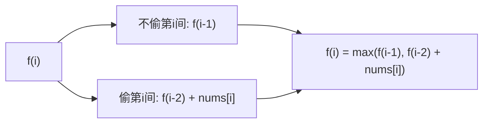

#动态规划

## 打家劫舍 (House Robber)

相关笔记：[[unbounded-knapsack]] | [[binary-search]]

经典 DP 系列题目。核心约束：不能偷相邻的房屋。

### 状态转移



## House Robber I

[198. 打家劫舍](https://leetcode.cn/problems/house-robber/)

沿街房屋排成一排，相邻房屋不能同时偷。求最高金额。

### 记忆化搜索

Time O(N)，Space O(N)

```go
func rob(nums []int) int {
    cache := make([]int, len(nums))
    for i := range cache {
        cache[i] = -1
    }
    var dfs func(int) int
    dfs = func(i int) int {
        if i < 0 {
            return 0
        }
        if cache[i] != -1 {
            return cache[i]
        }
        res := max(dfs(i-1), dfs(i-2)+nums[i])
        cache[i] = res
        return res
    }
    return dfs(len(nums) - 1)
}
```

### 递推（空间优化）

Time O(N)，Space O(1)

```go
func rob(nums []int) int {
    f0, f1 := 0, 0
    for _, x := range nums {
        f0, f1 = f1, max(f1, f0+x)
    }
    return f1
}
```

## House Robber II

[213. 打家劫舍 II](https://leetcode.cn/problems/house-robber-ii/)

房屋**围成一圈**，第一个和最后一个房屋相邻。

思路：分两种情况讨论 -- 偷第一间（不偷最后一间）或不偷第一间，取最大值。

```go
func rob(nums []int) int {
    n := len(nums)
    return max(help(nums, 1, n), nums[0]+help(nums, 2, n-1))
}

func help(nums []int, begin, end int) int {
    f0, f1 := 0, 0
    for i := begin; i < end; i++ {
        f0, f1 = f1, max(f0+nums[i], f1)
    }
    return f1
}
```

## House Robber III

[337. 打家劫舍 III](https://leetcode.cn/problems/house-robber-iii/) (==**二叉树**==)

房屋排列类似二叉树，直接相连的房子不能同时偷。

思路：树形 DP，每个节点返回 (偷, 不偷) 两个值。

Time O(N)，Space O(H)，H 为树高

```go
func rob(root *TreeNode) int {
    return max(dfs(root))
}

func dfs(root *TreeNode) (int, int) {
    if root == nil {
        return 0, 0
    }
    lrob, lnorob := dfs(root.Left)
    rrob, rnorob := dfs(root.Right)
    rob := root.Val + lnorob + rnorob
    nrob := max(lrob, lnorob) + max(rrob, rnorob)
    return rob, nrob
}
```

## House Robber IV

[2560. 打家劫舍 IV](https://leetcode.cn/problems/house-robber-iv/)

定义小偷的**窃取能力**为单间房屋中窃取的最大金额。给定数组 `nums` 和整数 `k`（最少窃取房屋数），返回最小窃取能力。

思路：二分答案 + 贪心验证。二分窃取能力的上限 `mid`，贪心检查在能力为 `mid` 时能否偷至少 `k` 间房。

Time O(N log M)，M 为数组最大值，Space O(1)

```go
func minCapability(nums []int, k int) int {
    lo, hi := 1, 0
    for _, v := range nums {
        if v > hi {
            hi = v
        }
    }
    for lo < hi {
        mid := lo + (hi-lo)/2
        if canRob(nums, mid, k) {
            hi = mid
        } else {
            lo = mid + 1
        }
    }
    return lo
}

func canRob(nums []int, cap, k int) bool {
    count := 0
    i := 0
    for i < len(nums) {
        if nums[i] <= cap {
            count++
            i += 2 // 跳过相邻
        } else {
            i++
        }
    }
    return count >= k
}
```
