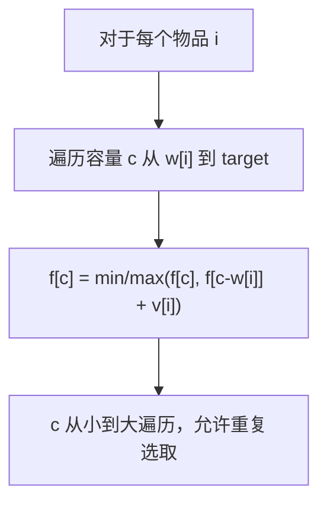

#动态规划 #背包

## 完全背包 (Unbounded Knapsack)

相关笔记：[[house-robber]]

完全背包问题中，每种物品可以选取无限次。与 0-1 背包的区别在于内层循环的遍历方向：完全背包从小到大遍历容量，0-1 背包从大到小。

### 状态转移



### 复杂度分析

| 指标 | 复杂度 |
|:---:|:---:|
| Time | O(N * C)，N 为物品数，C 为容量 |
| Space | O(C)，一维 DP |

## 例题

### 完全平方数

[279. 完全平方数](https://leetcode.cn/problems/perfect-squares/)

给你一个整数 `n`，返回和为 `n` 的完全平方数的最少数量。

状态转移方程：`f[c] = min(f[c], f[c-w]+1)`

将每个完全平方数视为一种"物品"，每种可以无限次选取 -- 典型的完全背包。

```go
func numSquares(n int) int {
    f := make([]int, n+1)
    for i := range f {
        f[i] = math.MaxInt
    }
    f[0] = 0
    for i := 1; i*i <= n; i++ {
        w := i * i
        for c := w; c <= n; c++ {
            f[c] = min(f[c], f[c-w]+1)
        }
    }
    return f[n]
}
```

### 分割等和子集

[416. 分割等和子集](https://leetcode.cn/problems/partition-equal-subset-sum/)

判断数组是否可以分割成两个子集，使得两个子集的元素和相等。

注意：这是 **0-1 背包**（每个元素只能用一次），内层循环从大到小。

状态转移方程：`dp[j] = dp[j] || dp[j-num]`

```go
func canPartition(nums []int) bool {
    sum := 0
    for _, num := range nums {
        sum += num
    }
    if sum%2 == 1 {
        return false
    }
    target := sum / 2
    dp := make([]bool, target+1)
    dp[0] = true
    for _, num := range nums {
        for j := target; j >= num; j-- { // 从大到小：0-1背包
            dp[j] = dp[j] || dp[j-num]
        }
    }
    return dp[target]
}
```

## 面试要点

### 高频问题

**Q: 完全背包和 0-1 背包在一维 DP 实现上的核心区别是什么？**

> [!question]- 参考答案（点击展开）
>
> 唯一区别是内层容量循环的遍历方向：完全背包**从小到大**（`c` 从 `w[i]` 到 `target`），0-1 背包**从大到小**（`j` 从 `target` 到 `num`）。正向遍历时 `f[c-w[i]]` 已经是本轮（含当前物品）更新过的值，所以同一物品能被重复选取；逆向遍历时 `f[j-num]` 仍是上一轮（不含当前物品）的旧值，保证每个物品只用一次。

**Q: 为什么 0-1 背包必须逆序遍历容量？**

> [!question]- 参考答案（点击展开）
>
> 一维数组是从二维 `dp[i][j] = max(dp[i-1][j], dp[i-1][j-w]+v)` 压缩而来，转移依赖的是**上一行** `dp[i-1][...]`。逆序遍历时较小的 `dp[j-w]` 还没被本轮覆盖，等同于读取上一行的值；若正序，`dp[j-w]` 已被当前物品更新过，相当于物品被重复计入，破坏了「每个物品最多一次」的约束。

**Q: 完全平方数（LeetCode 279）为什么是完全背包问题？**

> [!question]- 参考答案（点击展开）
>
> 把每个完全平方数（1, 4, 9, ...）看作一种「物品」，其重量 `w = i*i`，每选一个计数 `+1`，目标容量为 `n`，每种平方数可无限次使用，正是完全背包模型。转移方程 `f[c] = min(f[c], f[c-w]+1)`，初始 `f[0]=0`，其余初始化为正无穷（`math.MaxInt`），最终 `f[n]` 即最少数量。

**Q: 求「方案数」和求「最值」时，背包的初始化和转移有什么不同？**

> [!question]- 参考答案（点击展开）
>
> 求最值（如最少个数）用 `min/max`，初始化为 `±∞` 或 0，并保留无穷表示「不可达」；求方案数把 `min/max` 换成累加 `f[c] += f[c-w]`，初始化 `f[0]=1`，其余为 0；求可行性（如分割等和子集）用布尔或运算 `dp[j] = dp[j] || dp[j-num]`，`dp[0]=true`。

**Q: 求组合数和求排列数时，物品循环和容量循环的顺序如何影响结果？**

> [!question]- 参考答案（点击展开）
>
> **外层物品、内层容量**得到的是**组合数**（物品有固定先后顺序，不计排列，如硬币组合）；**外层容量、内层物品**得到的是**排列数**（同一组物品的不同顺序算多种，如爬楼梯类）。求最值时两层顺序可互换不影响结果，但求计数时绝不能搞错。

**Q: 分割等和子集（LeetCode 416）的思路是什么？为什么是 0-1 背包？**

> [!question]- 参考答案（点击展开）
>
> 数组总和为奇数时直接返回 false；否则令 `target = sum/2`，问题转化为「能否从数组中选出若干元素恰好凑成 `target`」。每个元素只能用一次，所以是 0-1 背包，内层从大到小遍历（`j` 从 `target` 到 `num`），转移 `dp[j] = dp[j] || dp[j-num]`，`dp[0]=true`，最终看 `dp[target]`。

**Q: 完全背包的时间和空间复杂度是多少？**

> [!question]- 参考答案（点击展开）
>
> 时间复杂度 O(N×C)，N 为物品种类数，C 为容量上限；用一维滚动数组后空间复杂度 O(C)。对于完全平方数，物品数 N≈√n、容量 C=n，所以总时间约为 O(n√n)。

### 面试加分点

- 能从二维 DP `dp[i][j]` 严格推导出一维滚动数组，并解释「正序覆盖 = 当前行 = 可重复，逆序覆盖 = 上一行 = 不可重复」的本质，而不是死记遍历方向。
- 清楚四类背包问题的统一框架：最值（min/max + ∞ 初始化）、可行性（||/&& 布尔）、方案计数（+= 累加 + `f[0]=1`），能根据「问什么」快速切换转移与初始化。
- 能区分组合数 vs 排列数对循环嵌套顺序的要求，这是零钱兑换 II（518，组合，外物品内容量）与组合总和 IV（377，排列，外容量内物品）的关键考点。
- 注意溢出与边界细节：用 `math.MaxInt` 作哨兵时，`f[c-w]` 仍为 `MaxInt` 的情况下 `f[c-w]+1` 会溢出成负数，污染 `min`（这是 numSquares 写法的潜在坑）；可改用足够大的常数如 `n+1` 作哨兵，或转移前先判可达。容量循环下界从 `w[i]` 起还能省去 `c >= w` 的判断。
- 完全平方数还有数论解法：根据 Lagrange 四平方和定理答案必为 1~4，配合 Legendre 三平方和定理（`n` 可表为三平方和当且仅当 `n != 4^a(8b+7)`）可 O(√n) 判断，体现「DP 之外还有更优解」的视野。
