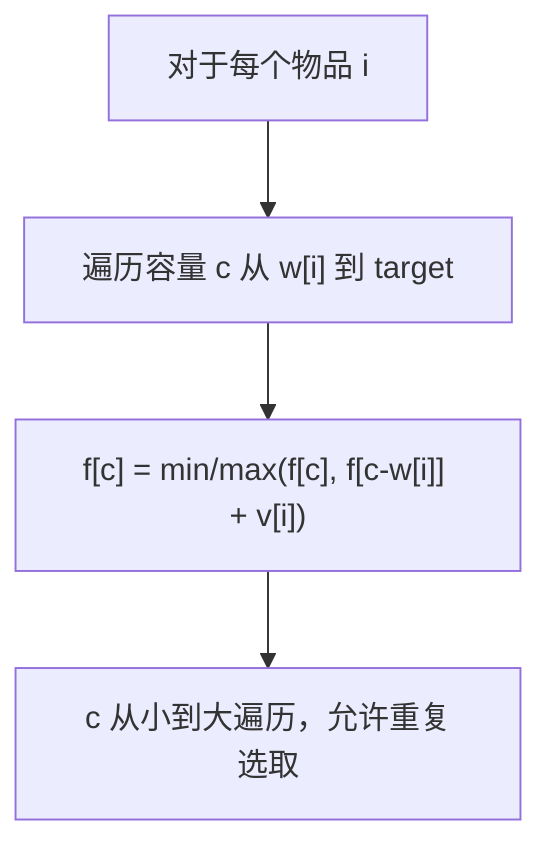

#动态规划 #背包

## 完全背包 (Unbounded Knapsack)

相关笔记：[[house-robber]]

完全背包问题中，每种物品可以选取无限次。与 0-1 背包的区别在于内层循环的遍历方向：完全背包从小到大遍历容量，0-1 背包从大到小。

### 状态转移



### 复杂度分析

| 指标 | 复杂度 |
|:---:|:---:|
| Time | O(N * C)，N 为物品数，C 为容量 |
| Space | O(C)，一维 DP |

## 例题

### 完全平方数

[279. 完全平方数](https://leetcode.cn/problems/perfect-squares/)

给你一个整数 `n`，返回和为 `n` 的完全平方数的最少数量。

状态转移方程：`f[c] = min(f[c], f[c-w]+1)`

将每个完全平方数视为一种"物品"，每种可以无限次选取 -- 典型的完全背包。

```go
func numSquares(n int) int {
    f := make([]int, n+1)
    for i := range f {
        f[i] = math.MaxInt
    }
    f[0] = 0
    for i := 1; i*i <= n; i++ {
        w := i * i
        for c := w; c <= n; c++ {
            f[c] = min(f[c], f[c-w]+1)
        }
    }
    return f[n]
}
```

### 分割等和子集

[416. 分割等和子集](https://leetcode.cn/problems/partition-equal-subset-sum/)

判断数组是否可以分割成两个子集，使得两个子集的元素和相等。

注意：这是 **0-1 背包**（每个元素只能用一次），内层循环从大到小。

状态转移方程：`dp[j] = dp[j] || dp[j-num]`

```go
func canPartition(nums []int) bool {
    sum := 0
    for _, num := range nums {
        sum += num
    }
    if sum%2 == 1 {
        return false
    }
    target := sum / 2
    dp := make([]bool, target+1)
    dp[0] = true
    for _, num := range nums {
        for j := target; j >= num; j-- { // 从大到小：0-1背包
            dp[j] = dp[j] || dp[j-num]
        }
    }
    return dp[target]
}
```
