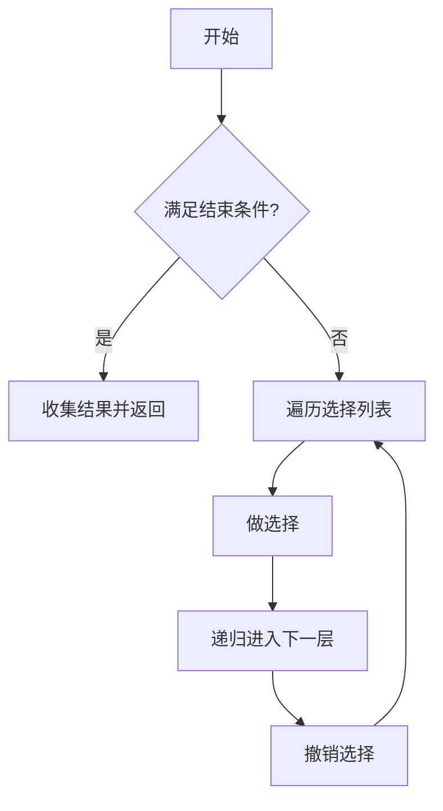

#回溯

## 回溯算法 (Backtracking)

相关笔记：[[dfs]] | [[bfs]]

回溯算法是一种通过穷举所有可能来寻找解的算法，本质上是 DFS 的一种应用。核心思想：在每一步做选择，如果发现当前选择不能导向有效解，就撤销选择（回溯），尝试其他选择。

### 算法流程



### 模版

```go
result = []
func backtrack(选择列表, 路径):
    if 满足结束条件:
        result.add(路径)
        return
    for 选择 in 选择列表:
        做选择
        backtrack(选择列表, 路径)
        撤销选择
```

### 复杂度分析

回溯算法的复杂度取决于具体问题：
- **子集问题**：Time O(n * 2^n)，Space O(n)
- **排列问题**：Time O(n * n!)，Space O(n)

## 不剪枝

### 子集 (Subsets)

给你一个整数数组 `nums`，数组中的元素**互不相同**。返回该数组所有可能的子集（幂集）。解集**不能**包含重复的子集。

```go
func subsets(nums []int) [][]int {
    result := make([][]int, 0)
    list := make([]int, 0)
    backtrack(nums, 0, list, &result)
    return result
}

// nums 给定的集合
// pos 下次添加到集合中的元素位置索引
// list 临时结果集合(每次需要复制保存)
// result 最终结果
func backtrack(nums []int, pos int, list []int, result *[][]int) {
    // 把临时结果复制出来保存到最终结果
    ans := make([]int, len(list))
    copy(ans, list)
    *result = append(*result, ans)
    // 选择、处理结果、再撤销选择
    for i := pos; i < len(nums); i++ {
        list = append(list, nums[i])
        backtrack(nums, i+1, list, result)
        list = list[0 : len(list)-1]
    }
}
```

### 全排列 (Permutations)

给定一个不含重复数字的数组 `nums`，返回其所有可能的全排列。

```go
func permute(nums []int) [][]int {
    result := make([][]int, 0)
    list := make([]int, 0)
    visited := make([]bool, len(nums))
    backtrack(nums, visited, list, &result)
    return result
}

// nums 输入集合
// visited 当前递归标记过的元素
// list 临时结果集(路径)
// result 最终结果
func backtrack(nums []int, visited []bool, list []int, result *[][]int) {
    if len(list) == len(nums) {
        ans := make([]int, len(list))
        copy(ans, list)
        *result = append(*result, ans)
        return
    }
    for i := 0; i < len(nums); i++ {
        if visited[i] {
            continue
        }
        list = append(list, nums[i])
        visited[i] = true
        backtrack(nums, visited, list, result)
        visited[i] = false
        list = list[0 : len(list)-1]
    }
}
```

## 剪枝

### 含重复元素的子集 (Subsets II)

给你一个整数数组 `nums`，其中可能包含重复元素，返回所有可能的子集。解集**不能**包含重复的子集。

关键：先排序，遇到重复元素跳过（`i != pos && nums[i] == nums[i-1]`）

```go
import "sort"

func subsetsWithDup(nums []int) [][]int {
    result := make([][]int, 0)
    list := make([]int, 0)
    sort.Ints(nums) // 先排序
    backtrack(nums, 0, list, &result)
    return result
}

func backtrack(nums []int, pos int, list []int, result *[][]int) {
    ans := make([]int, len(list))
    copy(ans, list)
    *result = append(*result, ans)
    for i := pos; i < len(nums); i++ {
        // 排序之后，如果再遇到重复元素，则不选择此元素
        if i != pos && nums[i] == nums[i-1] {
            continue
        }
        list = append(list, nums[i])
        backtrack(nums, i+1, list, result)
        list = list[0 : len(list)-1]
    }
}
```

### 含重复元素的全排列 (Permutations II)

给定一个可包含重复数字的序列 `nums`，返回所有不重复的全排列。

关键剪枝条件：`i != 0 && nums[i] == nums[i-1] && !visited[i-1]`

```go
import "sort"

func permuteUnique(nums []int) [][]int {
    result := make([][]int, 0)
    list := make([]int, 0)
    visited := make([]bool, len(nums))
    sort.Ints(nums)
    backtrack(nums, visited, list, &result)
    return result
}

func backtrack(nums []int, visited []bool, list []int, result *[][]int) {
    if len(list) == len(nums) {
        subResult := make([]int, len(list))
        copy(subResult, list)
        *result = append(*result, subResult)
    }
    for i := 0; i < len(nums); i++ {
        if visited[i] {
            continue
        }
        // 上一个元素和当前相同，并且没有访问过就跳过
        if i != 0 && nums[i] == nums[i-1] && !visited[i-1] {
            continue
        }
        list = append(list, nums[i])
        visited[i] = true
        backtrack(nums, visited, list, result)
        visited[i] = false
        list = list[0 : len(list)-1]
    }
}
```

## 面试要点

### 高频问题

**Q: 回溯算法和 DFS 是什么关系？**

> [!question]- 参考答案（点击展开）
>
> 回溯本质上是 DFS 的一种应用，都是在解空间树上深度优先地遍历。区别在于回溯强调"做选择—递归—撤销选择"这个对状态的回退动作，遍历完一个分支后会主动恢复现场（如 `list = list[0:len(list)-1]` 弹出路径末尾元素、`visited[i] = false` 复位），从而复用同一份数据结构去探索下一个分支。

**Q: 回溯三要素（模板）是什么？**

> [!question]- 参考答案（点击展开）
>
> 三要素是路径（已做出的选择）、选择列表（当前可做的选择）、结束条件（到达叶子或满足约束）。模板固定为：满足结束条件就收集结果并 `return`，否则 `for` 遍历选择列表，每次"做选择 → 递归进入下一层 → 撤销选择"。

**Q: 子集问题和排列问题的复杂度为什么不同？**

> [!question]- 参考答案（点击展开）
>
> 子集（幂集）共有 2^n 个解，复制每个解最长 O(n)，所以时间 O(n * 2^n)。排列有 n! 个解，每个长度 O(n)，所以时间 O(n * n!)。两者递归深度都是 O(n)，不计结果集时辅助空间均为 O(n)。

**Q: 子集和排列在写法上最大的区别是什么？**

> [!question]- 参考答案（点击展开）
>
> 子集用 `pos`/`start` 控制起点，每次递归从 `i+1` 开始，保证元素不重复使用且只取后面的，体现"组合"的无序性；排列每次都从 0 开始遍历全部元素，用 `visited[]` 数组标记已用过的，避免同一元素被重复放进同一条路径。

**Q: 含重复元素时，子集去重和排列去重的剪枝条件为什么不一样？**

> [!question]- 参考答案（点击展开）
>
> 两者都要先 `sort` 让相同元素相邻。子集 II 用 `i != pos && nums[i] == nums[i-1]` 跳过同一层（同一 `pos` 起点）中后续重复元素。排列 II 用 `i != 0 && nums[i] == nums[i-1] && !visited[i-1]`，即前一个相同元素尚未被使用时跳过，确保相同元素按固定相对顺序选取。两者剪枝条件不同的根本原因是：子集靠 `pos` 约束"层内不重复取相同值"，而排列没有 `pos`、元素可任意位置取用，必须靠 `visited` 区分"重复值的固定先后顺序"。

**Q: 排列 II 的剪枝条件用 `!visited[i-1]` 和 `visited[i-1]` 都能去重，有区别吗？**

> [!question]- 参考答案（点击展开）
>
> 两者都能正确去重。`!visited[i-1]`（前一个相同元素未使用就跳过）剪枝更彻底、效率更高，因为它在树的更高层就砍掉分支；`visited[i-1]` 则要等前一个被使用后才允许当前元素，剪枝点更靠下，递归调用次数更多。面试中推荐用 `!visited[i-1]`，笔记代码也是这种写法。

**Q: 为什么把路径加入结果集时必须 copy 一份，而不能直接 append？**

> [!question]- 参考答案（点击展开）
>
> 因为 `list` 是回溯过程中被反复增删修改的同一个 slice，底层数组共享。如果直接 `append(result, list)`，存进去的是指向同一底层数组的 slice header，后续撤销选择会改动它，最终所有结果都会指向同一份被污染的数据。所以要 `make` + `copy` 出独立副本再保存。

### 面试加分点

- 能说清"剪枝"的两类时机：约束剪枝（当前选择违反约束直接 `return`，如 N 皇后冲突检测）和去重剪枝（同层跳过重复元素），并指出剪枝只影响常数/实际运行时间，不改变最坏复杂度上界。
- 理解 Go 中 `list = list[0:len(list)-1]` 这种撤销方式：它通过缩短 slice 长度回退，底层数组不释放，下次 `append` 在原容量内复用，避免反复分配，是回溯里常见的"原地"恢复现场技巧。
- 能把回溯泛化到经典题型：组合（Combinations，固定长度 k）、组合总和（可重复使用同一元素则递归传 `i` 而非 `i+1`）、N 皇后、解数独、分割回文串、电话号码字母组合，并说明它们和子集/排列模板的对应关系。
- 指出全排列其实也可用"原地交换"写法（swap 当前位与后续位）省去 `visited` 数组，空间常数更优，但去重时不如 `visited` 写法直观。
- 强调去重的前提是 `sort` 让相同元素相邻，否则 `nums[i] == nums[i-1]` 的相邻比较无法覆盖所有重复，体现对剪枝条件成立前提的严谨理解。
