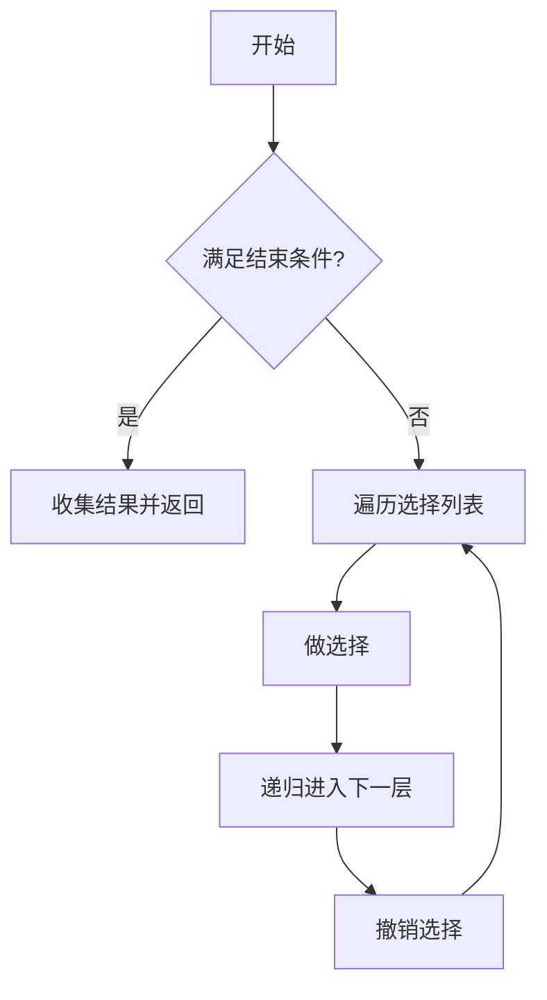

#回溯

## 回溯算法 (Backtracking)

相关笔记：[[dfs]] | [[bfs]]

回溯算法是一种通过穷举所有可能来寻找解的算法，本质上是 DFS 的一种应用。核心思想：在每一步做选择，如果发现当前选择不能导向有效解，就撤销选择（回溯），尝试其他选择。

### 算法流程



### 模版

```go
result = []
func backtrack(选择列表, 路径):
    if 满足结束条件:
        result.add(路径)
        return
    for 选择 in 选择列表:
        做选择
        backtrack(选择列表, 路径)
        撤销选择
```

### 复杂度分析

回溯算法的复杂度取决于具体问题：
- **子集问题**：Time O(n * 2^n)，Space O(n)
- **排列问题**：Time O(n * n!)，Space O(n)

## 不剪枝

### 子集 (Subsets)

给你一个整数数组 `nums`，数组中的元素**互不相同**。返回该数组所有可能的子集（幂集）。解集**不能**包含重复的子集。

```go
func subsets(nums []int) [][]int {
    result := make([][]int, 0)
    list := make([]int, 0)
    backtrack(nums, 0, list, &result)
    return result
}

// nums 给定的集合
// pos 下次添加到集合中的元素位置索引
// list 临时结果集合(每次需要复制保存)
// result 最终结果
func backtrack(nums []int, pos int, list []int, result *[][]int) {
    // 把临时结果复制出来保存到最终结果
    ans := make([]int, len(list))
    copy(ans, list)
    *result = append(*result, ans)
    // 选择、处理结果、再撤销选择
    for i := pos; i < len(nums); i++ {
        list = append(list, nums[i])
        backtrack(nums, i+1, list, result)
        list = list[0 : len(list)-1]
    }
}
```

### 全排列 (Permutations)

给定一个不含重复数字的数组 `nums`，返回其所有可能的全排列。

```go
func permute(nums []int) [][]int {
    result := make([][]int, 0)
    list := make([]int, 0)
    visited := make([]bool, len(nums))
    backtrack(nums, visited, list, &result)
    return result
}

// nums 输入集合
// visited 当前递归标记过的元素
// list 临时结果集(路径)
// result 最终结果
func backtrack(nums []int, visited []bool, list []int, result *[][]int) {
    if len(list) == len(nums) {
        ans := make([]int, len(list))
        copy(ans, list)
        *result = append(*result, ans)
        return
    }
    for i := 0; i < len(nums); i++ {
        if visited[i] {
            continue
        }
        list = append(list, nums[i])
        visited[i] = true
        backtrack(nums, visited, list, result)
        visited[i] = false
        list = list[0 : len(list)-1]
    }
}
```

## 剪枝

### 含重复元素的子集 (Subsets II)

给你一个整数数组 `nums`，其中可能包含重复元素，返回所有可能的子集。解集**不能**包含重复的子集。

关键：先排序，遇到重复元素跳过（`i != pos && nums[i] == nums[i-1]`）

```go
import "sort"

func subsetsWithDup(nums []int) [][]int {
    result := make([][]int, 0)
    list := make([]int, 0)
    sort.Ints(nums) // 先排序
    backtrack(nums, 0, list, &result)
    return result
}

func backtrack(nums []int, pos int, list []int, result *[][]int) {
    ans := make([]int, len(list))
    copy(ans, list)
    *result = append(*result, ans)
    for i := pos; i < len(nums); i++ {
        // 排序之后，如果再遇到重复元素，则不选择此元素
        if i != pos && nums[i] == nums[i-1] {
            continue
        }
        list = append(list, nums[i])
        backtrack(nums, i+1, list, result)
        list = list[0 : len(list)-1]
    }
}
```

### 含重复元素的全排列 (Permutations II)

给定一个可包含重复数字的序列 `nums`，返回所有不重复的全排列。

关键剪枝条件：`i != 0 && nums[i] == nums[i-1] && !visited[i-1]`

```go
import "sort"

func permuteUnique(nums []int) [][]int {
    result := make([][]int, 0)
    list := make([]int, 0)
    visited := make([]bool, len(nums))
    sort.Ints(nums)
    backtrack(nums, visited, list, &result)
    return result
}

func backtrack(nums []int, visited []bool, list []int, result *[][]int) {
    if len(list) == len(nums) {
        subResult := make([]int, len(list))
        copy(subResult, list)
        *result = append(*result, subResult)
    }
    for i := 0; i < len(nums); i++ {
        if visited[i] {
            continue
        }
        // 上一个元素和当前相同，并且没有访问过就跳过
        if i != 0 && nums[i] == nums[i-1] && !visited[i-1] {
            continue
        }
        list = append(list, nums[i])
        visited[i] = true
        backtrack(nums, visited, list, result)
        visited[i] = false
        list = list[0 : len(list)-1]
    }
}
```
