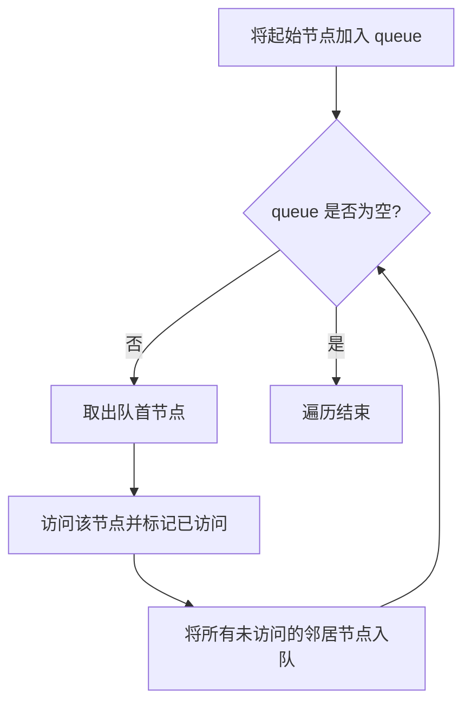

#广度优先

## 广度优先搜索 (BFS)

相关笔记：[[dfs]] | [[backtracking]] | [[lca]]

广度优先搜索（Breadth-First Search, BFS）是一种用于图或树的遍历算法，它从一个起始点开始，逐层遍历所有节点，即先访问离起始点最近的节点，再逐步向外扩展到更远的节点。BFS 通常使用 queue 来实现，其核心思想是先进先出（FIFO）。

### 算法流程



### 基本步骤

1. **初始化 queue**：将起始节点放入 queue 中
2. **循环遍历 queue**：当 queue 非空时，重复以下步骤：
   - 从 queue 中取出一个节点作为当前节点
   - 访问当前节点，根据需要进行操作（如检查或处理节点数据）
   - 将当前节点的所有未访问过的邻近节点加入 queue
3. **标记已访问节点**：为避免重复访问，需要标记每个访问过的节点。通常通过一个 set 或 array 实现

### 应用场景

- **最短路径**：在无权图中查找两点间的最短路径
- **层级遍历**：在 tree 或 graph 中按层级遍历节点
- **图的连通性**：检查图中两个节点是否连通，或者图中有多少个连通分量
- **实际问题**：如迷宫求解、社交网络中的最短路径查找等

### 复杂度分析

| 指标 | 复杂度 |
|:---:|:---:|
| Time | O(V + E)，V 为节点数，E 为边数 |
| Space | O(V)，queue 最多存储一层的节点 |

## 模版

### 二叉树层序遍历

```go
type TreeNode struct {
    Val   int
    Left  *TreeNode
    Right *TreeNode
}

// levelOrder 使用 BFS 策略进行树的层序遍历
func levelOrder(root *TreeNode) [][]int {
    var ans [][]int
    if root == nil {
        return ans
    }
    queue := []*TreeNode{root} // 使用切片模拟队列，初始化时将 root 入队

    for len(queue) > 0 { // 当队列非空时循环
        size := len(queue) // 当前层的节点数
        level := make([]int, size) // 用于存储当前层的值
        for i := 0; i < size; i++ {
            cur := queue[0] // 取出队首元素
            queue = queue[1:] // 出队
            level[i] = cur.Val
            if cur.Left != nil {
                queue = append(queue, cur.Left) // 左子节点入队
            }
            if cur.Right != nil {
                queue = append(queue, cur.Right) // 右子节点入队
            }
        }
        ans = append(ans, level) // 将当前层的值加入答案中
    }

    return ans
}
```

## 面试要点

### 高频问题

**Q: BFS 和 DFS 的核心区别是什么？分别适合哪类问题？**
A: BFS 借助 queue（FIFO）逐层向外扩展，DFS 借助 stack 或递归一条路走到底。BFS 适合求无权图最短路径、层级遍历、最小步数类问题；DFS 适合穷举所有路径、连通分量、回溯、拓扑排序（DFS 后序逆序）等。两者时间复杂度都是 O(V+E)，但 BFS 空间开销取决于最宽一层的节点数，DFS 取决于递归深度。

**Q: 为什么 BFS 能在无权图中求出最短路径，而 DFS 不能？**
A: BFS 按距离起点的层数由近及远扩展，第一次访问到某节点时所经过的边数一定最少，因此天然得到无权图（每条边权为 1）的最短路径。DFS 是深度优先，可能先沿一条很长的路径到达目标，无法保证最短。注意：带权图最短路径要用 Dijkstra 或带权 BFS（0-1 BFS 用 deque）。

**Q: BFS 的时间和空间复杂度是多少？空间复杂度的上界由什么决定？**
A: 时间复杂度 O(V+E)，每个节点入队出队一次、每条边检查一次。空间复杂度 O(V)，主要由 queue 在某一时刻存储的节点数决定，最坏接近图中最宽一层的节点数（外加 O(V) 的 visited 标记）；在完全二叉树中最后一层约占一半节点，故仍是 O(V)。

**Q: BFS 中标记访问（visited）应该在入队时还是出队时进行？**
A: 应在入队时立即标记。如果等到出队时才标记，同一个节点可能被多个邻居重复入队，导致 queue 膨胀甚至重复处理、退化性能。入队即标记保证每个节点最多入队一次。树遍历因无环可省略 visited，但图遍历必须有。

**Q: 层序遍历时如何区分每一层的节点？**
A: 在每轮循环开始时先记录当前 queue 的长度 `size := len(queue)`，这就是当前层的节点数，然后只循环 size 次出队处理，期间新入队的子节点属于下一层。笔记中的 `levelOrder` 模板正是用这个固定层大小的写法分层。

**Q: 用切片模拟 queue 时 `queue = queue[1:]` 有什么隐患？如何优化？**
A: `queue = queue[1:]` 只是移动切片头指针，底层数组前部已出队的空间不会被回收，长时间运行下底层数组可能持续增长造成内存浪费。优化方式：用下标 head 指针代替切片重切（处理完再整体回收），或使用 `container/list` 双向链表；在算法题规模下 `queue[1:]` 通常可接受。

**Q: 双向 BFS（Bidirectional BFS）的思想和适用场景是什么？**
A: 从起点和终点同时进行 BFS，两个搜索前沿相遇即找到最短路径。它把搜索空间从 O(b^d) 降到约 O(b^(d/2))，在已知起点和终点、分支因子 b 较大的最短路径问题（如单词接龙 Word Ladder）中显著加速。实现时每轮选择较小的前沿集合扩展以保持平衡。

### 面试加分点

- 0-1 BFS：当边权只有 0 和 1 时，用 deque 替代普通 queue，权为 0 的边从队首插入、权为 1 的边从队尾插入，可在 O(V+E) 内求最短路，避免上 Dijkstra 的 log 因子。
- 多源 BFS：把所有源点一次性入队作为「第 0 层」同时扩散，可在一次遍历内求每个点到最近源点的距离（如腐烂的橘子、矩阵中每个格子到最近 0 的距离），无需对每个源单独跑 BFS。
- BFS 在网格图（grid）中常用方向数组 `dirs := [][]int{{1,0},{-1,0},{0,1},{0,-1}}` 遍历四邻域，可原地修改格子值代替 visited 数组节省空间。
- BFS 求最短路径时若需还原具体路径，可额外维护 parent/prev 映射记录每个节点的前驱，到达终点后回溯即可。
- 拓扑排序的 Kahn 算法本质是 BFS：将入度为 0 的节点入队，逐个出队并削减邻居入度，新变为 0 度的入队，可同时检测有向图是否成环。
- 理解 BFS 与 Dijkstra 的关系：当所有边权相等时 Dijkstra 退化为 BFS，BFS 可视为优先队列里距离单调、无需堆的特例。
