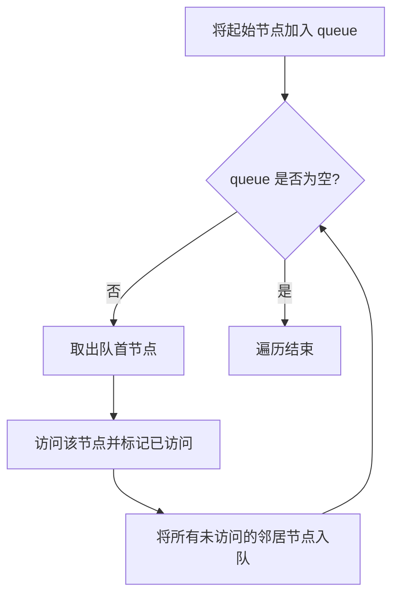

#广度优先

## 广度优先搜索 (BFS)

相关笔记：[[dfs]] | [[backtracking]] | [[lca]]

广度优先搜索（Breadth-First Search, BFS）是一种用于图或树的遍历算法，它从一个起始点开始，逐层遍历所有节点，即先访问离起始点最近的节点，再逐步向外扩展到更远的节点。BFS 通常使用 queue 来实现，其核心思想是先进先出（FIFO）。

### 算法流程



### 基本步骤

1. **初始化 queue**：将起始节点放入 queue 中
2. **循环遍历 queue**：当 queue 非空时，重复以下步骤：
   - 从 queue 中取出一个节点作为当前节点
   - 访问当前节点，根据需要进行操作（如检查或处理节点数据）
   - 将当前节点的所有未访问过的邻近节点加入 queue
3. **标记已访问节点**：为避免重复访问，需要标记每个访问过的节点。通常通过一个 set 或 array 实现

### 应用场景

- **最短路径**：在无权图中查找两点间的最短路径
- **层级遍历**：在 tree 或 graph 中按层级遍历节点
- **图的连通性**：检查图中两个节点是否连通，或者图中有多少个连通分量
- **实际问题**：如迷宫求解、社交网络中的最短路径查找等

### 复杂度分析

| 指标 | 复杂度 |
|:---:|:---:|
| Time | O(V + E)，V 为节点数，E 为边数 |
| Space | O(V)，queue 最多存储一层的节点 |

## 模版

### 二叉树层序遍历

```go
type TreeNode struct {
    Val   int
    Left  *TreeNode
    Right *TreeNode
}

// levelOrder 使用 BFS 策略进行树的层序遍历
func levelOrder(root *TreeNode) [][]int {
    var ans [][]int
    if root == nil {
        return ans
    }
    queue := []*TreeNode{root} // 使用切片模拟队列，初始化时将 root 入队

    for len(queue) > 0 { // 当队列非空时循环
        size := len(queue) // 当前层的节点数
        level := make([]int, size) // 用于存储当前层的值
        for i := 0; i < size; i++ {
            cur := queue[0] // 取出队首元素
            queue = queue[1:] // 出队
            level[i] = cur.Val
            if cur.Left != nil {
                queue = append(queue, cur.Left) // 左子节点入队
            }
            if cur.Right != nil {
                queue = append(queue, cur.Right) // 右子节点入队
            }
        }
        ans = append(ans, level) // 将当前层的值加入答案中
    }

    return ans
}
```
