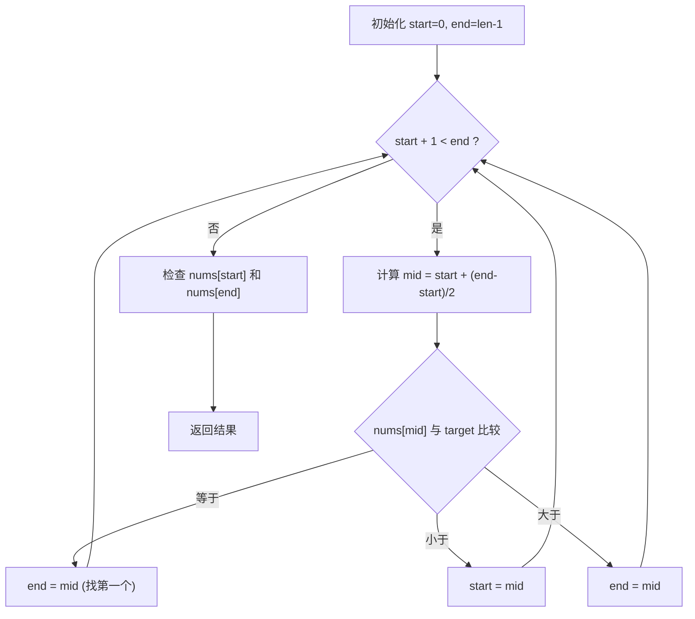

#二分查找

## Binary Search 二分搜索

相关笔记：[[sorting-overview]]

给一个**有序数组**和目标值，找第一次/最后一次/任何一次出现的索引，如果没有出现返回 -1。

### 算法流程



### 复杂度分析

| 指标 | 复杂度 |
|:---:|:---:|
| Time | O(log n) |
| Space | O(1) |

## 模版一：通用模版（推荐）

适用于有重复元素、需要找第一个/最后一个位置的场景。

四点要素：
1. 初始化：`start=0`、`end=len-1`
2. 循环退出条件：`start + 1 < end`
3. 比较中点和目标值：`A[mid]` 与 `target` 的关系
4. 判断最后两个元素是否符合：`A[start]`、`A[end]` 与 `target`

```go
// 二分搜索最常用模板
func search(nums []int, target int) int {
    // 1、初始化start、end
    start := 0
    end := len(nums) - 1
    // 2、处理for循环
    for start+1 < end {
        mid := start + (end-start)/2
        // 3、比较a[mid]和target值
        if nums[mid] == target {
            end = mid
        } else if nums[mid] < target {
            start = mid
        } else if nums[mid] > target {
            end = mid
        }
    }
    // 4、最后剩下两个元素，手动判断
    if nums[start] == target {
        return start
    }
    if nums[end] == target {
        return end
    }
    return -1
}
```

## 模版二：简洁版

适用于无重复元素、只需判断是否存在的场景。

```go
// 无重复元素搜索时，更方便
func search(nums []int, target int) int {
    start := 0
    end := len(nums) - 1
    for start <= end {
        mid := start + (end-start)/2
        if nums[mid] == target {
            return mid
        } else if nums[mid] < target {
            start = mid + 1
        } else if nums[mid] > target {
            end = mid - 1
        }
    }
    // 如果找不到，start 是第一个大于target的索引
    // 如果在B+树结构里面二分搜索，可以return start
    // 这样可以继续向子节点搜索，如：node:=node.Children[start]
    return -1
}
```
