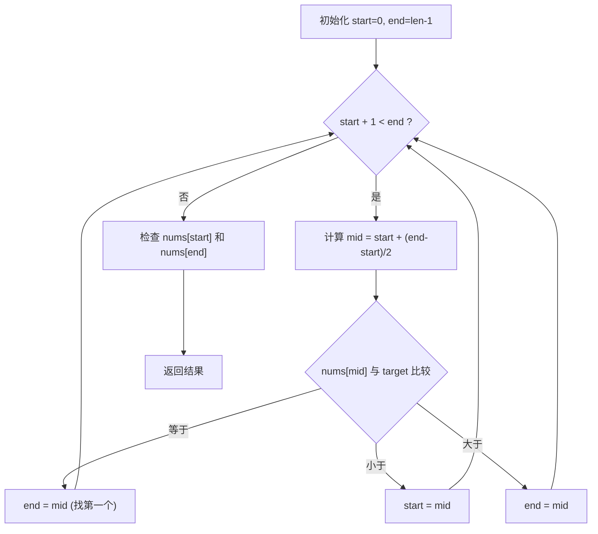

#二分查找

## Binary Search 二分搜索

相关笔记：[[sorting-overview]]

给一个**有序数组**和目标值，找第一次/最后一次/任何一次出现的索引，如果没有出现返回 -1。

### 算法流程



### 复杂度分析

| 指标 | 复杂度 |
|:---:|:---:|
| Time | O(log n) |
| Space | O(1) |

## 模版一：通用模版（推荐）

适用于有重复元素、需要找第一个/最后一个位置的场景。

四点要素：
1. 初始化：`start=0`、`end=len-1`
2. 循环退出条件：`start + 1 < end`
3. 比较中点和目标值：`A[mid]` 与 `target` 的关系
4. 判断最后两个元素是否符合：`A[start]`、`A[end]` 与 `target`

```go
// 二分搜索最常用模板
func search(nums []int, target int) int {
    // 1、初始化start、end
    start := 0
    end := len(nums) - 1
    // 2、处理for循环
    for start+1 < end {
        mid := start + (end-start)/2
        // 3、比较a[mid]和target值
        if nums[mid] == target {
            end = mid
        } else if nums[mid] < target {
            start = mid
        } else if nums[mid] > target {
            end = mid
        }
    }
    // 4、最后剩下两个元素，手动判断
    if nums[start] == target {
        return start
    }
    if nums[end] == target {
        return end
    }
    return -1
}
```

## 模版二：简洁版

适用于无重复元素、只需判断是否存在的场景。

```go
// 无重复元素搜索时，更方便
func search(nums []int, target int) int {
    start := 0
    end := len(nums) - 1
    for start <= end {
        mid := start + (end-start)/2
        if nums[mid] == target {
            return mid
        } else if nums[mid] < target {
            start = mid + 1
        } else if nums[mid] > target {
            end = mid - 1
        }
    }
    // 如果找不到，start 是第一个大于target的索引
    // 如果在B+树结构里面二分搜索，可以return start
    // 这样可以继续向子节点搜索，如：node:=node.Children[start]
    return -1
}
```

## 面试要点

### 高频问题

**Q: 为什么 mid 要写成 `start + (end-start)/2` 而不是 `(start+end)/2`？**
A: 当 `start` 和 `end` 都很大时，`start+end` 可能超出 int 范围导致整数溢出，从而得到负的 mid。`start + (end-start)/2` 在数学上等价但先做减法，保证中间结果不溢出，是更稳健的写法。

**Q: 通用模板的循环条件为什么是 `start + 1 < end` 而不是 `start <= end`？**
A: `start + 1 < end` 在循环结束时会停在相邻的两个元素 `start`、`end` 上，避免了死循环（因为模板里用 `start = mid` / `end = mid` 而不是 `mid±1`，区间永远收不到只剩一个元素）。退出后再手动判断这两个元素，能精确处理"找第一个/最后一个出现位置"的边界场景。

**Q: 两个模板（通用版 vs 简洁版）的核心区别和适用场景是什么？**
A: 简洁版用 `start <= end` 配合 `mid±1` 移动指针，找到即返回，适合无重复元素、只判断是否存在的场景。通用版用 `start + 1 < end` 配合 `start/end = mid`，循环结束后再判断 `nums[start]`、`nums[end]`，能稳定求"第一个等于 target"或"最后一个等于 target"的位置，适合有重复元素的场景。

**Q: 如何用二分查找有重复元素时第一个/最后一个出现的位置？**
A: 用通用模板，在 `nums[mid] == target` 时不要直接 return：找第一个就令 `end = mid`（继续往左收缩），找最后一个就令 `start = mid`（往右收缩）。这样循环结束后用相邻的 `start`/`end` 取到边界。LeetCode 34（在排序数组中查找元素的第一个和最后一个位置）就是这个套路。

**Q: 简洁版退出循环后，`start` 有什么含义？为什么 B+ 树查找会用到它？**
A: 循环以 `start > end` 退出，此时 `start` 正是插入位置，即第一个大于等于 target 的元素索引（lower_bound）；当 target 不存在时它也就是第一个大于 target 的位置。B+ 树内部节点存的是分隔键，二分定位出 `start` 后可直接 `node.Children[start]` 下钻到正确的子节点继续搜索，因此不返回 -1 而返回 `start` 更有用。

**Q: 二分查找的时间和空间复杂度是多少？前提条件是什么？**
A: 时间 O(log n)，每次比较把搜索区间折半；迭代写法空间 O(1)，递归写法因调用栈是 O(log n)。前提是数据**有序**（或满足单调性），否则无法保证淘汰一半区间的正确性。

**Q: 数组无序但只查一次，值得先排序再二分吗？**
A: 不值得。排序本身是 O(n log n)，比直接 O(n) 线性扫描还慢。只有在数据预先有序、或需要多次查询时（排序成本被多次查询摊销）二分才划算。

### 面试加分点

- 二分的本质是**二段性**而非"有序"：只要存在一个判定函数 `check(mid)` 满足单调（前一段 false、后一段 true），就能二分，比如旋转排序数组找最小值、对答案二分（"最小化最大值"类问题如分割数组、koko 吃香蕉）。
- 能清晰区分 `lower_bound`（第一个 ≥ target）和 `upper_bound`（第一个 > target）两个语义，二者相减即可 O(log n) 统计某值的出现次数。
- 死循环是二分最常见的 bug 来源：`start <= end` 模板必须用 `mid+1`/`mid-1` 移动，`start+1<end` 模板必须用 `mid` 且结束后补判，二者不能混用，否则区间无法收缩。
- 关注 mid 取值偏向：`(start+end)/2` 向下取整偏左，求左边界安全；若用 `start = mid` 且 mid 偏左可能死循环，此时需 `mid = start + (end-start+1)/2` 向上取整偏右，这是手写右边界二分的关键细节。
- 工程中优先用标准库：Go 的 `sort.Search` / `sort.SearchInts`，C++ 的 `lower_bound`/`upper_bound`，避免手写边界出错；理解其底层正是这套二分实现。
