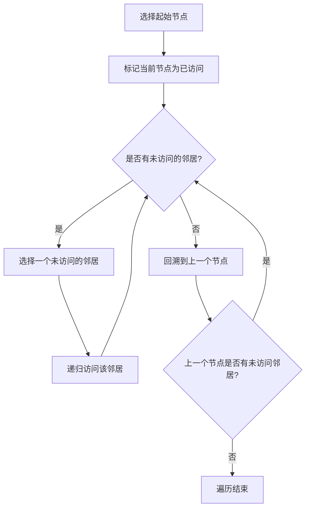

#深度优先

## 深度优先搜索 (DFS)

相关笔记：[[bfs]] | [[backtracking]] | [[lca]]

深度优先搜索（DFS, Depth-First Search）是一种用于遍历或搜索 tree 或 graph 的算法。核心思想是尽可能深地向前探索，直到到达终点，然后通过回溯来探索其他分支。DFS 可以使用递归或 stack 来实现。

### 算法流程



### DFS 的工作原理

1. **选择一个起点**：在 tree 或 graph 中选择一个起点作为搜索的开始
2. **向深处探索**：从起点开始，沿着某一路径尽可能深地探索，直到到达一个没有未访问相邻节点的节点
3. **回溯**：当到达一个没有未访问相邻节点的节点时，算法回溯到上一个节点，寻找其他可探索的路径
4. **重复步骤 2 和 3**：直到所有节点都被访问过，或找到所需的路径

### 两种实现方式

- **递归实现**：最简单直观，在递归的每一步选择一个未被访问的邻接节点继续前进，利用系统调用栈自动处理回溯
- **栈实现**：使用显式 stack 跟踪访问路径，核心思想不变，只是不依赖递归调用的系统栈

### 复杂度分析

| 指标 | 复杂度 |
|:---:|:---:|
| Time | O(V + E)，V 为节点数，E 为边数 |
| Space | O(V)，递归深度最大为节点数 |

## 模版

### 中序遍历验证 BST

```go
func isValidBST(root *TreeNode) bool {
    pre := math.MinInt
    var dfs func(*TreeNode) bool
    // 中序遍历 左中右
    dfs = func(node *TreeNode) bool {
        if node == nil {
            return true
        }
        if !dfs(node.Left) || node.Val <= pre {
            return false
        }
        pre = node.Val
        return dfs(node.Right)
    }
    return dfs(root)
}
```

### 笛卡尔积 (DFS 递归)

利用 DFS 递归生成多个数组的笛卡尔积：

```go
// cartesianProduct 计算多个字符串数组的笛卡尔积
func cartesianProduct(arrays [][]string) [][]string {
    if len(arrays) == 0 {
        return [][]string{{}}
    }

    // 递归地获取后面的笛卡尔积
    rest := cartesianProduct(arrays[1:])

    var result [][]string
    for _, val := range arrays[0] {
        for _, r := range rest {
            result = append(result, append([]string{val}, r...))
        }
    }
    return result
}
```
