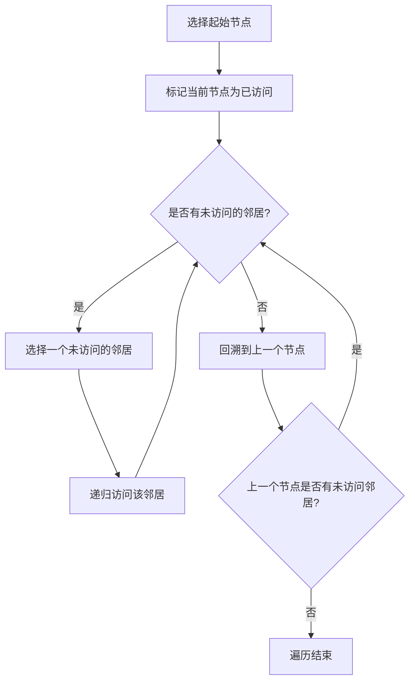

#深度优先

## 深度优先搜索 (DFS)

相关笔记：[[bfs]] | [[backtracking]] | [[lca]]

深度优先搜索（DFS, Depth-First Search）是一种用于遍历或搜索 tree 或 graph 的算法。核心思想是尽可能深地向前探索，直到到达终点，然后通过回溯来探索其他分支。DFS 可以使用递归或 stack 来实现。

### 算法流程



### DFS 的工作原理

1. **选择一个起点**：在 tree 或 graph 中选择一个起点作为搜索的开始
2. **向深处探索**：从起点开始，沿着某一路径尽可能深地探索，直到到达一个没有未访问相邻节点的节点
3. **回溯**：当到达一个没有未访问相邻节点的节点时，算法回溯到上一个节点，寻找其他可探索的路径
4. **重复步骤 2 和 3**：直到所有节点都被访问过，或找到所需的路径

### 两种实现方式

- **递归实现**：最简单直观，在递归的每一步选择一个未被访问的邻接节点继续前进，利用系统调用栈自动处理回溯
- **栈实现**：使用显式 stack 跟踪访问路径，核心思想不变，只是不依赖递归调用的系统栈

### 复杂度分析

| 指标 | 复杂度 |
|:---:|:---:|
| Time | O(V + E)，V 为节点数，E 为边数 |
| Space | O(V)，递归深度最大为节点数 |

## 模版

### 中序遍历验证 BST

```go
func isValidBST(root *TreeNode) bool {
    pre := math.MinInt
    var dfs func(*TreeNode) bool
    // 中序遍历 左中右
    dfs = func(node *TreeNode) bool {
        if node == nil {
            return true
        }
        if !dfs(node.Left) || node.Val <= pre {
            return false
        }
        pre = node.Val
        return dfs(node.Right)
    }
    return dfs(root)
}
```

### 笛卡尔积 (DFS 递归)

利用 DFS 递归生成多个数组的笛卡尔积：

```go
// cartesianProduct 计算多个字符串数组的笛卡尔积
func cartesianProduct(arrays [][]string) [][]string {
    if len(arrays) == 0 {
        return [][]string{{}}
    }

    // 递归地获取后面的笛卡尔积
    rest := cartesianProduct(arrays[1:])

    var result [][]string
    for _, val := range arrays[0] {
        for _, r := range rest {
            result = append(result, append([]string{val}, r...))
        }
    }
    return result
}
```

## 面试要点

### 高频问题

**Q: DFS 的核心思想是什么？它有哪两种实现方式？**
A: DFS 的核心是「尽可能深地探索，走不通再回溯」。一种实现是递归，利用系统调用栈自动完成回溯，代码最简洁；另一种是用显式 stack 模拟递归过程。两者逻辑等价，区别只在于回溯所依赖的栈是系统栈还是手动维护的 stack。

**Q: DFS 的时间复杂度和空间复杂度是多少？**
A: 时间复杂度是 O(V + E)，V 是节点数、E 是边数，因为每个节点和每条边都只会被访问一次（邻接表表示下）。空间复杂度是 O(V)：递归实现下，最坏情况（链状图/退化的树）递归深度可达 V，加上 visited 标记数组也是 O(V)。

**Q: 为什么 DFS 遍历 graph 时必须维护 visited 标记，而遍历 tree 时通常不需要？**
A: graph 可能存在环和多条路径指向同一节点，不标记 visited 会导致无限循环或重复访问。tree 是无环的连通图（n 个节点 n-1 条边），从根往下不会回到已访问节点，所以一般不需要 visited。但如果是无向图、或图中表示的树需要避免走回父节点，仍要记录来源（visited 或传入 parent）。

**Q: 二叉树的前序、中序、后序遍历有什么区别？中序遍历有什么特殊用途？**
A: 三者都是 DFS，区别在于「访问根节点」的时机：前序是「根左右」，中序是「左根右」，后序是「左右根」。中序遍历 BST 会得到一个严格递增的有序序列，因此可以用一次中序遍历配合 pre 变量校验是否为合法 BST（如笔记中的 `isValidBST`，判断 `node.Val <= pre` 即非法，并随遍历更新 pre 为前驱值）。

**Q: 递归 DFS 有什么风险？如何规避？**
A: 主要风险是递归过深导致 stack overflow。当树/图退化成链状、深度极大时，系统调用栈可能被打满。规避方式是改用显式 stack 的迭代写法，把递归深度从受限的系统栈转移到堆内存上的数据结构，从而支持更大规模的数据。

**Q: DFS 和 BFS 如何选择？**
A: 求「无权图最短路径」或按层处理时优先 BFS，它能保证第一次到达终点即为最短路径；DFS 适合「是否存在路径」「连通分量」「拓扑排序」「枚举所有方案/路径」等场景。空间上，DFS 占用与深度成正比 O(深度)，BFS 占用与最宽层成正比 O(宽度)，在深而窄的图上 DFS 更省内存，反之 BFS 更省。

**Q: DFS 和回溯（backtracking）是什么关系？**
A: 回溯本质上是带「状态撤销」的 DFS：在 DFS 探索过程中显式地做选择、递归、再撤销选择（恢复现场），从而系统地枚举所有可能解。笔记中的笛卡尔积生成就是 DFS 递归的一种应用，组合、排列、子集等经典回溯问题都建立在 DFS 框架之上。

### 面试加分点

- 能指出 O(V + E) 的复杂度前提是**邻接表**表示；若用**邻接矩阵**，遍历每个节点的邻居都要扫一整行，时间复杂度退化为 O(V²)。
- 能区分**递归栈空间**与 **visited 数组空间**：visited 恒为 O(V)，而递归栈取决于递归深度（链状/退化树最坏 O(V)，平衡树 O(log V)）。
- 中序遍历校验 BST 时，用单个 `pre` 变量（笔记中初始化为 `math.MinInt`）而非中序结果数组，可把额外空间从 O(V) 优化到 O(递归深度)，是典型的「边遍历边判断」优化；能进一步指出 `pre` 取 `math.MinInt` 存在边界隐患（节点值恰为 `math.MinInt` 时会误判），更稳妥的做法是用 `*int` 指针或显式 hasPrev 标记表示「无前驱」。
- 能说明 DFS 的三大经典应用：检测环（有向图看节点是否仍在当前递归栈中 / 三色标记法）、求强/弱连通分量、拓扑排序（后序遍历结果逆序）。
- 笛卡尔积的结果数量等于各数组长度之积，随数组个数增长是指数级的；DFS 递归需为每个结果做一次拷贝，时间约为「结果数 × 数组个数」。能意识到这类「枚举所有组合」的问题本质上无法低于结果规模，必要时需靠剪枝缩小搜索空间。
- 能将「显式 stack 迭代 DFS」与「递归 DFS」的入栈顺序对应起来（如前序迭代需先压右子节点再压左子节点，以保证左子树先出栈被访问）。
