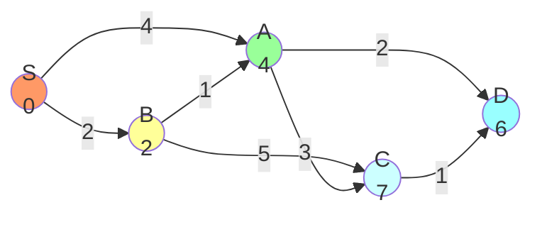
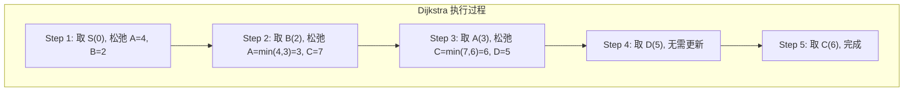

#算法 #graph #shortest-path

## Dijkstra 最短路径算法

相关笔记：[[graph-bfs-dfs]] | [[bfs]]

Dijkstra 算法是解决**单源最短路径**问题的经典算法，适用于边权非负的加权图。核心思想是贪心：每次从未确定最短路径的节点中选取距离最小的节点，并用它去更新邻居的距离。

### 算法原理

1. 初始化：源点距离为 0，其余节点距离为 +∞
2. 每次从未确定的节点中取出距离最小的节点 u
3. 用 u 的距离去松弛（relax）所有邻居 v：`dist[v] = min(dist[v], dist[u] + w(u,v))`
4. 重复直到所有节点都已确定

### 算法步骤可视化





### 朴素实现 vs 堆优化

| 实现方式 | Time | Space | 适用场景 |
|:---:|:---:|:---:|:---:|
| 朴素（遍历取最小值） | O(V^2) | O(V) | 稠密图 |
| 堆优化（优先队列） | O(E log V) | O(V + E) | 稀疏图（大多数场景） |

### Go 堆优化 Dijkstra 实现

```go
import "container/heap"

// Edge 表示加权边
type Edge struct {
    to, weight int
}

// Item 优先队列中的元素
type Item struct {
    node, dist int
}

// PQ 最小堆
type PQ []Item

func (pq PQ) Len() int            { return len(pq) }
func (pq PQ) Less(i, j int) bool  { return pq[i].dist < pq[j].dist }
func (pq PQ) Swap(i, j int)       { pq[i], pq[j] = pq[j], pq[i] }
func (pq *PQ) Push(x interface{}) { *pq = append(*pq, x.(Item)) }
func (pq *PQ) Pop() interface{} {
    old := *pq
    n := len(old)
    x := old[n-1]
    *pq = old[:n-1]
    return x
}

// Dijkstra 返回从 src 到所有节点的最短距离
func Dijkstra(n int, adj [][]Edge, src int) []int {
    const INF = 1<<63 - 1
    dist := make([]int, n)
    for i := range dist {
        dist[i] = INF
    }
    dist[src] = 0

    pq := &PQ{{src, 0}}
    heap.Init(pq)

    for pq.Len() > 0 {
        cur := heap.Pop(pq).(Item)
        if cur.dist > dist[cur.node] {
            continue // 跳过已经有更短路径的过时条目
        }
        for _, e := range adj[cur.node] {
            newDist := dist[cur.node] + e.weight
            if newDist < dist[e.to] {
                dist[e.to] = newDist
                heap.Push(pq, Item{e.to, newDist})
            }
        }
    }
    return dist
}
```

### Bellman-Ford / SPFA 对比

Dijkstra 不能处理**负权边**，此时需要 Bellman-Ford 或 SPFA。

| 算法 | Time | 负权边 | 负环检测 | 适用场景 |
|:---:|:---:|:---:|:---:|:---:|
| Dijkstra（堆优化） | O(E log V) | 不支持 | 不支持 | 非负权图 |
| Bellman-Ford | O(V * E) | 支持 | 支持 | 有负权边 |
| SPFA（BF 队列优化） | 平均 O(E)，最坏 O(V * E) | 支持 | 支持 | 一般图 |

#### Bellman-Ford 核心思想

对所有边进行 V-1 次松弛操作。如果第 V 次还能松弛，说明存在负环。

```go
// BellmanFord 支持负权边的最短路径算法
func BellmanFord(n int, edges [][3]int, src int) ([]int, bool) {
    const INF = 1<<63 - 1
    dist := make([]int, n)
    for i := range dist {
        dist[i] = INF
    }
    dist[src] = 0

    // 松弛 V-1 次
    for i := 0; i < n-1; i++ {
        for _, e := range edges {
            u, v, w := e[0], e[1], e[2]
            if dist[u] != INF && dist[u]+w < dist[v] {
                dist[v] = dist[u] + w
            }
        }
    }

    // 检测负环：第 V 次还能松弛则有负环
    for _, e := range edges {
        u, v, w := e[0], e[1], e[2]
        if dist[u] != INF && dist[u]+w < dist[v] {
            return dist, true // 存在负环
        }
    }
    return dist, false
}
```

### 复杂度分析

| 指标 | 复杂度（堆优化） |
|:---:|:---:|
| Time | O(E log V) |
| Space | O(V + E) |

### 面试要点

1. **为什么 Dijkstra 不能处理负权边**：贪心策略假设已确定的节点不会被更新，负权边会打破这一假设
2. **堆优化的关键**：跳过过时条目 `if cur.dist > dist[cur.node]`，避免重复处理
3. **实际应用**：网络路由（OSPF 协议）、地图导航、社交网络最短路径
4. **常见题目**：LeetCode 743（网络延迟时间）、LeetCode 787（K 站中转最便宜航班）
5. **Floyd-Warshall**：多源最短路径 O(V^3)，适合小图全局最短路径查询
