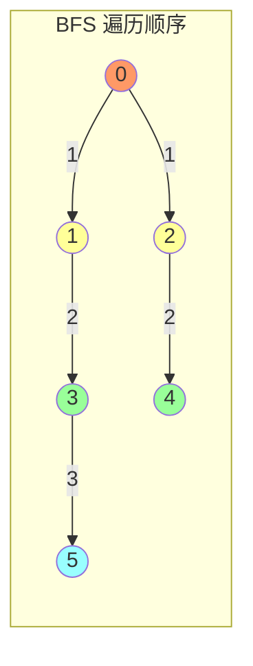

#算法 #graph

## 图论基础 - BFS/DFS 在图上的应用

相关笔记：[[bfs]] | [[dfs]] | [[dijkstra]]

图（Graph）是由顶点（Vertex）和边（Edge）组成的数据结构，用于表示对象之间的关系。图的遍历是许多图论算法的基础，BFS 和 DFS 是两种最核心的遍历方式。

### 图的表示方式

#### 邻接矩阵 (Adjacency Matrix)

用二维数组 `matrix[i][j]` 表示节点 i 到节点 j 是否有边。

- 优点：查询边 O(1)，适合稠密图
- 缺点：空间 O(V^2)，遍历邻居 O(V)

#### 邻接表 (Adjacency List)

每个节点维护一个邻居列表，只存储实际存在的边。

- 优点：空间 O(V + E)，遍历邻居高效
- 缺点：查询特定边 O(degree)

```go
// 邻接表表示
type Graph struct {
    adj map[int][]int // 节点 -> 邻居列表
}

func NewGraph() *Graph {
    return &Graph{adj: make(map[int][]int)}
}

func (g *Graph) AddEdge(u, v int) {
    g.adj[u] = append(g.adj[u], v)
    g.adj[v] = append(g.adj[v], u) // 无向图
}
```

### 图的 BFS 遍历

从起点出发，逐层访问所有可达节点。与树的 BFS 不同，图需要 visited 集合防止重复访问。



```go
// BFS 遍历图
func (g *Graph) BFS(start int) []int {
    visited := make(map[int]bool)
    queue := []int{start}
    visited[start] = true
    var order []int

    for len(queue) > 0 {
        node := queue[0]
        queue = queue[1:]
        order = append(order, node)

        for _, neighbor := range g.adj[node] {
            if !visited[neighbor] {
                visited[neighbor] = true
                queue = append(queue, neighbor)
            }
        }
    }
    return order
}
```

### 图的 DFS 遍历

沿着一条路径尽可能深地探索，到达死胡同后回溯。

```go
// DFS 遍历图（递归）
func (g *Graph) DFS(start int) []int {
    visited := make(map[int]bool)
    var order []int

    var dfs func(node int)
    dfs = func(node int) {
        visited[node] = true
        order = append(order, node)
        for _, neighbor := range g.adj[node] {
            if !visited[neighbor] {
                dfs(neighbor)
            }
        }
    }

    dfs(start)
    return order
}
```

### 连通分量

无向图中，通过遍历所有节点并对未访问节点启动新的 BFS/DFS，可以找到所有连通分量。

```go
// CountConnectedComponents 计算无向图的连通分量数
func (g *Graph) CountConnectedComponents(n int) int {
    visited := make(map[int]bool)
    count := 0

    var dfs func(node int)
    dfs = func(node int) {
        visited[node] = true
        for _, neighbor := range g.adj[node] {
            if !visited[neighbor] {
                dfs(neighbor)
            }
        }
    }

    for i := 0; i < n; i++ {
        if !visited[i] {
            dfs(i)
            count++
        }
    }
    return count
}
```

### 环检测

#### 无向图环检测

DFS 过程中如果遇到已访问的节点且不是父节点，则存在环。

```go
// HasCycleUndirected 检测无向图是否有环
func (g *Graph) HasCycleUndirected() bool {
    visited := make(map[int]bool)

    var dfs func(node, parent int) bool
    dfs = func(node, parent int) bool {
        visited[node] = true
        for _, neighbor := range g.adj[node] {
            if !visited[neighbor] {
                if dfs(neighbor, node) {
                    return true
                }
            } else if neighbor != parent {
                return true // 访问到非父节点的已访问节点，存在环
            }
        }
        return false
    }

    for node := range g.adj {
        if !visited[node] {
            if dfs(node, -1) {
                return true
            }
        }
    }
    return false
}
```

#### 有向图环检测（三色标记法）

使用白(0)/灰(1)/黑(2) 三种状态：灰色表示当前递归栈中的节点，遇到灰色节点说明有环。

```go
// HasCycleDirected 检测有向图是否有环
func HasCycleDirected(n int, adj map[int][]int) bool {
    color := make([]int, n) // 0:白 1:灰 2:黑

    var dfs func(node int) bool
    dfs = func(node int) bool {
        color[node] = 1 // 标记为灰色（正在访问）
        for _, neighbor := range adj[node] {
            if color[neighbor] == 1 {
                return true // 遇到灰色节点，存在环
            }
            if color[neighbor] == 0 && dfs(neighbor) {
                return true
            }
        }
        color[node] = 2 // 标记为黑色（访问完成）
        return false
    }

    for i := 0; i < n; i++ {
        if color[i] == 0 {
            if dfs(i) {
                return true
            }
        }
    }
    return false
}
```

### 复杂度分析

| 算法 | Time | Space |
|:---:|:---:|:---:|
| BFS 遍历 | O(V + E) | O(V) |
| DFS 遍历 | O(V + E) | O(V) |
| 连通分量 | O(V + E) | O(V) |
| 环检测 | O(V + E) | O(V) |

### 面试要点

1. **BFS vs DFS 选择**：BFS 适合最短路径、层级遍历；DFS 适合路径搜索、连通性判断、环检测
2. **图 vs 树的遍历区别**：图需要 visited 防止死循环，树不需要
3. **有向图 vs 无向图环检测**：无向图用 parent 判断；有向图用三色标记法
4. **邻接矩阵 vs 邻接表**：稀疏图用邻接表（大多数场景），稠密图用邻接矩阵
5. **连通分量的应用**：朋友圈问题（LeetCode 547）、岛屿数量（LeetCode 200）
