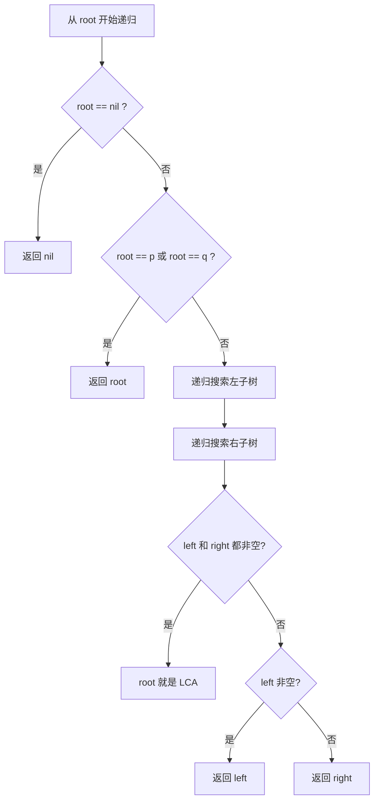

#LCA

## 最低公共祖先 (Lowest Common Ancestor, LCA)

相关笔记：[[dfs]] | [[bfs]]

LCA 问题是在 tree（特别是二叉树）中寻找两个节点最近的共同祖先。这类问题在生物信息学、网络路由、社交网络分析等领域有广泛应用。

### 算法流程（递归法）



### LCA 问题的变种

1. **在普通二叉树中寻找 LCA**：最基本的变种，通过后序遍历递归查找
2. **在 BST 中寻找 LCA**：利用 BST 性质（左小右大），通过比较节点值更高效地查找
3. **在有父指针的树中寻找 LCA**：追溯父节点链来实现，不需要递归或 DFS

### 解决方法

| 方法 | 说明 | 适用场景 |
|:---:|:---|:---|
| 递归 | 后序遍历，从左右子树查找目标节点 | 普通二叉树，单次查询 |
| 路径比较 | 分别找出到两个目标节点的路径，比较最后一个公共节点 | 有父指针的树 |
| Tarjan 离线算法 | 基于 Union-Find，批量处理 LCA 查询 | 多次查询 |
| 动态规划 (倍增法) | 预处理 DP 表，快速查询任意两节点的 LCA | 静态树，频繁查询 |

### 复杂度分析

| 方法 | Time | Space |
|:---:|:---:|:---:|
| 递归 | O(n) | O(n) |
| Tarjan | O(n + q)，q 为查询数 | O(n) |
| 倍增法 | 预处理 O(n log n)，查询 O(log n) | O(n log n) |

## 模版

### 在普通二叉树中寻找 LCA

```go
type TreeNode struct {
    Val   int
    Left  *TreeNode
    Right *TreeNode
}

func lowestCommonAncestor(root, p, q *TreeNode) *TreeNode {
    if root == nil {
        return nil
    }
    if root == p || root == q {
        return root
    }
    left := lowestCommonAncestor(root.Left, p, q)
    right := lowestCommonAncestor(root.Right, p, q)
    if left != nil && right != nil {
        return root
    }
    if left != nil {
        return left
    }
    if right != nil {
        return right
    }
    return nil
}
```
