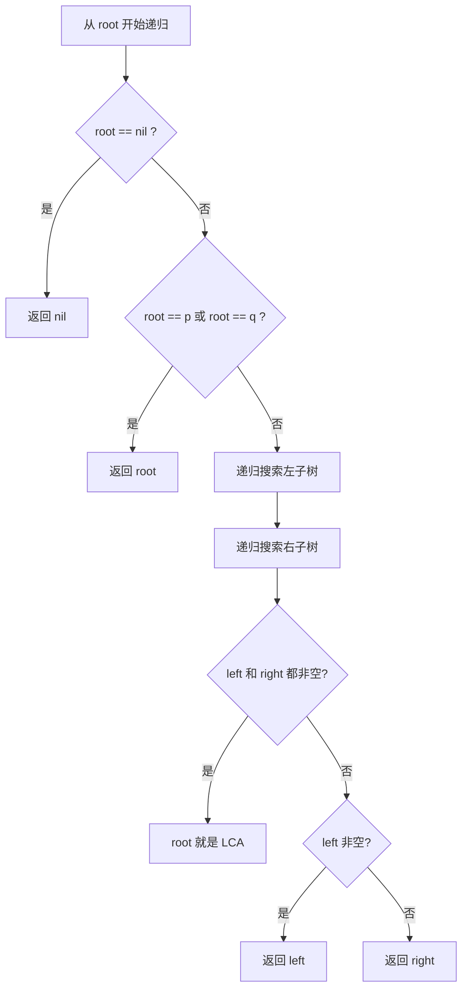

#LCA

## 最低公共祖先 (Lowest Common Ancestor, LCA)

相关笔记：[[dfs]] | [[bfs]]

LCA 问题是在 tree（特别是二叉树）中寻找两个节点最近的共同祖先。这类问题在生物信息学、网络路由、社交网络分析等领域有广泛应用。

### 算法流程（递归法）



### LCA 问题的变种

1. **在普通二叉树中寻找 LCA**：最基本的变种，通过后序遍历递归查找
2. **在 BST 中寻找 LCA**：利用 BST 性质（左小右大），通过比较节点值更高效地查找
3. **在有父指针的树中寻找 LCA**：追溯父节点链来实现，不需要递归或 DFS

### 解决方法

| 方法 | 说明 | 适用场景 |
|:---:|:---|:---|
| 递归 | 后序遍历，从左右子树查找目标节点 | 普通二叉树，单次查询 |
| 路径比较 | 分别找出到两个目标节点的路径，比较最后一个公共节点 | 有父指针的树 |
| Tarjan 离线算法 | 基于 Union-Find，批量处理 LCA 查询 | 多次查询 |
| 动态规划 (倍增法) | 预处理 DP 表，快速查询任意两节点的 LCA | 静态树，频繁查询 |

### 复杂度分析

| 方法 | Time | Space |
|:---:|:---:|:---:|
| 递归 | O(n) | O(n) |
| Tarjan | O(n + q)，q 为查询数 | O(n) |
| 倍增法 | 预处理 O(n log n)，查询 O(log n) | O(n log n) |

## 模版

### 在普通二叉树中寻找 LCA

```go
type TreeNode struct {
    Val   int
    Left  *TreeNode
    Right *TreeNode
}

func lowestCommonAncestor(root, p, q *TreeNode) *TreeNode {
    if root == nil {
        return nil
    }
    if root == p || root == q {
        return root
    }
    left := lowestCommonAncestor(root.Left, p, q)
    right := lowestCommonAncestor(root.Right, p, q)
    if left != nil && right != nil {
        return root
    }
    if left != nil {
        return left
    }
    if right != nil {
        return right
    }
    return nil
}
```

## 面试要点

### 高频问题

**Q: 普通二叉树求 LCA 的递归算法，核心思路是什么？**
A: 本质是一次后序遍历（postorder），自底向上回溯。递归函数返回值的语义是"以当前子树为根，能否找到 p 或 q（或它们的 LCA）"。当某个节点的左、右子树各返回一个非空结果时，说明 p 和 q 分别位于该节点两侧，当前节点就是 LCA；否则把非空那一侧的结果向上传递。时间和空间复杂度均为 O(n)，空间来自递归栈（树高最坏 O(n)）。

**Q: 为什么递归到 `root == p || root == q` 就直接返回，不继续往下找？**
A: 因为这道题的隐含前提是 p、q 都存在于树中。一旦遇到 p 或 q 就返回它本身：如果另一个节点在它的子树里，那么它就是 LCA（祖先包含自身）；如果不在，上层会通过左右两侧非空来判定真正的 LCA。所以提前返回不会漏解，反而省去无谓递归。但若不保证两个节点都存在，需要额外用两个布尔标记确认 p、q 都被找到后再返回结果。

**Q: 在 BST 中求 LCA 有没有更优解法？**
A: 有。利用 BST 左小右大的性质从 root 开始比较：若 p、q 的值都小于当前节点，往左子树走；都大于则往右子树走；否则（一个在左一个在右，或等于当前节点）当前节点就是 LCA。这样不需要后序遍历整棵树，时间复杂度降到 O(h)，h 为树高，平衡时为 O(log n)，且可以写成迭代形式、空间 O(1)。

**Q: 如果树节点带有父指针（parent），怎么求 LCA？**
A: 转化为"两条链表求相交点"问题。从 p、q 分别沿 parent 向上得到两条到 root 的路径，求第一个公共节点即可。可以用 HashSet 存 p 的所有祖先再遍历 q 的祖先链，O(h) 时间 O(h) 空间；也可以双指针法——两指针分别从 p、q 出发，走到顶后切换到对方起点，相遇处即 LCA，做到 O(h) 时间 O(1) 空间，无需递归或 DFS。

**Q: 需要对同一棵树做大量 LCA 查询，递归法每次 O(n) 太慢，怎么优化？**
A: 两类思路。离线（所有查询一次性给出）可用 Tarjan 算法，基于 Union-Find 一次 DFS 处理全部查询，整体 O(n + q)。在线/静态树频繁查询则用倍增法（Binary Lifting）：预处理 `up[v][j]` 表示 v 向上 2^j 的祖先，预处理 O(n log n)、单次查询 O(log n)。另一经典做法是把 LCA 转成欧拉序上的 RMQ，配合 Sparse Table 做到查询 O(1)。

**Q: 倍增法（Binary Lifting）求 LCA 的查询过程是怎样的？**
A: 先用 DFS 求出每个节点的深度 depth 和 `up[v][0]`（直接父节点），再递推 `up[v][j] = up[up[v][j-1]][j-1]`。查询时先把较深的节点向上跳，使两节点深度对齐；若此时已相等则它就是 LCA。否则两节点同步从高位到低位尝试上跳——当 `up[p][j] != up[q][j]` 时才跳，跳完后它们恰好停在 LCA 的两个子节点上，`up[p][0]` 即为答案。

**Q: 递归解法存在栈溢出风险吗？如何规避？**
A: 有。当树退化成链（如完全偏斜树）时递归深度达到 O(n)，节点数很大时可能爆栈。规避方式：改写为显式栈的迭代后序遍历，或对有父指针的场景改用路径比较法，或在工程语言中调大栈大小。对超大规模、多查询场景则直接选倍增/Tarjan 等预处理方案。

### 面试加分点

- 能点出递归法的返回值语义本质上是"该子树是否包含目标节点"，并由此解释"左右都非空即为 LCA"的正确性，而不是死记模板。
- 区分清楚离线 Tarjan（O(n+q)，依赖 Union-Find，需所有查询提前给出）与在线倍增/RMQ（支持随到随查）的适用边界，并能说明数值与权衡。
- 知道 LCA 与欧拉序 + RMQ 的等价转化，以及 Sparse Table 能把查询压到 O(1) 这一进阶结论。
- 强调"祖先包含自身"这一约定，并能讨论当 p、q 不保证都存在于树中时模板需要的改动（双布尔标记）。
- 能从复杂度出发选型：单次查询用 O(n) 递归，BST 用 O(h) 比较，多查询用 O(n log n) 预处理 + O(log n) 查询，体现对时间/空间权衡的判断。
