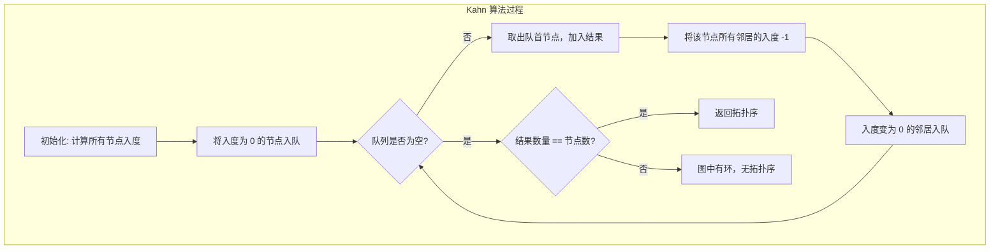
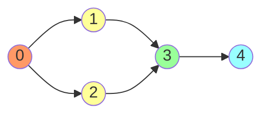

#算法 #graph #topological-sort

## 拓扑排序 (Topological Sort)

相关笔记：[[graph-bfs-dfs]] | [[bfs]] | [[dfs]]

拓扑排序是对有向无环图（DAG）的所有顶点进行线性排序，使得对于每条边 (u, v)，u 在排序中出现在 v 之前。拓扑排序不唯一，一个 DAG 可能有多种合法的拓扑序。如果图中存在环，则不存在拓扑排序。

### 两种方法

| 方法 | 核心思想 | 实现方式 |
|:---:|:---:|:---:|
| Kahn 算法 | BFS + 入度 | 反复删除入度为 0 的节点 |
| DFS 后序法 | DFS + 逆后序 | DFS 完成后逆序即为拓扑序 |

### Kahn 算法（BFS 入度法）



#### 示例图的拓扑排序过程



排序结果：`0 → 1 → 2 → 3 → 4` 或 `0 → 2 → 1 → 3 → 4`（不唯一）

### Go 实现

#### Kahn 算法（BFS）

```go
// TopologicalSortKahn 使用 BFS 入度法进行拓扑排序
// 返回拓扑序和是否存在合法拓扑序（无环）
func TopologicalSortKahn(n int, adj [][]int) ([]int, bool) {
    inDegree := make([]int, n)
    for u := 0; u < n; u++ {
        for _, v := range adj[u] {
            inDegree[v]++
        }
    }

    // 将入度为 0 的节点入队
    queue := []int{}
    for i := 0; i < n; i++ {
        if inDegree[i] == 0 {
            queue = append(queue, i)
        }
    }

    var order []int
    for len(queue) > 0 {
        node := queue[0]
        queue = queue[1:]
        order = append(order, node)

        for _, neighbor := range adj[node] {
            inDegree[neighbor]--
            if inDegree[neighbor] == 0 {
                queue = append(queue, neighbor)
            }
        }
    }

    if len(order) != n {
        return nil, false // 存在环
    }
    return order, true
}
```

#### DFS 后序法

```go
// TopologicalSortDFS 使用 DFS 后序逆序进行拓扑排序
func TopologicalSortDFS(n int, adj [][]int) ([]int, bool) {
    visited := make([]int, n) // 0:未访问 1:访问中 2:已完成
    var stack []int
    hasCycle := false

    var dfs func(node int)
    dfs = func(node int) {
        if hasCycle {
            return
        }
        visited[node] = 1 // 标记为访问中
        for _, neighbor := range adj[node] {
            if visited[neighbor] == 1 {
                hasCycle = true // 遇到正在访问的节点，存在环
                return
            }
            if visited[neighbor] == 0 {
                dfs(neighbor)
            }
        }
        visited[node] = 2 // 标记为已完成
        stack = append(stack, node) // 后序：完成后入栈
    }

    for i := 0; i < n; i++ {
        if visited[i] == 0 {
            dfs(i)
        }
    }

    if hasCycle {
        return nil, false
    }

    // 逆序得到拓扑序
    order := make([]int, n)
    for i, v := range stack {
        order[n-1-i] = v
    }
    return order, true
}
```

### 课程表问题

#### LeetCode 207 - 课程表（判断是否可以完成所有课程）

```go
// canFinish 判断是否能完成所有课程（即 DAG 无环检测）
func canFinish(numCourses int, prerequisites [][]int) bool {
    adj := make([][]int, numCourses)
    inDegree := make([]int, numCourses)
    for _, p := range prerequisites {
        adj[p[1]] = append(adj[p[1]], p[0])
        inDegree[p[0]]++
    }

    queue := []int{}
    for i := 0; i < numCourses; i++ {
        if inDegree[i] == 0 {
            queue = append(queue, i)
        }
    }

    count := 0
    for len(queue) > 0 {
        node := queue[0]
        queue = queue[1:]
        count++
        for _, next := range adj[node] {
            inDegree[next]--
            if inDegree[next] == 0 {
                queue = append(queue, next)
            }
        }
    }
    return count == numCourses
}
```

#### LeetCode 210 - 课程表 II（返回学习顺序）

```go
// findOrder 返回课程的学习顺序
func findOrder(numCourses int, prerequisites [][]int) []int {
    adj := make([][]int, numCourses)
    inDegree := make([]int, numCourses)
    for _, p := range prerequisites {
        adj[p[1]] = append(adj[p[1]], p[0])
        inDegree[p[0]]++
    }

    queue := []int{}
    for i := 0; i < numCourses; i++ {
        if inDegree[i] == 0 {
            queue = append(queue, i)
        }
    }

    var order []int
    for len(queue) > 0 {
        node := queue[0]
        queue = queue[1:]
        order = append(order, node)
        for _, next := range adj[node] {
            inDegree[next]--
            if inDegree[next] == 0 {
                queue = append(queue, next)
            }
        }
    }

    if len(order) != numCourses {
        return nil
    }
    return order
}
```

### 复杂度分析

| 指标 | 复杂度 |
|:---:|:---:|
| Time | O(V + E) |
| Space | O(V + E) |

### 面试要点

1. **拓扑排序的前提**：必须是 DAG（有向无环图），有环则无拓扑序
2. **两种方法对比**：Kahn 更直观且能顺便检测环；DFS 法代码更简洁但需要逆序
3. **环检测**：Kahn 法看结果数量是否等于节点数；DFS 法用三色标记
4. **应用场景**：编译依赖排序、课程安排、任务调度、包管理器依赖解析
5. **常见变体**：LeetCode 207/210（课程表）、LeetCode 269（外星文字典）
