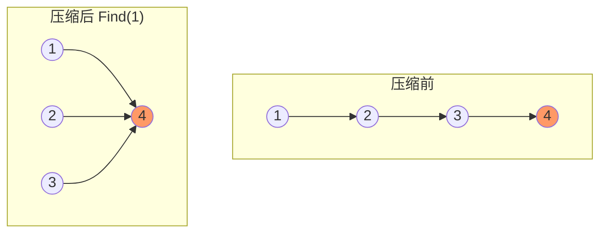
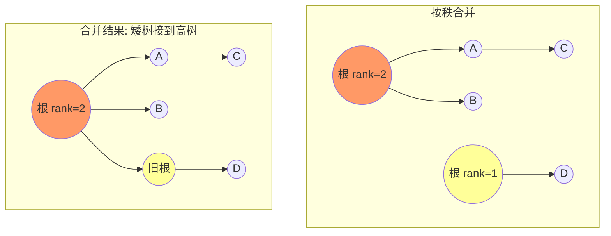

#算法 #union-find

## 并查集 (Union-Find / Disjoint Set Union)

相关笔记：[[graph-bfs-dfs]] | [[dfs]]

并查集是一种用于管理元素分组的数据结构，支持两个核心操作：**合并（Union）** 两个集合和 **查找（Find）** 元素所属集合。通过路径压缩和按秩合并两种优化，可以将操作复杂度降到近似 O(1)。

### 核心操作

| 操作 | 描述 |
|:---:|:---:|
| Find(x) | 查找 x 的根节点（所属集合的代表元素） |
| Union(x, y) | 将 x 和 y 所在的集合合并 |
| Connected(x, y) | 判断 x 和 y 是否在同一集合 |

### 路径压缩 (Path Compression)

Find 操作时，将路径上所有节点直接指向根节点，压平树结构。



### 按秩合并 (Union by Rank)

合并时，将矮的树接到高的树上，避免树退化为链表。



### Go 并查集模板

```go
type UnionFind struct {
    parent []int
    rank   []int
    count  int // 连通分量数
}

func NewUnionFind(n int) *UnionFind {
    parent := make([]int, n)
    rank := make([]int, n)
    for i := range parent {
        parent[i] = i // 初始时每个节点是自己的根
    }
    return &UnionFind{parent: parent, rank: rank, count: n}
}

// Find 查找根节点（带路径压缩）
func (uf *UnionFind) Find(x int) int {
    if uf.parent[x] != x {
        uf.parent[x] = uf.Find(uf.parent[x]) // 路径压缩
    }
    return uf.parent[x]
}

// Union 合并两个集合（按秩合并）
func (uf *UnionFind) Union(x, y int) bool {
    rootX, rootY := uf.Find(x), uf.Find(y)
    if rootX == rootY {
        return false // 已在同一集合
    }
    // 按秩合并：矮树接到高树
    if uf.rank[rootX] < uf.rank[rootY] {
        rootX, rootY = rootY, rootX
    }
    uf.parent[rootY] = rootX
    if uf.rank[rootX] == uf.rank[rootY] {
        uf.rank[rootX]++
    }
    uf.count--
    return true
}

// Connected 判断是否在同一集合
func (uf *UnionFind) Connected(x, y int) bool {
    return uf.Find(x) == uf.Find(y)
}
```

### 应用一：连通分量计数

等价于 LeetCode 547（省份数量）/ LeetCode 200（岛屿数量）。

```go
// findCircleNum 朋友圈 / 省份数量
func findCircleNum(isConnected [][]int) int {
    n := len(isConnected)
    uf := NewUnionFind(n)
    for i := 0; i < n; i++ {
        for j := i + 1; j < n; j++ {
            if isConnected[i][j] == 1 {
                uf.Union(i, j)
            }
        }
    }
    return uf.count
}
```

### 应用二：冗余连接（LeetCode 684）

在树中添加一条边形成环，找到这条多余的边。

```go
// findRedundantConnection 找到使树形成环的冗余边
func findRedundantConnection(edges [][]int) []int {
    n := len(edges)
    uf := NewUnionFind(n + 1)
    for _, e := range edges {
        if !uf.Union(e[0], e[1]) {
            return e // 合并失败说明已连通，这条边是冗余的
        }
    }
    return nil
}
```

### 应用三：岛屿数量的并查集解法

```go
// numIslands 用并查集解岛屿数量
func numIslands(grid [][]byte) int {
    m, n := len(grid), len(grid[0])
    uf := NewUnionFind(m * n)
    water := 0

    dirs := [4][2]int{{0, 1}, {0, -1}, {1, 0}, {-1, 0}}
    for i := 0; i < m; i++ {
        for j := 0; j < n; j++ {
            if grid[i][j] == '0' {
                water++
                continue
            }
            for _, d := range dirs {
                ni, nj := i+d[0], j+d[1]
                if ni >= 0 && ni < m && nj >= 0 && nj < n && grid[ni][nj] == '1' {
                    uf.Union(i*n+j, ni*n+nj)
                }
            }
        }
    }
    return uf.count - water
}
```

### 复杂度分析

| 指标 | 复杂度 |
|:---:|:---:|
| Find | O(α(n)) ≈ O(1)，α 为反阿克曼函数 |
| Union | O(α(n)) ≈ O(1) |
| Space | O(n) |

### 面试要点

1. **两种优化缺一不可**：路径压缩保证 Find 高效，按秩合并防止树退化
2. **并查集 vs BFS/DFS**：并查集适合动态连通性查询（边逐步添加）；BFS/DFS 适合静态图遍历
3. **何时用并查集**：关键词 "连通"、"分组"、"合并"、"是否属于同一集合"
4. **带权并查集**：Find 时维护到根的权值，用于处理等式方程（LeetCode 399）
5. **常见题目**：LeetCode 200（岛屿数量）、547（省份数量）、684（冗余连接）、128（最长连续序列的变体解法）
