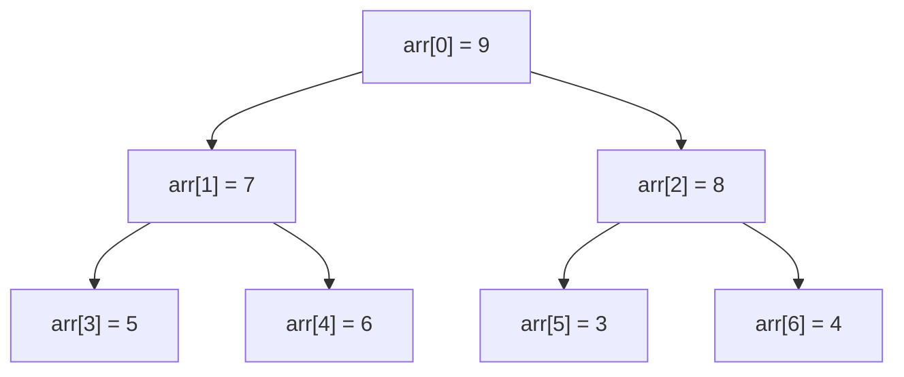

#堆

## 堆排序 (Heap Sort)

相关笔记：[[sorting-overview]] | [[quick-sort]]

### 堆结构

堆（Heap）是一种特殊的完全二叉树（Complete Binary Tree），主要有两种类型：

- **最大堆 (Max Heap)**：每个节点的值都大于或等于其子节点的值，根节点是最大元素
- **最小堆 (Min Heap)**：每个节点的值都小于或等于其子节点的值，根节点是最小元素

### 堆的性质

- **结构性质**：堆是一个完全二叉树，除了最后一层外每一层都被完全填满，节点尽可能向左对齐
- **有序性质**：父节点的值大于等于（大根堆）或小于等于（小根堆）子节点的值

### 堆的数组实现

给定节点索引 `i`：
- 父节点索引：`(i-1)/2`
- 左子节点索引：`2*i + 1`
- 右子节点索引：`2*i + 2`



### 堆排序步骤

1. **构建堆 (Heapify)**：从最后一个非叶子节点开始向上，对每个节点进行 down 操作
2. **排序**：将堆顶元素与末尾交换，缩小堆的范围，重新 heapify，重复直到排序完成

### 复杂度分析

| 指标 | 复杂度 |
|:---:|:---:|
| Time | O(N log N) |
| Space | O(1)，就地排序 |
| 稳定性 | 不稳定 |

## 模版：TopK 问题

利用堆排序解决 TopK 问题：创建一个大根堆，然后 Pop 出 k-1 个元素后，堆顶元素即为第 K 大的值。

```go
func findKthLargest(nums []int, k int) int {
    heapify(nums)
    for i := 0; i < k-1; i++ {
        pop(&nums)
    }
    return nums[0]
}

func heapify(nums []int) {
    n := len(nums)
    for i := n/2 - 1; i >= 0; i-- {
        down(nums, i, n)
    }
}

func down(nums []int, i, n int) bool {
    parent := i
    for {
        left := 2*parent + 1
        if left >= n || left < 1 {
            break
        }
        max := left
        if right := left + 1; right < n && nums[right] > nums[left] {
            max = right
        }
        if nums[max] < nums[parent] {
            break
        }
        nums[parent], nums[max] = nums[max], nums[parent]
        parent = max
    }
    return parent > i
}

func pop(nums *[]int) int {
    last := len(*nums) - 1
    (*nums)[0], (*nums)[last] = (*nums)[last], (*nums)[0]
    down(*nums, 0, last)
    rst := (*nums)[last]
    (*nums) = (*nums)[:last]
    return rst
}
```

## Go 中实现 heap.Interface

Go 标准库 `container/heap` 要求实现以下 5 个方法：

1. `Len() int`：返回堆中的元素数量
2. `Less(i, j int) bool`：定义堆中元素的排序顺序
3. `Swap(i, j int)`：交换两个元素
4. `Push(x interface{})`：添加新元素到堆末尾
5. `Pop() interface{}`：删除并返回最末尾的元素

```go
type ListNodeHeap []*ListNode

func (h ListNodeHeap) Len() int           { return len(h) }
func (h ListNodeHeap) Less(i, j int) bool { return h[i].Val < h[j].Val }
func (h ListNodeHeap) Swap(i, j int)      { h[i], h[j] = h[j], h[i] }
func (h *ListNodeHeap) Pop() interface{} {
    old := *h
    n := len(old)
    v := old[n-1]
    *h = old[:n-1]
    return v
}
func (h *ListNodeHeap) Push(v interface{}) {
    *h = append(*h, v.(*ListNode))
}
```

## 面试要点

### 高频问题

**Q: 堆排序的时间复杂度是多少？为什么建堆是 O(N) 而不是 O(N log N)？**
A: 整体排序是 O(N log N)：要做 N-1 次 Pop（取出堆顶后下沉），每次 down 的代价为 O(log N)。但一次性建堆（heapify）是 O(N) 而非 O(N log N)，因为越底层的节点越多但下沉高度越小，按层求和 Σ(节点数 × 高度) 收敛到 O(N)。注意「先建堆 O(N) + 排序 (N-1) 次 O(log N)」总和仍是 O(N log N)，主导项在排序阶段。

**Q: 堆排序为什么是不稳定的排序？**
A: 排序阶段会把堆顶元素与末尾元素交换，这一交换可能改变值相等元素的相对顺序；建堆时的 down 也会跨越相等元素做交换。因此相等 key 的前后关系可能被打乱，堆排序不稳定。相比之下 merge sort 是稳定的，而 quick sort 同样不稳定。

**Q: 堆为什么用数组而不是链表/指针实现？父子节点索引如何计算？**
A: 堆是完全二叉树（Complete Binary Tree），节点按层从左到右连续排布，可直接映射到数组下标且无空洞，省去指针开销、缓存局部性（cache locality）好。给定节点 i（0-based）：父节点 `(i-1)/2`，左子 `2*i+1`，右子 `2*i+2`。

**Q: 求第 K 大元素，用堆怎么做？建大根堆 Pop k 次和维护 size 为 k 的小根堆有什么区别？**
A: 方法一（笔记中的写法）：建大根堆 O(N)，Pop k-1 次后堆顶即第 K 大，总复杂度 O(N + k log N)。方法二：维护一个大小为 k 的小根堆，遍历 N 个元素，比堆顶大就替换并下沉，最终堆顶即第 K 大，复杂度 O(N log k)、空间 O(k)。数据量大、k 小或数据流（streaming）场景下方法二更优；离线一次性求解方法一足够。另外还可用 quickselect 做到平均 O(N)。

**Q: 堆排序 vs 快速排序，各自的优劣和适用场景？**
A: 两者平均都是 O(N log N) 且原地（O(1) 额外空间）。quick sort 常数更小、cache 友好，实际通常更快，但最坏 O(N²)（可用随机化/三数取中缓解）。heap sort 最坏仍是 O(N log N)，对抗恶意输入更安全，因此常作为 introsort（如 C++ STL std::sort）在递归过深时的兜底。两者均不稳定。

**Q: Go 标准库 `container/heap` 的 `heap.Push`/`heap.Pop` 和我们实现的 `Push`/`Pop` 方法是什么关系？**
A: 我们在类型上实现的是 `heap.Interface` 的 5 个方法（Len/Less/Swap/Push/Pop，其中前三个来自内嵌的 `sort.Interface`），这里的 Push 只是把元素 append 到切片末尾、Pop 只是摘掉末尾元素，二者都不维护堆序。真正的 sift-up / sift-down 由包级函数 `heap.Push(h, x)`（上浮）和 `heap.Pop(h)`（把末尾换到堆顶再下沉）调用这些原语来完成；对非空且无序的数据，使用前必须先 `heap.Init(h)` 建堆。

**Q: down（下沉）和 up（上浮）操作分别在什么时候用？**
A: down/siftDown 用于堆顶或某节点的值「太小」需要往下沉，典型场景是 Pop 后把末尾元素放到堆顶后下沉、以及建堆时从最后一个非叶子节点 `n/2-1` 向前逐个下沉。up/siftUp 用于新元素 Push 到末尾后「太大」需要往上浮。建堆用自底向上的 down 是 O(N)，若改用逐个 Push（up）则是 O(N log N)。

### 面试加分点

- 能从数学上解释建堆 O(N)：对高度为 h 的节点共约 n/2^(h+1) 个，下沉代价 O(h)，Σ h·n/2^(h+1) = O(n)，关键在「叶子最多但下沉为 0，根下沉最深但只有 1 个」。
- 清楚 heap sort 不稳定，且不像 merge sort 那样利于分块/外部排序，数据量超内存时通常选 external merge sort 而非 heap sort。
- 知道堆是优先队列（Priority Queue）的典型实现，延伸到 Dijkstra、Top-K、流式中位数（对顶堆：大根堆 + 小根堆各维护一半）等应用，以及合并 K 个有序链表用小根堆 O(N log k)。
- 了解二叉堆之外的变体：d-ary heap（降低树高、减少层数，利于 decrease-key 少的场景）、Fibonacci heap（decrease-key 摊还 O(1)，理论上把 Dijkstra 优化到 O(E + V log V)，但常数大实际少用）。
- 指出笔记 down 函数里 `left < 1` 这个判断对 0-based 数组实际不会触发（`left = 2*parent+1 >= 1`），属于冗余分支；核心边界是 `left >= n` 越界判断。
- 注意 Go 1.18 后 `container/heap` 的 `Push`/`Pop` 签名用 `any`（即 `interface{}` 的别名），实现里仍需类型断言（如 `v.(*ListNode)`）；可在外层用泛型封装以获得类型安全。
