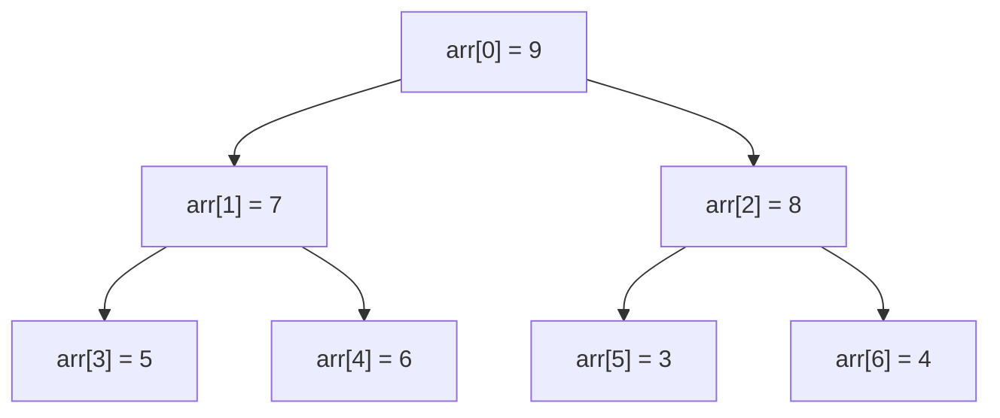

#堆

## 堆排序 (Heap Sort)

相关笔记：[[sorting-overview]] | [[quick-sort]]

### 堆结构

堆（Heap）是一种特殊的完全二叉树（Complete Binary Tree），主要有两种类型：

- **最大堆 (Max Heap)**：每个节点的值都大于或等于其子节点的值，根节点是最大元素
- **最小堆 (Min Heap)**：每个节点的值都小于或等于其子节点的值，根节点是最小元素

### 堆的性质

- **结构性质**：堆是一个完全二叉树，除了最后一层外每一层都被完全填满，节点尽可能向左对齐
- **有序性质**：父节点的值大于等于（大根堆）或小于等于（小根堆）子节点的值

### 堆的数组实现

给定节点索引 `i`：
- 父节点索引：`(i-1)/2`
- 左子节点索引：`2*i + 1`
- 右子节点索引：`2*i + 2`



### 堆排序步骤

1. **构建堆 (Heapify)**：从最后一个非叶子节点开始向上，对每个节点进行 down 操作
2. **排序**：将堆顶元素与末尾交换，缩小堆的范围，重新 heapify，重复直到排序完成

### 复杂度分析

| 指标 | 复杂度 |
|:---:|:---:|
| Time | O(N log N) |
| Space | O(1)，就地排序 |
| 稳定性 | 不稳定 |

## 模版：TopK 问题

利用堆排序解决 TopK 问题：创建一个大根堆，然后 Pop 出 k-1 个元素后，堆顶元素即为第 K 大的值。

```go
func findKthLargest(nums []int, k int) int {
    heapify(nums)
    for i := 0; i < k-1; i++ {
        pop(&nums)
    }
    return nums[0]
}

func heapify(nums []int) {
    n := len(nums)
    for i := n/2 - 1; i >= 0; i-- {
        down(nums, i, n)
    }
}

func down(nums []int, i, n int) bool {
    parent := i
    for {
        left := 2*parent + 1
        if left >= n || left < 1 {
            break
        }
        max := left
        if right := left + 1; right < n && nums[right] > nums[left] {
            max = right
        }
        if nums[max] < nums[parent] {
            break
        }
        nums[parent], nums[max] = nums[max], nums[parent]
        parent = max
    }
    return parent > i
}

func pop(nums *[]int) int {
    last := len(*nums) - 1
    (*nums)[0], (*nums)[last] = (*nums)[last], (*nums)[0]
    down(*nums, 0, last)
    rst := (*nums)[last]
    (*nums) = (*nums)[:last]
    return rst
}
```

## Go 中实现 heap.Interface

Go 标准库 `container/heap` 要求实现以下 5 个方法：

1. `Len() int`：返回堆中的元素数量
2. `Less(i, j int) bool`：定义堆中元素的排序顺序
3. `Swap(i, j int)`：交换两个元素
4. `Push(x interface{})`：添加新元素到堆末尾
5. `Pop() interface{}`：删除并返回最末尾的元素

```go
type ListNodeHeap []*ListNode

func (h ListNodeHeap) Len() int           { return len(h) }
func (h ListNodeHeap) Less(i, j int) bool { return h[i].Val < h[j].Val }
func (h ListNodeHeap) Swap(i, j int)      { h[i], h[j] = h[j], h[i] }
func (h *ListNodeHeap) Pop() interface{} {
    old := *h
    n := len(old)
    v := old[n-1]
    *h = old[:n-1]
    return v
}
func (h *ListNodeHeap) Push(v interface{}) {
    *h = append(*h, v.(*ListNode))
}
```
