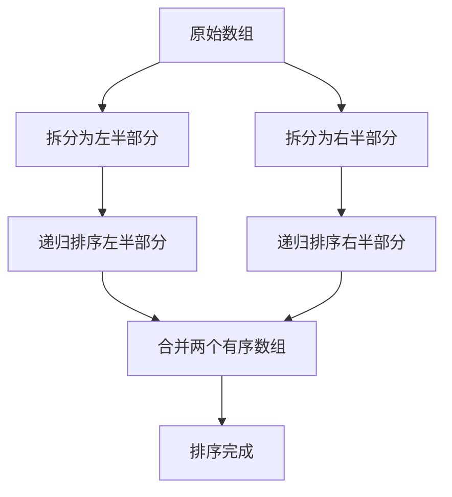

#master算法

## 归并排序 (Merge Sort)

相关笔记：[[sorting-overview]] | [[quick-sort]]

### Master 公式

适用于所有子问题规模相同的递归：`T(n) = a * T(n/b) + O(n^c)`

| 条件 | 复杂度 |
|:---|:---|
| log(b, a) < c | O(n^c) |
| log(b, a) > c | O(n^log(b,a)) |
| log(b, a) = c | O(n^c * logn) |

特殊情况：`T(n) = 2*T(n/2) + O(n*logn)` 时间复杂度是 `O(n * (logn)^2)`

### 复杂度分析

| 指标 | 复杂度 |
|:---:|:---:|
| Time | O(N log N) |
| Space | O(N) |
| 稳定性 | 稳定 |

## 归并分治

### 原理



核心思路：
1. 问题在大范围上的答案 = 左部分的答案 + 右部分的答案 + 跨越左右产生的答案
2. 计算"跨越左右产生的答案"时，如果加上左、右各自有序这个设定，会获得计算的便利性
3. 如果以上两点都成立，该问题很可能被归并分治解决

## 模版

### 基础归并排序

```go
func mergeSort(nums []int) []int {
    if len(nums) <= 1 {
        return nums
    }
    mid := len(nums) / 2
    left := mergeSort(nums[:mid])
    right := mergeSort(nums[mid:])
    result := merge(left, right)
    return result
}

func merge(left, right []int) (result []int) {
    l, r := 0, 0
    for l < len(left) && r < len(right) {
        if left[l] < right[r] {
            result = append(result, left[l])
            l++
        } else {
            result = append(result, right[r])
            r++
        }
    }
    result = append(result, left[l:]...)
    result = append(result, right[r:]...)
    return result
}
```

### 应用：翻转对 (Reverse Pairs)

归并分治的经典应用 -- 在 merge 过程中统计跨越左右的答案：

```go
func reversePairs(nums []int) int {
    return count(nums, 0, len(nums)-1)
}

func count(arr []int, l, r int) int {
    if l >= r {
        return 0
    }
    mid := l + (r-l)/2
    leftPairs := count(arr, l, mid)
    rightPairs := count(arr, mid+1, r)
    mergePairs := mergeAndCount(arr, l, mid, r)
    return leftPairs + rightPairs + mergePairs
}

func mergeAndCount(arr []int, l, mid, r int) (count int) {
    temp := make([]int, r-l+1)

    // 统计跨越左右的翻转对
    i, j := l, mid+1
    for ; i <= mid; i++ {
        for j <= r && arr[i] > 2*arr[j] {
            j++
        }
        count += j - mid - 1
    }

    // 标准 merge 过程
    i, j = l, mid+1
    k := 0
    for i <= mid && j <= r {
        if arr[i] <= arr[j] {
            temp[k] = arr[i]
            i++
        } else {
            temp[k] = arr[j]
            j++
        }
        k++
    }
    if i <= mid {
        copy(temp[k:], arr[i:mid+1])
    }
    if j <= r {
        copy(temp[k:], arr[j:r+1])
    }
    copy(arr[l:r+1], temp)
    return count
}
```
