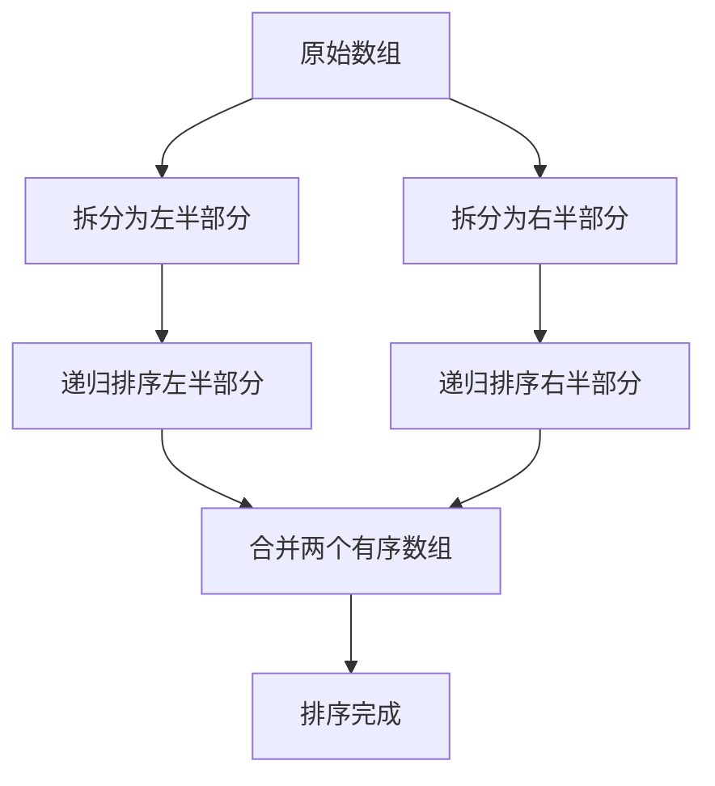

#master算法

## 归并排序 (Merge Sort)

相关笔记：[[sorting-overview]] | [[quick-sort]]

### Master 公式

适用于所有子问题规模相同的递归：`T(n) = a * T(n/b) + O(n^c)`

| 条件 | 复杂度 |
|:---|:---|
| log(b, a) < c | O(n^c) |
| log(b, a) > c | O(n^log(b,a)) |
| log(b, a) = c | O(n^c * logn) |

特殊情况：`T(n) = 2*T(n/2) + O(n*logn)` 时间复杂度是 `O(n * (logn)^2)`

### 复杂度分析

| 指标 | 复杂度 |
|:---:|:---:|
| Time | O(N log N) |
| Space | O(N) |
| 稳定性 | 稳定 |

## 归并分治

### 原理



核心思路：
1. 问题在大范围上的答案 = 左部分的答案 + 右部分的答案 + 跨越左右产生的答案
2. 计算"跨越左右产生的答案"时，如果加上左、右各自有序这个设定，会获得计算的便利性
3. 如果以上两点都成立，该问题很可能被归并分治解决

## 模版

### 基础归并排序

```go
func mergeSort(nums []int) []int {
    if len(nums) <= 1 {
        return nums
    }
    mid := len(nums) / 2
    left := mergeSort(nums[:mid])
    right := mergeSort(nums[mid:])
    result := merge(left, right)
    return result
}

func merge(left, right []int) (result []int) {
    l, r := 0, 0
    for l < len(left) && r < len(right) {
        if left[l] < right[r] {
            result = append(result, left[l])
            l++
        } else {
            result = append(result, right[r])
            r++
        }
    }
    result = append(result, left[l:]...)
    result = append(result, right[r:]...)
    return result
}
```

### 应用：翻转对 (Reverse Pairs)

归并分治的经典应用 -- 在 merge 过程中统计跨越左右的答案：

```go
func reversePairs(nums []int) int {
    return count(nums, 0, len(nums)-1)
}

func count(arr []int, l, r int) int {
    if l >= r {
        return 0
    }
    mid := l + (r-l)/2
    leftPairs := count(arr, l, mid)
    rightPairs := count(arr, mid+1, r)
    mergePairs := mergeAndCount(arr, l, mid, r)
    return leftPairs + rightPairs + mergePairs
}

func mergeAndCount(arr []int, l, mid, r int) (count int) {
    temp := make([]int, r-l+1)

    // 统计跨越左右的翻转对
    i, j := l, mid+1
    for ; i <= mid; i++ {
        for j <= r && arr[i] > 2*arr[j] {
            j++
        }
        count += j - mid - 1
    }

    // 标准 merge 过程
    i, j = l, mid+1
    k := 0
    for i <= mid && j <= r {
        if arr[i] <= arr[j] {
            temp[k] = arr[i]
            i++
        } else {
            temp[k] = arr[j]
            j++
        }
        k++
    }
    if i <= mid {
        copy(temp[k:], arr[i:mid+1])
    }
    if j <= r {
        copy(temp[k:], arr[j:r+1])
    }
    copy(arr[l:r+1], temp)
    return count
}
```

## 面试要点

### 高频问题

**Q: Merge Sort 的时间和空间复杂度是多少？为什么和数据分布无关？**

> [!question]- 参考答案（点击展开）
>
> 时间复杂度恒为 O(N log N)（最好、最坏、平均都一样），因为递归树深度固定为 log N、每层 merge 的总工作量为 O(N)，与输入是否有序无关；空间复杂度为 O(N)，需要额外的辅助数组存放合并结果（自顶向下递归再加上 O(log N) 的递归栈，但 O(N) 占主导）。

**Q: Merge Sort 是稳定排序吗？关键在哪一行代码？**

> [!question]- 参考答案（点击展开）
>
> 取决于 merge 时相等元素的取舍。稳定的充要条件是：当左右元素相等时优先取「左半部分（下标更小）」的元素，即用 `arr[i] <= arr[j]` 取左（本笔记翻转对的 `mergeAndCount` 正是 `arr[i] <= arr[j]` 取左，是稳定的）。注意：本笔记基础 `merge` 写的是 `left[l] < right[r]`，相等时走 else 取的是 right，这种写法相等元素会让右边先出，是**不稳定**的；只要把它改成 `left[l] <= right[r]` 取左即可恢复稳定。一句话：相等时取左则稳定，取右则不稳定。

**Q: 用 Master 公式如何推导 Merge Sort 的复杂度？**

> [!question]- 参考答案（点击展开）
>
> Merge Sort 满足 `T(n) = 2*T(n/2) + O(n)`，即 a=2、b=2、c=1。此时 log(b,a)=log₂2=1=c，对应表中 `log(b,a) = c` 的情况，结果为 `O(n^c * log n)` = O(N log N)。

**Q: 为什么用归并分治能在排序的同时统计『翻转对 / 逆序对』这类跨越左右的问题？**

> [!question]- 参考答案（点击展开）
>
> 归并分治的核心是「大范围答案 = 左部分答案 + 右部分答案 + 跨越左右的答案」。当左右两边各自有序后，统计跨越部分变得高效：用双指针扫描，外层 i 在左半右移时内层 j 只增不减（单调不回退），每个指针总移动 O(N) 次，统计成本 O(N)，整体仍是 O(N log N)，比暴力 O(N²) 优。

**Q: 翻转对统计时为什么要先统计再 merge，而不是边 merge 边统计？**

> [!question]- 参考答案（点击展开）
>
> 因为统计条件（`arr[i] > 2*arr[j]`）和 merge 的排序条件（`arr[i] <= arr[j]`）不一致：满足翻转对的 j 不一定就是 merge 时该先取的元素。如果在同一个循环里混用，两套指针的移动逻辑会互相干扰，导致漏算或重算。所以本笔记先用一对独立的 `i, j` 双指针统计跨越对数，再用复位后的 `i, j` 做标准 merge，两个阶段各自维护干净的指针单调性。

**Q: Merge Sort 相比 Quick Sort 有什么优劣？**

> [!question]- 参考答案（点击展开）
>
> Merge Sort 最坏复杂度稳定为 O(N log N)、容易实现稳定排序、适合链表和外部排序；缺点是数组实现需要 O(N) 额外空间。Quick Sort 原地排序、常数因子小、cache 友好、平均更快，但最坏退化到 O(N²)、且不稳定。Java 对象排序（`Arrays.sort(Object[])` / `Collections.sort`）默认用 TimSort（基于归并），正是看中其稳定性。

**Q: Merge Sort 适合排序链表吗？为什么？**

> [!question]- 参考答案（点击展开）
>
> 非常适合。链表无法随机访问，Quick Sort 的分区操作代价高；而 Merge Sort 用快慢指针找中点拆分、合并时只改指针指向，不需要额外数组。其中自底向上（bottom-up）迭代写法能做到 O(1) 额外空间，自顶向下递归写法还需 O(log N) 栈，二者都能保持稳定，时间均为 O(N log N)。

### 面试加分点

- 能说出递归版（自顶向下，需 O(log N) 栈）与迭代版（自底向上 bottom-up，按步长 1,2,4… 两两合并，省去递归栈）两种实现，并知道后者更适合链表、且能避免深递归栈溢出。
- 理解归并分治可解的判定标准：跨越左右的答案能借助「左右各自有序」获得计算便利，典型题包括逆序对、翻转对、区间和计数（Count of Range Sum）、Count of Smaller Numbers After Self。
- 翻转对里 `arr[i] > 2*arr[j]` 的 `2*arr[j]` 在 32 位 int 下（如 Java/C++ 的 LeetCode 模板）可能溢出，工程上应转 `long`/`int64` 或写成 `arr[i] > 2L * arr[j]`；本笔记是 Go，主流平台 `int` 为 64 位一般安全，但说明边界意识仍是加分点。
- 能用 Master 公式分析变体：如 `T(n) = 2*T(n/2) + O(n log n)`（每层 merge 开销升为 O(n log n)）的结果是 O(n·(log n)²)，与本笔记 Master 公式特殊情况一致，说明每层开销变化会改变总复杂度。
- 知道 TimSort 在归并基础上引入 run 识别和 Galloping mode，对近乎有序的数据可达到接近 O(N) 的最好情况，是工业级排序的优化方向。
