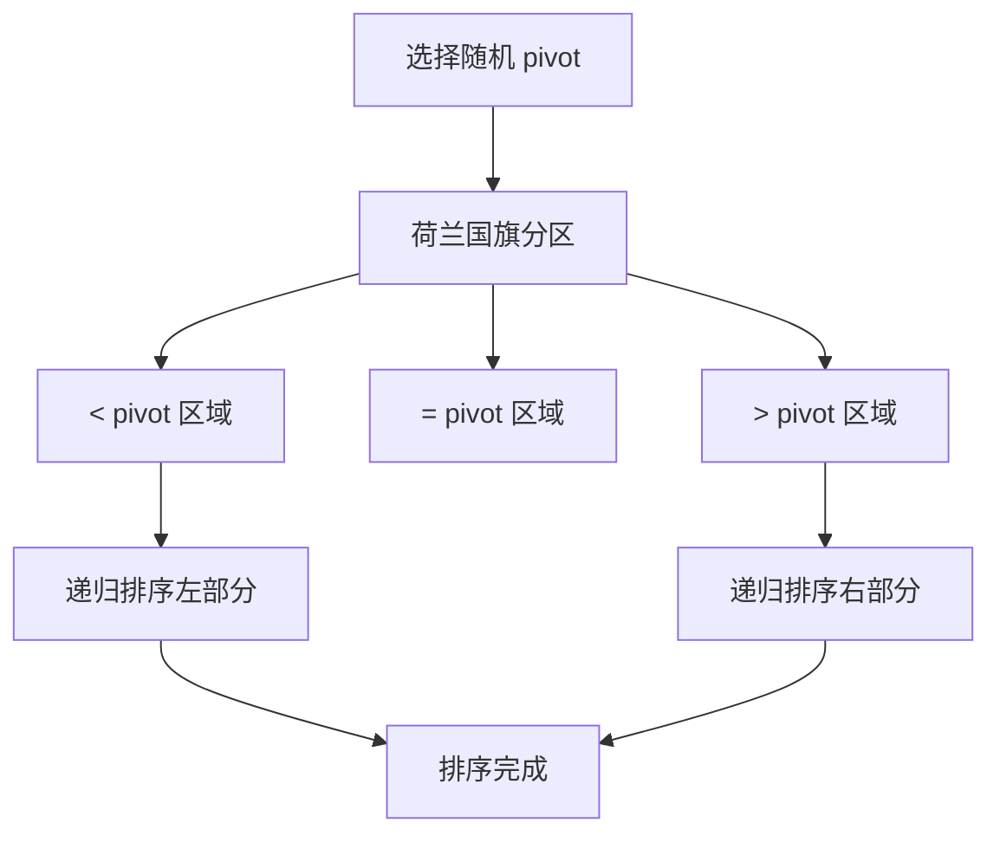

#荷兰旗问题

## 快速排序 (Quick Sort)

相关笔记：[[sorting-overview]] | [[heap-sort]] | [[merge-sort]]

### 算法原理

快速排序是一种 divide-and-conquer 算法，包含三个步骤：

1. **选择基准值 (Pivot Selection)**：从数组中选择一个元素作为 pivot
2. **分区 (Partitioning)**：重新排列数组，使小于 pivot 的元素在左边，大于 pivot 的元素在右边
3. **递归排序 (Recursive Sorting)**：递归地对左右两部分进行排序

### 算法流程



### 荷兰国旗问题 (Dutch National Flag)

荷兰国旗问题是快速排序分区步骤的优化。将数组分成三个部分：
- `< pivot` 的元素
- `= pivot` 的元素
- `> pivot` 的元素

这种方法减少了重复元素的影响，特别是当数组中包含多个与 pivot 相等的元素时效率更高。

### 复杂度分析

| 指标 | 复杂度 |
|:---:|:---:|
| Time (平均) | O(N log N) |
| Time (最坏) | O(N^2)，随机化 pivot 可避免 |
| Space | O(log N)，递归栈深度 |
| 稳定性 | 不稳定 |

## 模版

### 快速排序（荷兰国旗分区）

```go
func quickSort(arr []int, l, r int) {
    if l >= r {
        return
    }
    // 随机选择一个元素作为基准
    x := arr[l+rand.Intn(r-l+1)]
    left, right := partition(arr, l, r, x)
    quickSort(arr, l, left-1)
    quickSort(arr, right+1, r)
}

// 荷兰国旗问题
// 划分数组：<x 放左边，==x 放中间，>x 放右边
// 返回 ==x 区域的左右边界
func partition(arr []int, l, r, x int) (int, int) {
    first := l
    last := r
    i := l
    for i <= last {
        if arr[i] < x {
            arr[i], arr[first] = arr[first], arr[i]
            first++
            i++
        } else if arr[i] > x {
            arr[i], arr[last] = arr[last], arr[i]
            last--
        } else {
            i++
        }
    }
    return first, last
}
```

### 应用：数组中的第 K 大元素

[LCR 076. 数组中的第 K 个最大元素](https://leetcode.cn/problems/xx4gT2/)

利用快速选择算法（Quick Select），平均 Time O(N)，无需完整排序。

```go
func findKthLargest(nums []int, k int) int {
    return help(nums, len(nums)-k)
}

func help(nums []int, k int) (ans int) {
    for l, r := 0, len(nums)-1; l <= r; {
        indexs := partition(nums, l, r, nums[l+rand.Intn(r-l+1)])
        if k < indexs[0] {
            r = indexs[0] - 1
        } else if k > indexs[1] {
            l = indexs[1] + 1
        } else {
            ans = nums[k]
            break
        }
    }
    return
}

// partition 实现荷兰国旗问题，返回等于区的左右边界
func partition(arr []int, l int, r int, x int) []int {
    first, last := l, r
    i := l
    for i <= last {
        if arr[i] < x {
            arr[i], arr[first] = arr[first], arr[i]
            first++
            i++
        } else if arr[i] > x {
            arr[i], arr[last] = arr[last], arr[i]
            last--
        } else {
            i++
        }
    }
    return []int{first, last}
}
```
