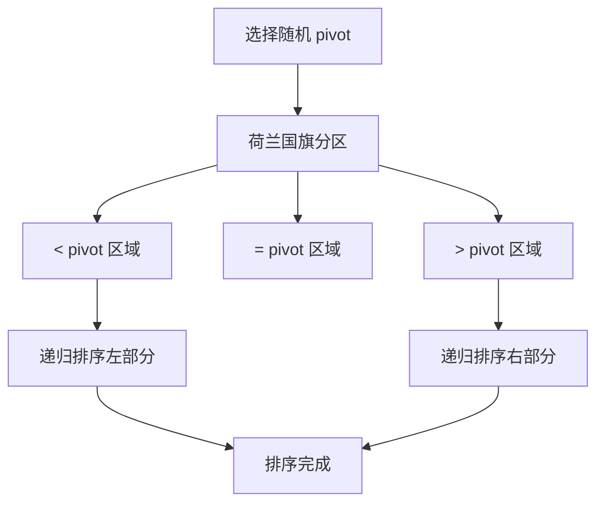

#荷兰旗问题

## 快速排序 (Quick Sort)

相关笔记：[[sorting-overview]] | [[heap-sort]] | [[merge-sort]]

### 算法原理

快速排序是一种 divide-and-conquer 算法，包含三个步骤：

1. **选择基准值 (Pivot Selection)**：从数组中选择一个元素作为 pivot
2. **分区 (Partitioning)**：重新排列数组，使小于 pivot 的元素在左边，大于 pivot 的元素在右边
3. **递归排序 (Recursive Sorting)**：递归地对左右两部分进行排序

### 算法流程



### 荷兰国旗问题 (Dutch National Flag)

荷兰国旗问题是快速排序分区步骤的优化。将数组分成三个部分：
- `< pivot` 的元素
- `= pivot` 的元素
- `> pivot` 的元素

这种方法减少了重复元素的影响，特别是当数组中包含多个与 pivot 相等的元素时效率更高。

### 复杂度分析

| 指标 | 复杂度 |
|:---:|:---:|
| Time (平均) | O(N log N) |
| Time (最坏) | O(N^2)，随机化 pivot 可避免 |
| Space | O(log N)，递归栈深度 |
| 稳定性 | 不稳定 |

## 模版

### 快速排序（荷兰国旗分区）

```go
func quickSort(arr []int, l, r int) {
    if l >= r {
        return
    }
    // 随机选择一个元素作为基准
    x := arr[l+rand.Intn(r-l+1)]
    left, right := partition(arr, l, r, x)
    quickSort(arr, l, left-1)
    quickSort(arr, right+1, r)
}

// 荷兰国旗问题
// 划分数组：<x 放左边，==x 放中间，>x 放右边
// 返回 ==x 区域的左右边界
func partition(arr []int, l, r, x int) (int, int) {
    first := l
    last := r
    i := l
    for i <= last {
        if arr[i] < x {
            arr[i], arr[first] = arr[first], arr[i]
            first++
            i++
        } else if arr[i] > x {
            arr[i], arr[last] = arr[last], arr[i]
            last--
        } else {
            i++
        }
    }
    return first, last
}
```

### 应用：数组中的第 K 大元素

[LCR 076. 数组中的第 K 个最大元素](https://leetcode.cn/problems/xx4gT2/)

利用快速选择算法（Quick Select），平均 Time O(N)，无需完整排序。

```go
func findKthLargest(nums []int, k int) int {
    return help(nums, len(nums)-k)
}

func help(nums []int, k int) (ans int) {
    for l, r := 0, len(nums)-1; l <= r; {
        indexs := partition(nums, l, r, nums[l+rand.Intn(r-l+1)])
        if k < indexs[0] {
            r = indexs[0] - 1
        } else if k > indexs[1] {
            l = indexs[1] + 1
        } else {
            ans = nums[k]
            break
        }
    }
    return
}

// partition 实现荷兰国旗问题，返回等于区的左右边界
func partition(arr []int, l int, r int, x int) []int {
    first, last := l, r
    i := l
    for i <= last {
        if arr[i] < x {
            arr[i], arr[first] = arr[first], arr[i]
            first++
            i++
        } else if arr[i] > x {
            arr[i], arr[last] = arr[last], arr[i]
            last--
        } else {
            i++
        }
    }
    return []int{first, last}
}
```

## 面试要点

### 高频问题

**Q: 快速排序的平均和最坏时间复杂度分别是多少？最坏情况什么时候发生？**
A: 平均 Time O(N log N)，最坏 Time O(N^2)。最坏发生在每次 partition 都极度不平衡时，例如对已排序（或逆序）数组固定取首元素作 pivot，每层只能排除一个元素，递归深度退化为 O(N)。本文模板用随机化 pivot（`l+rand.Intn(r-l+1)`）打散输入分布，或用三数取中，可让最坏情况几乎不可能命中。

**Q: 快速排序为什么是不稳定排序？**
A: partition 过程中会做远距离的元素交换（如把 `> pivot` 的元素和末尾元素对调），相等元素的相对顺序可能被打乱，所以不稳定。相比之下 merge sort 是稳定的。如果业务要求稳定，可改用归并排序，或给元素附加原始下标作为第二关键字来人为保持稳定。

**Q: 快排的空间复杂度为什么是 O(log N)？**
A: 快排是原地（in-place）排序，分区本身只用常数额外空间，主要开销来自递归调用栈。平均情况下递归深度约为 log N，所以 Space 为 O(log N)；最坏情况递归深度退化到 O(N)，栈空间也变成 O(N)。可以对较小的一侧先递归、较大的一侧用尾递归/循环消除，把栈深度稳定控制在 O(log N)。

**Q: 荷兰国旗（三路）分区相比经典两路分区有什么优势？**
A: 三路分区把数组划分为 `< pivot`、`= pivot`、`> pivot` 三段，等于 pivot 的元素一次性归位，不再参与后续递归（本文 `quickSort` 只对 `[l, left-1]` 和 `[right+1, r]` 递归，整段等于区被跳过）。当数组中存在大量重复元素时，经典两路分区会把相等元素反复拆分导致退化，而三路分区能直接跳过等于区，把这种场景的复杂度从接近 O(N^2) 降到接近 O(N log N)。

**Q: Quick Select 求第 K 大元素的复杂度是多少？为什么比排序快？**
A: 平均 Time O(N)，最坏 O(N^2)。它借用 partition，但每次只递归 pivot 落点所在的那一侧而非两侧，期望比较次数为 N + N/2 + N/4 + ... ≈ 2N，因此是线性的；而完整排序要 O(N log N)。本文里 `findKthLargest` 把“第 k 大”转换成“第 len(nums)-k 小”，再用三路 partition 返回的等于区边界 `indexs[0]`、`indexs[1]` 判断目标落在哪一段（命中等于区即可直接返回）。

**Q: 如何避免快排在已排序数组上退化？**
A: 关键是让 pivot 尽量靠近中位数。常用手段：随机化 pivot（本文做法）、三数取中（median-of-three，取首/中/尾的中位数）、甚至九数取中。工程实现（如内省排序 introsort）还会在递归深度超过约 2*log N 时切换到 heap sort 保证最坏 O(N log N)，并对小数组改用 insertion sort。

**Q: 快速排序和归并排序如何选择？**
A: 快排原地、常数因子小、缓存友好，平均最快，是内存内通用排序首选，但不稳定且最坏 O(N^2)。归并排序稳定、最坏仍 O(N log N)、易于并行和做外部排序（大数据无法全部装入内存时），但需要 O(N) 额外空间。要稳定或要可控最坏界选归并，追求平均性能选快排。

### 面试加分点

- 能说清三路 partition 的三指针不变式：`[l, first)` 为小于区、`[first, i)` 为等于区、`(last, r]` 为大于区，循环条件 `i <= last`，当 `i` 越过 `last`（即 `i == last+1`）时分区结束；并注意命中 `> pivot` 时只交换 `last` 而不前移 `i`（因为从右端换过来的元素还未检查）。
- 了解工程级实现 introsort（C++ STL `std::sort`）：quicksort + heapsort + insertion sort 三者结合，递归过深切堆排，小区间走插入排序，兼顾平均性能与最坏保证。
- 知道理论上存在 BFPRT（中位数的中位数）算法，可把第 K 大做到最坏 O(N)，但常数大，实践中仍以随机化 Quick Select 为主。
- 能指出 partition 写法的边界陷阱：pivot 必须先按值取出再传入（本文先算 `x := arr[...]` 再传给 partition），否则交换后该下标处的值会变；以及随机下标用 `l+rand.Intn(r-l+1)` 而非 `rand.Intn(r-l)`，避免取不到右端点。
- 理解快排对缓存友好（顺序访问、局部性好）是它在实际硬件上常比同为 O(N log N) 的堆排序更快的重要原因。
