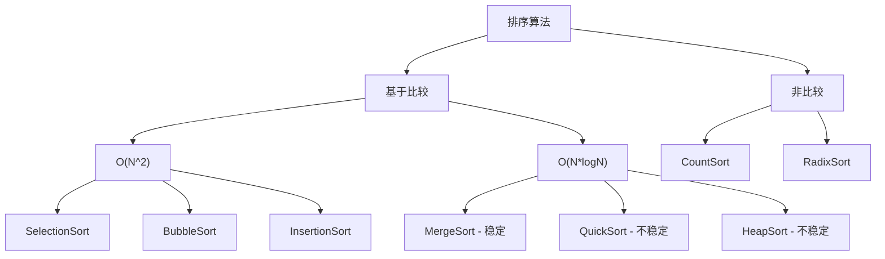

#算法 #总结

## 排序算法总结 (Sorting Overview)

相关笔记：[[heap-sort]] | [[quick-sort]] | [[radix-sort]] | [[merge-sort]]

### 稳定性

排序算法的稳定性是指：同样大小的样本在排序之后不会改变原始的相对次序。

- 稳定性对基础类型对象来说毫无意义
- 稳定性对非基础类型对象有意义，可以保留之前的相对次序

### 主要算法对比

| 算法 | Time | Space | 稳定性 |
|:---:|:---:|:---:|:---:|
| SelectionSort | O(N^2) | O(1) | 无 |
| BubbleSort | O(N^2) | O(1) | 有 |
| InsertionSort | O(N^2) | O(1) | 有 |
| MergeSort | O(N*logN) | O(N) | 有 |
| QuickSort | O(N*logN) | O(logN) | 无 |
| HeapSort | O(N*logN) | O(1) | 无 |
| CountSort | O(N) | O(M) | 有 |
| RadixSort | O(N) | O(M) | 有 |

### 算法分类

### 重要结论

基于比较的排序，Time O(N*logN)、Space 低于 O(N)、且具有稳定性的排序算法目前不存在。

TimSort 虽然在实际应用中通常不需要 O(N) 的额外空间，但 Space 复杂度指标就是 O(N)。ShellSort（希尔排序）是加入步长调整的插入排序，在算法面试中很少用到。

### 如何选择

| 场景 | 推荐算法 |
|:---|:---|
| 数据量非常小，需要快速排序 | InsertionSort |
| 性能优异、实现简单、不在乎稳定性 | QuickSort (随机快排) |
| 性能优异、不在乎额外空间、需要稳定性 | MergeSort |
| 性能优异、Space 要求 O(1)、不在乎稳定性 | HeapSort |
