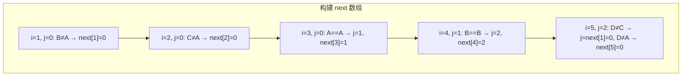
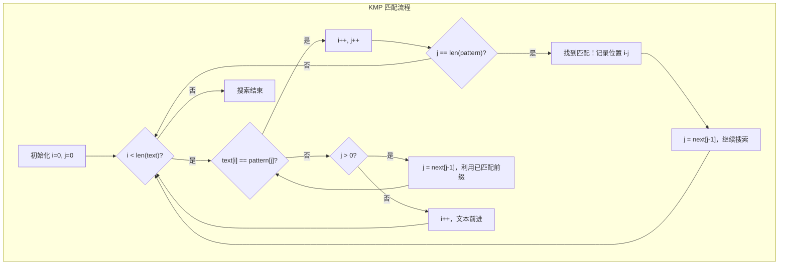

#算法 #string #kmp

## KMP 字符串匹配算法

相关笔记：[[binary-search]] | [[sliding-window]]

KMP（Knuth-Morris-Pratt）算法是一种高效的字符串匹配算法。与暴力匹配 O(n*m) 不同，KMP 利用已匹配的信息避免回退文本指针，实现 O(n+m) 的时间复杂度。其核心是构建 next 数组（也叫 failure function / 前缀函数）。

### 核心思想

暴力匹配在失配时，文本指针回退、模式指针归零。KMP 的优化是：**失配时文本指针不回退，模式指针跳到 next 数组指示的位置**，利用已匹配的前缀信息跳过不必要的比较。

### next 数组（前缀函数）

`next[i]` 表示 `pattern[0..i]` 中，最长的相等前后缀长度。

例如 pattern = `"ABCABD"`：

| i | pattern[0..i] | 最长相等前后缀 | next[i] |
|:---:|:---:|:---:|:---:|
| 0 | A | 无 | 0 |
| 1 | AB | 无 | 0 |
| 2 | ABC | 无 | 0 |
| 3 | ABCA | A = A | 1 |
| 4 | ABCAB | AB = AB | 2 |
| 5 | ABCABD | 无 | 0 |

### next 数组构建过程



### 匹配过程



### Go KMP 实现

```go
// buildNext 构建 next 数组（前缀函数）
func buildNext(pattern string) []int {
    m := len(pattern)
    next := make([]int, m)
    j := 0 // 前缀末尾指针

    for i := 1; i < m; i++ {
        // 失配时回退到 next[j-1]
        for j > 0 && pattern[i] != pattern[j] {
            j = next[j-1]
        }
        if pattern[i] == pattern[j] {
            j++
        }
        next[i] = j
    }
    return next
}

// KMP 在 text 中查找 pattern 的所有出现位置
func KMP(text, pattern string) []int {
    n, m := len(text), len(pattern)
    if m == 0 {
        return []int{0}
    }

    next := buildNext(pattern)
    var result []int
    j := 0 // 模式串指针

    for i := 0; i < n; i++ {
        // 失配时利用 next 数组跳转
        for j > 0 && text[i] != pattern[j] {
            j = next[j-1]
        }
        if text[i] == pattern[j] {
            j++
        }
        if j == m {
            result = append(result, i-m+1) // 记录匹配起始位置
            j = next[j-1]                  // 继续搜索下一个匹配
        }
    }
    return result
}
```

### 使用示例

```go
func main() {
    text := "ABABDABACDABABCABAB"
    pattern := "ABABCABAB"

    positions := KMP(text, pattern)
    fmt.Println(positions) // [9]

    next := buildNext(pattern)
    fmt.Println(next) // [0 0 1 2 0 1 2 3 4]
}
```

### LeetCode 28 - 找出字符串中第一个匹配项的下标

```go
func strStr(haystack string, needle string) int {
    positions := KMP(haystack, needle)
    if len(positions) == 0 {
        return -1
    }
    return positions[0]
}
```

### 复杂度分析

| 指标 | 复杂度 |
|:---:|:---:|
| 构建 next 数组 | O(m)，m 为模式串长度 |
| 匹配过程 | O(n)，n 为文本串长度 |
| 总时间 | O(n + m) |
| Space | O(m)，存储 next 数组 |

### 面试要点

1. **next 数组的含义**：`next[i]` 是 `pattern[0..i]` 的最长相等前后缀长度，本质是利用模式串自身的重复结构
2. **为什么文本指针不回退**：失配时已匹配部分的前缀 == 后缀，直接对齐跳过不可能匹配的位置
3. **next 数组构建的本质**：模式串对自身做 KMP 匹配，所以构建过程和匹配过程结构相同
4. **KMP vs 其他算法**：Rabin-Karp 用哈希比较（平均 O(n+m)，最坏 O(nm)）；Boyer-Moore 实际应用更快但实现更复杂
5. **常见题目**：LeetCode 28（strStr）、LeetCode 459（重复的子字符串：`len % (len - next[len-1]) == 0`）
