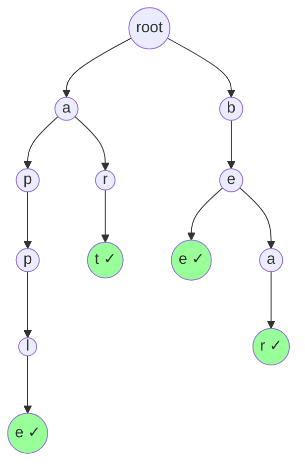

#算法 #string #trie

## Trie 前缀树 (Prefix Tree)

相关笔记：[[kmp]] | [[dfs]]

Trie（发音 "try"）是一种树形数据结构，用于高效存储和检索字符串集合中的键。每个节点代表一个字符，从根到某个节点的路径组成一个前缀。Trie 的核心优势是前缀查询 O(m)，m 为查询字符串长度，与集合大小无关。

### Trie 结构图



上图存储了单词：`apple`, `art`, `bee`, `bear`。绿色节点标记 `isEnd = true`。

### 核心操作

| 操作 | 描述 | 时间复杂度 |
|:---:|:---:|:---:|
| Insert | 插入一个单词 | O(m) |
| Search | 查找完整单词是否存在 | O(m) |
| StartsWith | 查找是否有某前缀的单词 | O(m) |

### Go Trie 实现

```go
type TrieNode struct {
    children [26]*TrieNode // 假设只有小写字母
    isEnd    bool          // 标记是否为单词结尾
}

type Trie struct {
    root *TrieNode
}

func NewTrie() *Trie {
    return &Trie{root: &TrieNode{}}
}

// Insert 插入单词
func (t *Trie) Insert(word string) {
    node := t.root
    for _, ch := range word {
        idx := ch - 'a'
        if node.children[idx] == nil {
            node.children[idx] = &TrieNode{}
        }
        node = node.children[idx]
    }
    node.isEnd = true
}

// Search 查找完整单词
func (t *Trie) Search(word string) bool {
    node := t.findNode(word)
    return node != nil && node.isEnd
}

// StartsWith 查找前缀是否存在
func (t *Trie) StartsWith(prefix string) bool {
    return t.findNode(prefix) != nil
}

// findNode 辅助函数：沿路径找到最后一个节点
func (t *Trie) findNode(s string) *TrieNode {
    node := t.root
    for _, ch := range s {
        idx := ch - 'a'
        if node.children[idx] == nil {
            return nil
        }
        node = node.children[idx]
    }
    return node
}
```

### 使用示例

```go
func main() {
    trie := NewTrie()
    trie.Insert("apple")
    trie.Insert("app")
    trie.Insert("art")

    fmt.Println(trie.Search("apple"))      // true
    fmt.Println(trie.Search("app"))        // true
    fmt.Println(trie.Search("ap"))         // false（不是完整单词）
    fmt.Println(trie.StartsWith("ap"))     // true（存在前缀）
    fmt.Println(trie.StartsWith("b"))      // false
}
```

### 应用场景

#### 1. 自动补全 (Autocomplete)

从前缀节点出发 DFS 收集所有单词：

```go
// Autocomplete 返回所有以 prefix 开头的单词
func (t *Trie) Autocomplete(prefix string) []string {
    node := t.findNode(prefix)
    if node == nil {
        return nil
    }
    var results []string
    var dfs func(node *TrieNode, path string)
    dfs = func(node *TrieNode, path string) {
        if node.isEnd {
            results = append(results, path)
        }
        for i, child := range node.children {
            if child != nil {
                dfs(child, path+string(rune('a'+i)))
            }
        }
    }
    dfs(node, prefix)
    return results
}
```

#### 2. 词频统计

在 TrieNode 中增加 `count` 字段：

```go
type TrieNodeWithCount struct {
    children [26]*TrieNodeWithCount
    count    int // 以该节点结尾的单词出现次数
}

func (t *Trie) InsertWithCount(word string) {
    // ... 同 Insert，最后 node.count++
}
```

#### 3. LeetCode 212 - 单词搜索 II（Trie + DFS 回溯）

在二维网格中搜索多个单词，Trie 用于剪枝：

```go
func findWords(board [][]byte, words []string) []string {
    trie := NewTrie()
    for _, w := range words {
        trie.Insert(w)
    }

    m, n := len(board), len(board[0])
    var result []string
    seen := make(map[string]bool)

    var dfs func(i, j int, node *TrieNode, path string)
    dfs = func(i, j int, node *TrieNode, path string) {
        if i < 0 || i >= m || j < 0 || j >= n || board[i][j] == '#' {
            return
        }
        ch := board[i][j]
        child := node.children[ch-'a']
        if child == nil {
            return // Trie 剪枝
        }
        path += string(ch)
        if child.isEnd && !seen[path] {
            result = append(result, path)
            seen[path] = true
        }

        board[i][j] = '#' // 标记已访问
        dirs := [4][2]int{{0, 1}, {0, -1}, {1, 0}, {-1, 0}}
        for _, d := range dirs {
            dfs(i+d[0], j+d[1], child, path)
        }
        board[i][j] = ch // 回溯
    }

    for i := 0; i < m; i++ {
        for j := 0; j < n; j++ {
            dfs(i, j, trie.root, "")
        }
    }
    return result
}
```

### Trie 变体

| 变体 | 特点 | 应用场景 |
|:---:|:---:|:---:|
| 基本 Trie | children[26] 数组 | 小写字母场景 |
| HashMap Trie | children 用 map | 字符集较大（Unicode） |
| 压缩 Trie (Radix Tree) | 合并单分支路径 | 节省空间，IP 路由表 |
| 01 Trie | 二叉，存储二进制位 | 最大异或值（LeetCode 421） |

### 复杂度分析

| 指标 | 复杂度 |
|:---:|:---:|
| Insert | O(m)，m 为单词长度 |
| Search | O(m) |
| StartsWith | O(m) |
| Space | O(N * M * C)，N 个单词，平均长度 M，字符集 C |

### 面试要点

1. **Trie vs HashSet**：Trie 支持前缀查询，HashSet 不行；但 HashSet 精确查找更快且空间更优
2. **空间优化**：用 HashMap 代替数组节省空间；压缩 Trie 合并单分支
3. **与 DFS 结合**：LeetCode 212 是经典的 Trie + 回溯题，Trie 提供剪枝能力
4. **实际应用**：搜索引擎自动补全、拼写检查、IP 路由最长前缀匹配、T9 输入法
5. **常见题目**：LeetCode 208（实现 Trie）、LeetCode 211（添加与搜索单词）、LeetCode 212（单词搜索 II）
